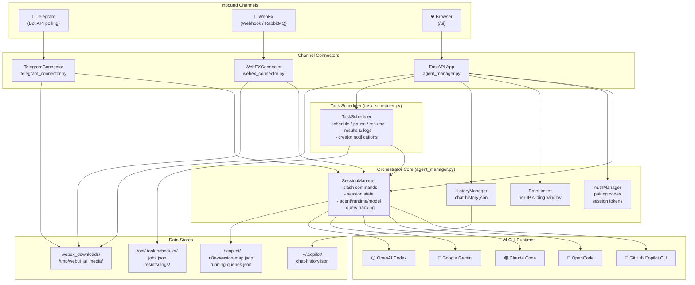
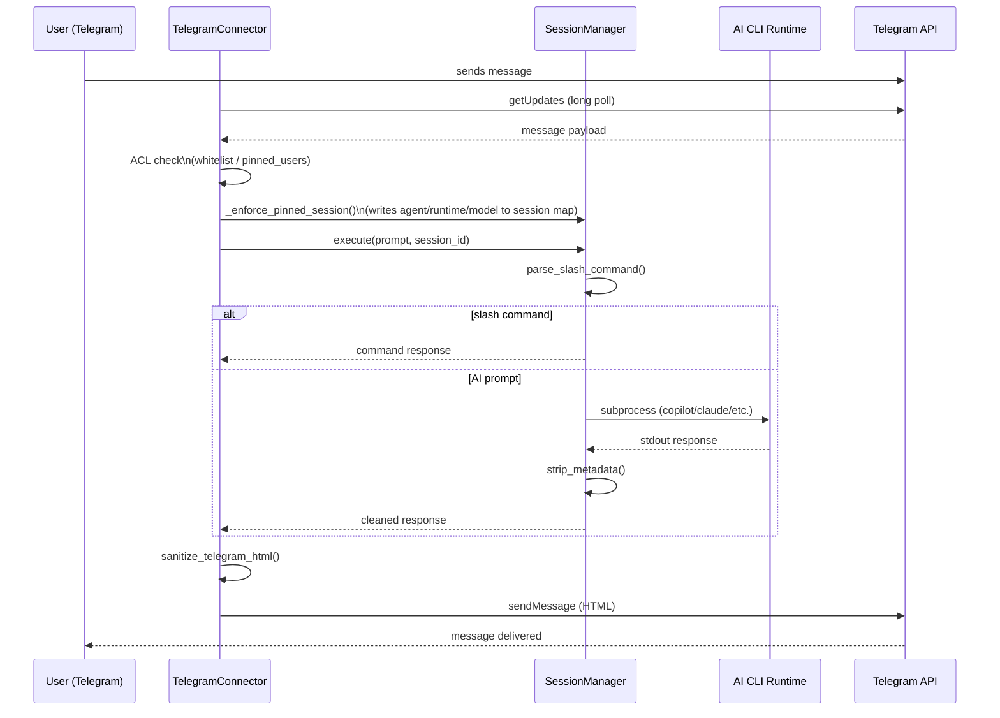
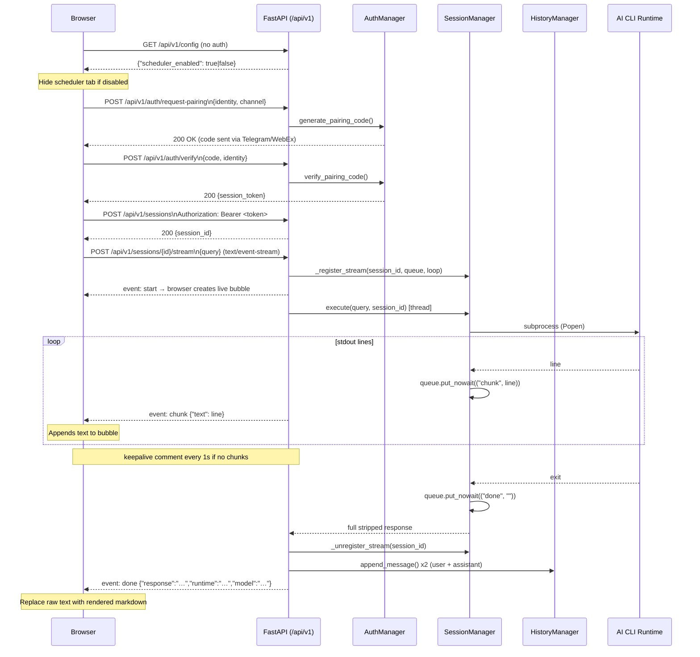
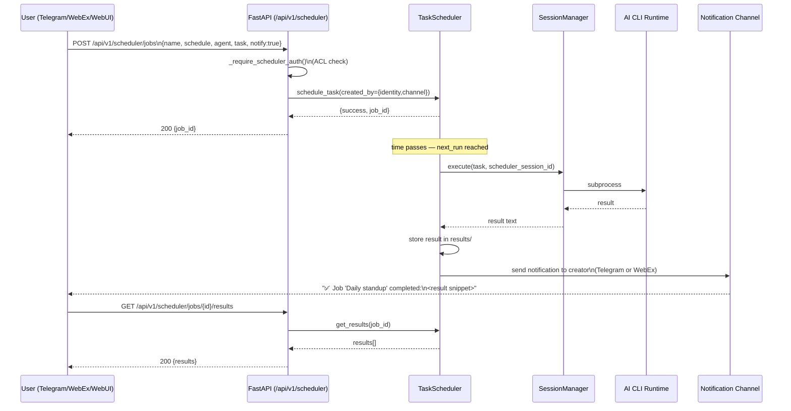
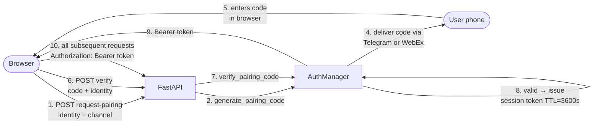
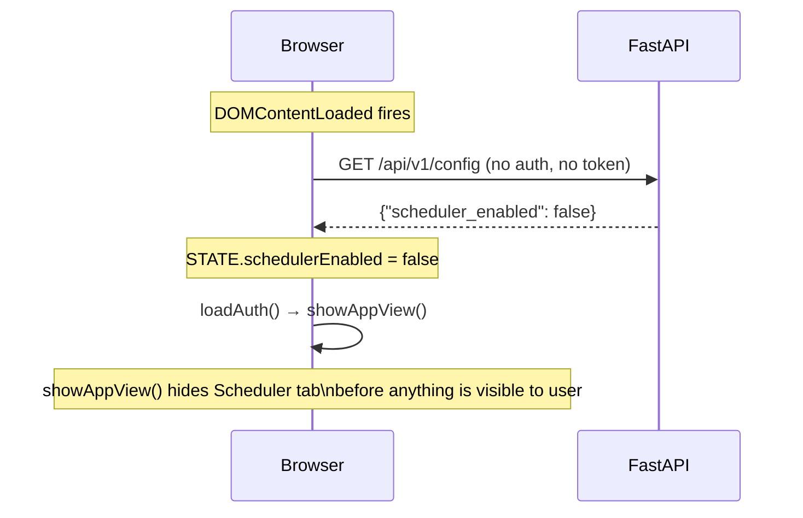

# Architecture — Wee-Orchestrator

> This document describes the runtime architecture of Wee-Orchestrator as of v2.0.

## Table of Contents

- [System Overview](#system-overview)
- [Component Diagram](#component-diagram)
- [Request Flow - Chat Message](#request-flow-chat-message)
- [Request Flow - Web UI](#request-flow-web-ui)
- [Task Scheduler Flow](#task-scheduler-flow)
- [Authentication Flow Web UI Pairing](#authentication-flow-web-ui-pairing)
- [Component Reference](#component-reference)
- [Data Stores](#data-stores)
- [Deployment Topology](#deployment-topology)
- [Environment Variables](#environment-variables)

---

## System Overview

Wee-Orchestrator is a Python-based multi-channel AI orchestration platform. It receives messages from three inbound channels (**Telegram**, **WebEx**, **Web UI**), routes them through a shared `SessionManager`, dispatches work to one of five AI CLI runtimes, and returns the response.

A built-in **Task Scheduler** can trigger AI jobs autonomously and deliver results back to the originating user via the same channel adapters.

```text
┌──────────────────────────────────────────────────────────────────┐
│                      Wee-Orchestrator Host                        │
│                                                                   │
│   Telegram ──► TelegramConnector ──┐                             │
│                                    │                             │
│   WebEx ────► WebEXConnector ──────┼──► SessionManager ──► AI   │
│                                    │                   CLIs      │
│   Browser ──► FastAPI /api/v1 ─────┘                             │
│                     │                                             │
│              TaskScheduler ───────────────────────────────────── │
└──────────────────────────────────────────────────────────────────┘
```

---

## Component Diagram



---

## Request Flow - Chat Message

The following sequence shows how a Telegram message is processed end-to-end.



---

## Request Flow - Web UI (Streaming)

Chat messages from the Web UI use the SSE streaming endpoint. The browser displays a live bubble with a blinking cursor while the AI CLI is running.



---

## Task Scheduler Flow



---

## Authentication Flow Web UI Pairing



---

## Component Reference

### `SessionManager` (`agent_manager.py`)

The central execution engine. Responsible for:

- Loading `agents.json` and resolving agent paths
- Maintaining session state files (`n8n-session-map.json`)
- Parsing and executing slash commands (`/agent`, `/runtime`, `/model`, `/session`, `/status`, `/cancel`, `/mode`)
- Dispatching AI prompts to the selected runtime subprocess
- **Streaming**: maintaining `_stream_queues` (per-session `asyncio.Queue` registry); pushing stdout chunks to the SSE endpoint in real-time via `loop.call_soon_threadsafe()`
- Tracking running queries (PID, runtime, agent, output snippet)
- Stripping CLI metadata (thinking tags, token counts, banners) from output
- Building per-agent context prompts (skills, repo info, AGENTS.md)

**Key methods:**

| Method | Purpose |
|--------|---------|
| `execute()` | Entry point — parse slash command or dispatch to AI |
| `run_copilot()` / `run_claude()` / `run_gemini()` / `run_opencode()` / `run_codex()` | Runtime-specific subprocess wrappers |
| `_execute_subprocess_with_tracking()` | Dual-path: streaming (queue-based line-by-line) or blocking (`communicate()`) |
| `_register_stream()` / `_unregister_stream()` | Register/remove per-session SSE queue |
| `set_agent()` | Switch agent and update session state |
| `update_session_field()` | Write a single field (model, runtime, mode…) to the session map |
| `strip_metadata()` | Clean raw CLI stdout |
| `track_running_query()` / `clear_running_query()` | PID-based query lifecycle |

---

### `HistoryManager` (`agent_manager.py`)

Stores per-user, per-channel chat history in `~/.copilot/chat-history.json`.

- Keyed by `channel:identity` (e.g. `telegram:8193231291`, `webui:alice@example.com`)
- Each key holds a list of session objects, each containing a `messages` array
- Used by the Web UI to populate the sidebar session list and restore conversation context

---

### `AuthManager` (`agent_manager.py`)

Handles Web UI authentication:

- `generate_pairing_code(identity, channel)` — creates a time-limited 6-digit code and triggers delivery via the appropriate connector
- `verify_pairing_code(code, identity)` — validates the code and returns a signed session token (JWT-like dict stored in memory)
- `validate_session_token(token)` — verifies a Bearer token; returns identity+channel or None
- `validate_shared_key(key)` — server-to-server authentication via `API_SHARED_KEY`

---

### `RateLimiter` (`agent_manager.py`)

Per-IP sliding-window rate limiter for all FastAPI endpoints. Default limits enforced per endpoint path to protect against abuse.

---

### `TaskScheduler` (`task_scheduler.py`)

Embedded cron-like scheduler:

- Persists jobs in `/opt/.task-scheduler/jobs.json` (path configurable via env vars)
- `schedule_task()` — create a job with natural-language schedule, returns `job_id`
- `update_job()` — patch any job field
- `pause_job()` / `resume_job()` — toggle enabled state
- `get_results(job_id, limit)` — returns last N execution results
- `doctor()` — health check report for the daemon status badge
- Parses human schedules: `in X minutes/hours/days`, `every X hours`, `every day at HH:MM`

---

### `TelegramConnector` (`telegram_connector.py`)

Long-polling Telegram bot:

- Polls `getUpdates` in a loop; handles text, photos, documents
- Per-user whitelist/blacklist (`allowed_users` / `denied_users`)
- `pinned_users` — locks user to an agent/runtime/model before every query
- `yolo_allowed_users` — restricts `/mode yolo` to listed IDs
- Calls `SM.execute()` and formats response as Telegram HTML (entities sanitized)
- `send_file()` / `download_file()` for file/image attachments

---

### `WebEXConnector` (`webex_connector.py`)

Cisco WebEx connector (supports both webhook and RabbitMQ modes):

- Listens on RabbitMQ queue (`webex` prod / `webex-dev` dev) or HTTP webhook
- Same per-user ACL as Telegram (`pinned_users`, `yolo_allowed_users`)
- `send_file()` — uploads local file back to WebEx room
- `download_file()` — downloads attachment from WebEx to `webex_downloads/`
- Automatic temp-file cleanup (files >5 min old)

---

### FastAPI App (`create_api_app()` in `agent_manager.py`)

Factory function that builds the ASGI application. Endpoints grouped by prefix:

| Prefix | Purpose |
|--------|---------|
| `/api/v1/health` | Health check |
| `/api/v1/config` | **Public** feature-flag endpoint (no auth); returns `{scheduler_enabled}` |
| `/api/v1/auth/` | Pairing code request and verification |
| `/api/v1/sessions/` | Session create, execute (blocking), status, delete |
| `/api/v1/sessions/{id}/stream` | **SSE streaming** execute — WebUI chat path |
| `/api/v1/history/` | Per-user session history |
| `/api/v1/sessions/{id}/upload` | File uploads |
| `/api/v1/uploads/` | Serve uploaded files |
| `/api/v1/search/images` | DuckDuckGo image proxy |
| `/api/v1/scheduler/` | Task scheduler CRUD and results (only registered when `SCHEDULER_ENABLED=true`) |
| `/ai-media/` | AI-fetched images (static, no auth) |
| `/ui` | Web UI SPA (static, no auth) |

---

## Data Stores

| Store | Path | Description |
|-------|------|-------------|
| Session map | `~/.copilot/n8n-session-map.json` | Maps N8N/API session IDs to runtime session IDs, agent, model, runtime, mode |
| Running queries | `~/.copilot/running-queries.json` | Active query PIDs and metadata (for `/status` / `/cancel`) |
| Chat history | `~/.copilot/chat-history.json` | Per-user, per-channel conversation history for Web UI |
| Scheduler jobs | `/opt/.task-scheduler/jobs.json` | All scheduled job definitions |
| Scheduler results | `/opt/.task-scheduler/results/` | Per-job execution result files |
| Scheduler logs | `/opt/.task-scheduler/logs/` | Per-job execution log files |
| WebEx downloads | `webex_downloads/` | Temporary incoming file attachments |
| AI media | `/tmp/webui_ai_media/` | Images fetched by AI agents for inline display |

---

## Deployment Topology

Two environments run side-by-side on the CLI-Tools host:

```text
┌────────────────────────────────────────────────────┐
│              CLI-Tools Host (Linux)                  │
│                                                      │
│  ┌──────────────────────────────────────────────┐   │
│  │  PRODUCTION   /opt/n8n-copilot-shim          │   │
│  │  Branch: main                                 │   │
│  │  webex-connector.service                      │   │
│  │  telegram-bot-listener.service                │   │
│  │  agent-manager-api.service   (port 8000)      │   │
│  └──────────────────────────────────────────────┘   │
│                                                      │
│  ┌──────────────────────────────────────────────┐   │
│  │  DEVELOPMENT  /opt/n8n-copilot-shim-dev      │   │
│  │  Branch: dev                                  │   │
│  │  webex-connector-dev.service                  │   │
│  │  telegram-bot-listener-dev.service            │   │
│  │  agent-manager-api-dev.service  (port 8001)   │   │
│  └──────────────────────────────────────────────┘   │
│                                                      │
│  RabbitMQ  192.168.0.85:5672                        │
│  Queue: webex (prod) / webex-dev (dev)              │
└────────────────────────────────────────────────────┘
```

Service files live in the repo and are deployed to `/etc/systemd/system/`. All services run as the `flipkey` user and source environment from `.env` via `EnvironmentFile=`.

---

## Environment Variables

Key variables (see `.env.example` for the full list):

| Variable | Default | Description |
|----------|---------|-------------|
| `APP_ENV` | `PROD` | `DEV` enables debug logging and relaxes some validations |
| `API_PORT` | `8000` | Port for the FastAPI server |
| `API_SHARED_KEY` | — | Shared secret for server-to-server API auth |
| `PAIRING_CODE_LENGTH` | `6` | Digits in the one-time pairing code |
| `PAIRING_CODE_TTL` | `300` | Seconds before a pairing code expires |
| `SESSION_TOKEN_TTL` | `3600` | Seconds before a Web UI session token expires |
| `AGENT_CONFIG_FILE` | — | Path to `agents.json` (overrides auto-discovery) |
| `COPILOT_DEFAULT_AGENT` | `orchestrator` | Default agent for new sessions |
| `COPILOT_DEFAULT_MODEL` | `gpt-5-mini` | Default model for new sessions |
| `COPILOT_DEFAULT_RUNTIME` | `copilot` | Default runtime for new sessions |
| `SCHEDULER_JOBS_FILE` | `/opt/.task-scheduler/jobs.json` | Scheduler jobs persistence |
| `SCHEDULER_LOGS_DIR` | `/opt/.task-scheduler/logs/` | Scheduler log directory |
| `SCHEDULER_RESULTS_DIR` | `/opt/.task-scheduler/results/` | Scheduler results directory |
| `SCHEDULER_ALLOWED_TELEGRAM` | `vtflip` | Comma-separated Telegram usernames allowed to manage scheduler |
| `SCHEDULER_ALLOWED_WEBEX` | `flipkey@cisco.com` | Comma-separated WebEx emails allowed to manage scheduler |
| `SCHEDULER_ENABLED` | `true` | Set to `false` to disable all scheduler routes and hide the Scheduler tab in the Web UI |

---

## Feature Flags

Feature flags are read from the environment at startup and exposed to the browser via the public `GET /api/v1/config` endpoint. Because the endpoint requires no authentication, the browser can read it before the login screen appears.

| Flag | Env Var | Default | Effect |
|------|---------|---------|--------|
| Scheduler | `SCHEDULER_ENABLED` | `true` | When `false`: all `/api/v1/scheduler/*` routes are not registered (404); `GET /api/v1/config` returns `{"scheduler_enabled": false}`; browser hides the Scheduler tab before the app view is shown |

### Config Boot Flow



### Adding a New Feature Flag

1. Add the env-var read in `agent_manager.py` near the top of `create_api_app()`:

   ```python
   python
   MY_FLAG = os.environ.get("MY_FLAG", "true").lower() not in ("false", "0", "no")
   ```

2. Add it to the `GET /api/v1/config` response dict.
3. In `app.js`, read `config.my_flag` inside the config fetch in `DOMContentLoaded` and store in `STATE`.
4. Apply visibility in `showAppView()` (runs before UI is shown).
5. Document in `.env.example` and this file.
