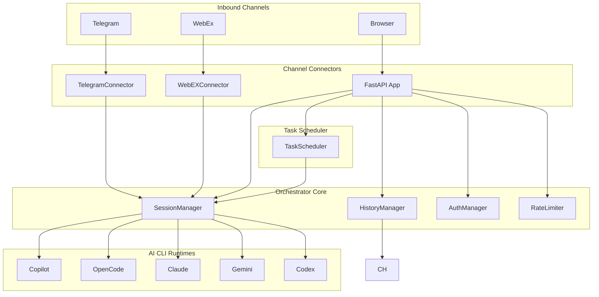
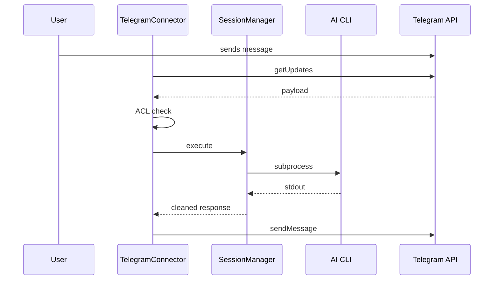
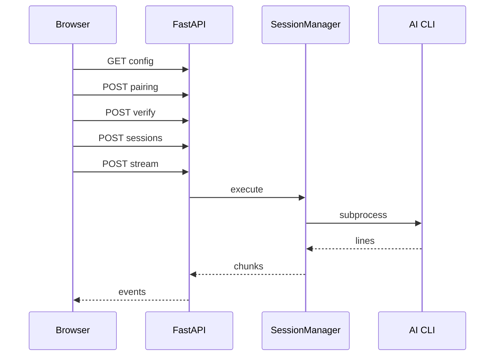
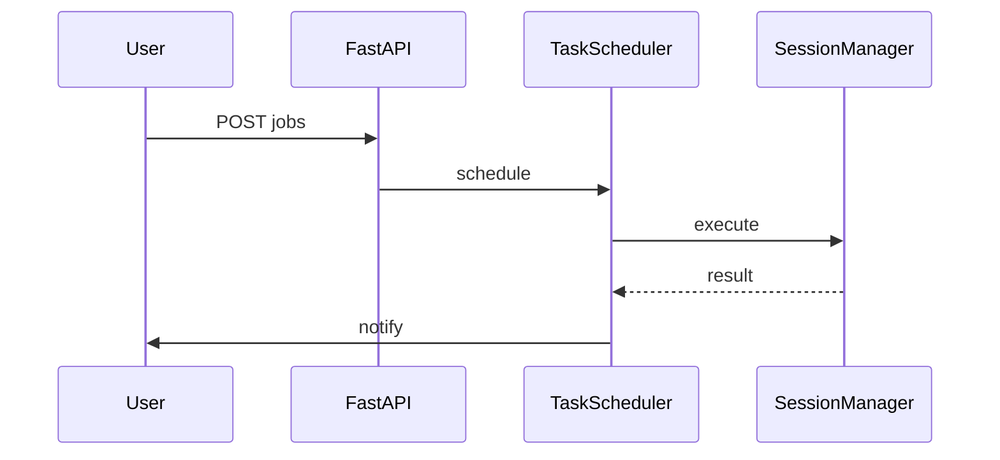
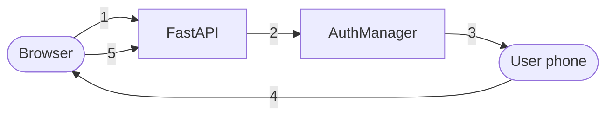

# Architecture - Wee-Orchestrator

> This document describes the runtime architecture of Wee-Orchestrator as of v2.0.

## Table of Contents

- [System Overview](#system-overview)
- [Component Diagram](#component-diagram)
- [Request Flow Chat Message](#request-flow-chat-message)
- [Request Flow Web UI](#request-flow-web-ui)
- [Task Scheduler Flow](#task-scheduler-flow)
- [Authentication Flow](#authentication-flow-web-ui-pairing)
- [Component Reference](#component-reference)
- [Data Stores](#data-stores)
- [Deployment Topology](#deployment-topology)
- [Environment Variables](#environment-variables)

---

## System Overview

Wee-Orchestrator is a Python-based multi-channel AI orchestration platform. It receives messages from three inbound channels (**Telegram**, **WebEx**, **Web UI**), routes them through a shared `SessionManager`, dispatches work to one of five AI CLI runtimes, and returns the response.

A built-in **Task Scheduler** can trigger AI jobs autonomously and deliver results back to the originating user via the same channel adapters.

```text
┌──────────────────────────────────────────────────────────────────┐
│                      Wee-Orchestrator Host                        │
│                                                                   │
│   Telegram ──► TelegramConnector ──┐                             │
│                                    │                             │
│   WebEx ────► WebEXConnector ──────┼──► SessionManager ──► AI   │
│                                    │                   CLIs      │
│   Browser ──► FastAPI /api/v1 ─────┘                             │
│                     │                                             │
│              TaskScheduler ───────────────────────────────────── │
└──────────────────────────────────────────────────────────────────┘
```

---

## Component Diagram



---

## Request Flow Chat Message

The following sequence shows how a Telegram message is processed end-to-end.



---

## Request Flow Web UI

Chat messages from the Web UI use SSE streaming.



---

## Task Scheduler Flow



---

## Authentication Flow Web UI Pairing



---

## Component Reference

### SessionManager

| Method | Purpose |
| --- | --- |
| execute | Entry point |
| run_runtimes | Subprocess wrappers |
| strip_metadata | Clean stdout |

### HistoryManager

Stores chat history.

### AuthManager

Handles authentication.

### TaskScheduler

Embedded scheduler.

---

## Data Stores

| Store | Path |
| --- | --- |
| Session map | ~/.copilot/n8n-session-map.json |
| Chat history | ~/.copilot/chat-history.json |
| Scheduler jobs | /opt/.task-scheduler/jobs.json |

---

## Deployment Topology

```text
┌────────────────────────────────────────────────────┐
│              CLI-Tools Host                        │
│  ┌──────────────────────────────────────────────┐   │
│  │  PRODUCTION                                   │   │
│  └──────────────────────────────────────────────┘   │
└────────────────────────────────────────────────────┘
```

---

## Environment Variables

| Variable | Default |
| --- | --- |
| APP_ENV | PROD |
| API_PORT | 8000 |
| SCHEDULER_ENABLED | true |
