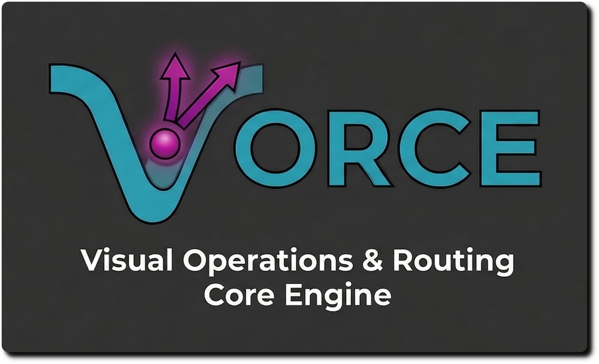

<div align="center">  
    

**A High-Performance, Professional-Grade Projection Mapping Tool Built with Rust.**  

[](LICENSE)  
[](https://www.rust-lang.org/)  

[](<https://git>  
hub.com/Vorce-Studios/Vorce/actions)  
<!-- markdownlint-disable MD013 -->  
[](https://github.com/Vorce-Studios/Vorce/actions/workflows/CICD-DevFlow_Job01_Validation.yml)  
[](<https://github.com>  
/Vorce-Studios/Vorce/actions/workflows/CI-02_security-scan.yml)  
[](<https://git>  
hub.com/Vorce-Studios/Vorce/actions/workflows/CICD-MainFlow_Job03_Release.yml)  
  
[](LICENSE)  
[](https://www.rust-lang.org/)  
[](CONTRIBUTING.md)  
 <!-- markdownlint-enable MD013 -->  
</div>  

---

## 🌟 Introduction

**Vorce** is a modern, open-source projection mapping software designed for
visual artists, stage designers, and live performers. It combines the
efficiency of Rust with a powerful, real-time node-based workflow and a
highly reactive modulation system.

### ⚡ Professional Rendering Engine

Powered by **WGPU** and the **Bevy Engine**, Vorce delivers low-latency,
hardware-accelerated rendering.

* **Multi-Layer Composition**: Advanced blend modes and hierarchical grouping.
* **3D & Particle Integration**: Native Bevy support for stunning
  volumetric effects and 3D scenes.
* **LUT Color Grading**: Industry-standard `.cube` support for cinematic looks.

### 🔊 Deep Audio Reactivity

Our **AudioAnalyzer V2** tracks 9 frequency bands, RMS volume, and peak
detection in real-time, allowing visuals to dance perfectly to the beat.

### 📐 Precision Projection Mapping

* **Bezier Warping**: Flexible mesh deformation for complex surfaces.
* **Edge Blending**: Seamless multi-projector setups with per-output
  gamma correction.
* **Advanced Masking**: Integrated shape and file-based masking tools.

### 🎛️ Unified Control

Seamlessly integrate with your performance setup via **OSC**, **MIDI**, and
**Ableton Link**. Our built-in **Jules AI assistant** is always ready to help
you extend the software's capabilities.

---

## 🛠️ Technology Stack

| Component | Technology |
| :--- | :--- |
| **Core** | [Rust 🦀](https://www.rust-lang.org/) (High-performance, Thread-safe) |
| **Graphics** | [WGPU](https://wgpu.rs/) (Modern WebGPU-based hardware acceleration) |
| **3D Engine** | [Bevy](https://bevyengine.org/) (Data-driven ECS engine) |
| **Interface** | [egui](https://github.com/emilk/egui) (Blazing fast immediate mode UI) |
| **Video/Audio** | FFmpeg (via `ffmpeg-next`), CPAL (Cross-platform audio) |
| **Protocol** | [Model Context Protocol](https://modelcontextprotocol.io/) (AI integration) |

---

## 🚦 Quick Start

### 1. Requirements

* **Rust**: [Install latest stable version](https://rustup.rs/)
* **FFmpeg**: System-wide installation required for video decoding.
* **NDI (Optional)**: For network video I/O.

### 2. Run from Source

```bash
# Clone the repository
git clone https://github.com/Vorce-Studios/Vorce.git
cd Vorce

# Run the application (Release mode recommended for performance)
cargo run --release
```

### 3. Usage

* Check the [**Quick Start Guide**](docs/A4_USER/B1_MANUAL/DOC-C2_QUICKSTART.md)
  to create your first composition.
* Explore the [**User Manual**](docs/A4_USER/B1_MANUAL/DOC-C0_README.md)
  for detailed control explanations.

---

## 📚 Documentation

Explore our comprehensive guides in the [`docs/`](docs/README.md) directory:

* 📖 [**User Guide**](docs/A4_USER/B1_MANUAL/DOC-C0_README.md): Interface layout, keyboard
  shortcuts, and performance tips.
* 👨‍💻 [**Developer Portal**](docs/A2_DEVELOPMENT/DOC-B0_README.md): Architecture overview,
  coding standards, and build instructions.
* 🗺️ **Project Roadmap**: Current status and upcoming Phase 1.0 release goals are
  tracked via GitHub Project Issues.

---

## 🤝 Contributing

We welcome contributions from visual artists and developers alike! Please read
our [**Contributing Guidelines**](CONTRIBUTING.md) and check our
[**GitHub Issues**](https://github.com/Vorce-Studios/Vorce/issues) for open
tasks.

## 📄 License

Vorce is licensed under **GPL-3.0**. See the [LICENSE](LICENSE) file for more information.

---
<div align="center">
  Created with ❤️ by the Vorce Contributors.
</div>
