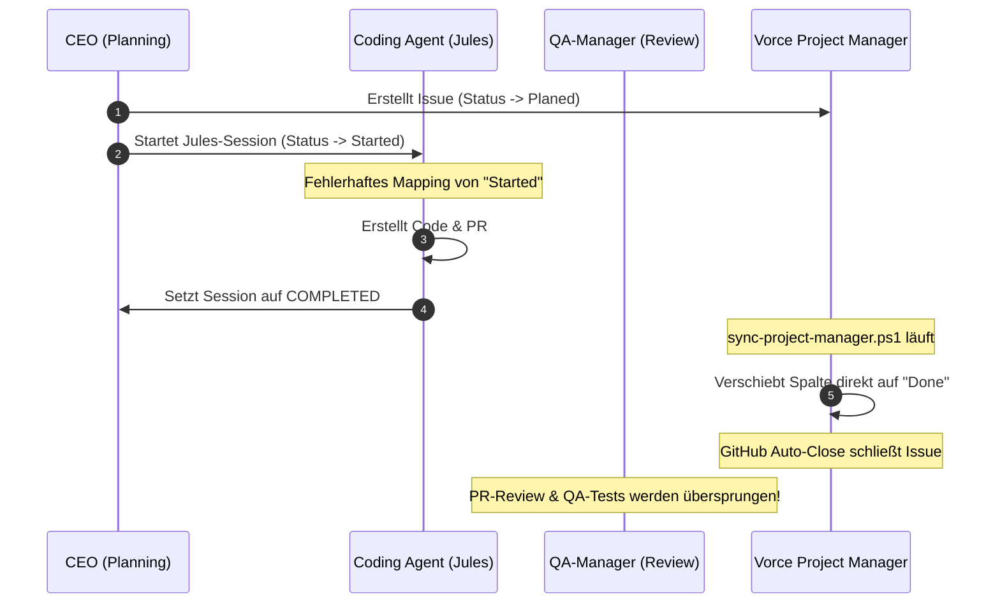
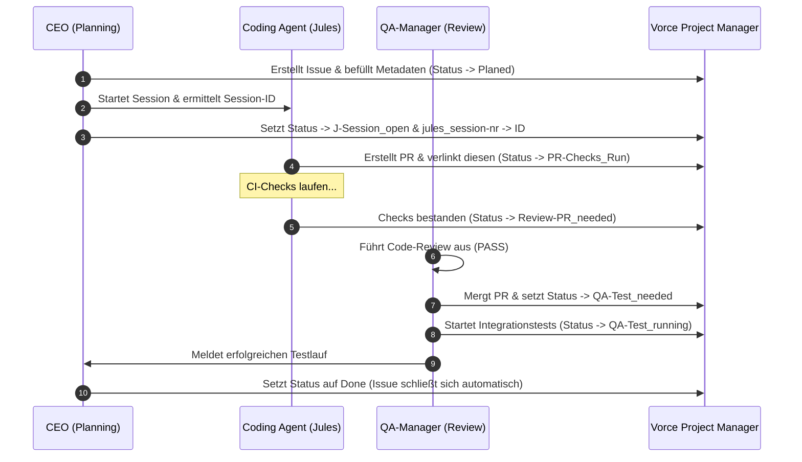

# Vorce Sync & Workflow-Analyse: Jules, GitHub & Vorce-Autopilot (Version 5)

Dieses Dokument beschreibt die präzisen technischen Mechanismen, Skripte und Bedingungen, durch die der Status und die Metadaten im **Vorce Project Manager** automatisch aktualisiert werden.

---

## 1. Detaillierte technische Übergangslogik

Die folgende Übersicht dokumentiert chronologisch, welche Skripte und Ereignisse für die automatischen Statusübergänge verantwortlich sind und wie die Metadaten befüllt werden.

### 1. Status: `Planed`

* **Bedingung:** CEO plant eine neue Aufgabe (Master, Sub- oder Default-Issue).
* **Ausführendes Skript:** `planning-wakeup.ps1` (in der Autopilot-Hauptschleife).
* **Technische Aktion:** Ruft `New-GitHubIssue` auf.
* **Metadaten-Befüllung:**
  * `Status` wird initial auf `Planed` gesetzt.
  * `task_type` wird anhand der Labels (`bug`, `enhancement` etc.) gesetzt.
  * `priority` wird anhand des Labels `priority:...` gesetzt.
  * `agent` wird anhand des Labels `agent:...` gesetzt.

### 2. Status: `Started` (Ausschließlich für Master-Issues)

* **Bedingung:** Arbeit an mindestens einem Sub-Issue des Master-Issues hat begonnen.
* **Ausführendes Skript:** `planning-wakeup.ps1` oder `monitoring-wakeup.ps1`.
* **Technische Aktion:** Erkennt, dass ein Sub-Issue des Master-Issues nicht mehr im Status `Planed` ist, und aktualisiert das Master-Issue im Board.
* **Metadaten-Befüllung:**
  * `Status` ➔ `Started`.

### 3. Status: `J-Session_open`

* **Bedingung:** CEO startet eine neue Jules-Session (Planning-Phase oder Monitoring-Refill).
* **Ausführendes Skript:** `planning-wakeup.ps1` oder `monitoring-wakeup.ps1` (Jules Refill).
* **Technische Aktion:**
  1. Ruft `New-JulesSession` via Jules-REST-API auf.
  2. Nach erfolgreichem API-Aufruf wird direkt `set-managed-issue-state.ps1` oder `Sync-VorceProjectFields` aufgerufen.
* **Metadaten-Befüllung:**
  * `Status` ➔ `J-Session_open`.
  * **`jules_session-nr`** ➔ Wird mit der zurückgegebenen Jules-Session-ID (z. B. `18033754151...`) befüllt.

### 4. Status: `J-Session_failed`

* **Bedingung:** Jules meldet einen Abbruch der Session oder ein lokaler Agentenprozess stürzt ab.
* **Ausführendes Skript:** `monitoring-wakeup.ps1`.
* **Technische Aktion:**
  * Jules-API meldet `FAILED` bei `Get-JulesSessionStatus` ODER lokaler Task meldet in `agent-tasks/{nr}.json` den Status `FAILED`.
  * Ruft `Set-DelegationEscalation` auf.
* **Metadaten-Befüllung:**
  * `Status` ➔ `J-Session_failed`.

### 5. Status: `J-Session_waiting`

* **Bedingung:** Der Coding Agent wartet auf User-Feedback (Retry-Limit überschritten).
* **Ausführendes Skript:** `monitoring-wakeup.ps1`.
* **Technische Aktion:** Jules-API meldet `AWAITING_USER_FEEDBACK` oder `PAUSED` und die automatischen Retries sind erschöpft.
* **Metadaten-Befüllung:**
  * `Status` ➔ `J-Session_waiting`.

### 6. Status: `PR-Checks_Run`

* **Bedingung:** Coding Agent hat seine Arbeit fertiggestellt und einen PR geöffnet.
* **Ausführendes Skript:** `monitoring-wakeup.ps1` (oder `sync-project-manager.ps1`).
* **Technische Aktion:** Erkennt einen offenen PR für das Issue im Cache.
* **Metadaten-Befüllung:**
  * `Status` ➔ `PR-Checks_Run`.
  * `Linked PR` / `Linked pull requests` ➔ Wird mit der PR-URL befüllt.

### 7. Status: `PR-Checks_failed`

* **Bedingung:** Mindestens ein CI-Check des Pull Requests meldet einen Fehler.
* **Ausführendes Skript:** `monitoring-wakeup.ps1` (oder `sync-project-manager.ps1`).
* **Technische Aktion:** Liest das Feld `statusCheckRollup` des PRs aus; erkennt den Zustand `conclusion = FAILURE`.
* **Metadaten-Befüllung:**
  * `Status` ➔ `PR-Checks_failed`.
  * `pr_checks_status` ➔ `failed`.

### 8. Status: `PR-Merge_Conflicts`

* **Bedingung:** Der Pull Request hat Konflikte mit der Zielbranch (`main`).
* **Ausführendes Skript:** `monitoring-wakeup.ps1` (oder `sync-project-manager.ps1`).
* **Technische Aktion:** Liest das Feld `mergeable` aus dem PR-Status; erkennt den Zustand `CONFLICTING`.
* **Metadaten-Befüllung:**
  * `Status` ➔ `PR-Merge_Conflicts`.
  * `pr_checks_status` ➔ `merge-conflict`.

### 9. Status: `Review-PR_needed`

* **Bedingung:** PR-Checks sind erfolgreich durchgelaufen; PR wartet auf inhaltliche Freigabe.
* **Ausführendes Skript:** `monitoring-wakeup.ps1`.
* **Technische Aktion:** Erkennt, dass alle CI-Checks bestanden haben (`statusCheckRollup` ist grün/passed).
* **Metadaten-Befüllung:**
  * `Status` ➔ `Review-PR_needed`.
  * `review_status` ➔ `needed`.

### 10. Status: `Review-PR_inRework`

* **Bedingung:** Code-Review durch den QA-Manager hat Mängel ergeben und wurde abgelehnt.
* **Ausführendes Skript:** `monitoring-wakeup.ps1`.
* **Technische Aktion:** Wertet den Ausgang des `Invoke-DualCeoTask -TaskType code_review` aus. Das Ergebnis lautet `REJECT`.
* **Metadaten-Befüllung:**
  * `Status` ➔ `Review-PR_inRework`.
  * `review_status` ➔ `changes_requested`.

### 11. Status: `QA-Test_needed`

* **Bedingung:** Code-Review durch den QA-Manager war erfolgreich; PR wird gemergt.
* **Ausführendes Skript:** `monitoring-wakeup.ps1`.
* **Technische Aktion:**
  * CEO/QA-Manager liefert `PASS`.
  * Autopilot führt den Merge des PRs in `main` aus (oder stellt den erfolgreichen Merge fest).
* **Metadaten-Befüllung:**
  * `Status` ➔ `QA-Test_needed`.
  * `review_status` ➔ `passed`.

### 12. Status: `QA-Test_running`

* **Bedingung:** Lokale Validierungs- und Integrationstests auf dem aktuellen Build laufen.
* **Ausführendes Skript:** `monitoring-wakeup.ps1`.
* **Technische Aktion:** Startet die lokalen Test-Suiten auf dem Host-System.
* **Metadaten-Befüllung:**
  * `Status` ➔ `QA-Test_running`.

### 13. Status: `Done`

* **Bedingung:** Alle QA-Tests und Validierungsschritte waren erfolgreich.
* **Ausführendes Skript:** `monitoring-wakeup.ps1` oder `planning-wakeup.ps1`.
* **Technische Aktion:**
  * Stellt fest, dass alle Integrations- und Smoke-Tests bestanden haben.
  * Ruft `set-managed-issue-state.ps1` auf, um den Status auf `Done` zu setzen.
* **Metadaten-Befüllung:**
  * `Status` ➔ `Done`.
  * Das Issue auf GitHub wird automatisch in den Zustand `CLOSED` versetzt.

---

## 2. Chronologischer Ist-Zustand (As-Is)

Im aktuellen Zustand führt das voreilige Mapping einer erfolgreichen Jules-Session zum sofortigen Statuswechsel auf `Done` und zur automatischen Schließung des Issues durch GitHub, noch bevor PR-Reviews oder Tests stattgefunden haben.

---

## 3. Chronologischer Soll-Zustand (To-Be)

Im Soll-Zustand wird die Aufgabe chronologisch durch alle Phasen geführt. Der CEO setzt das Issue erst auf `Done`, nachdem der QA-Manager das Feature erfolgreich geprüft hat.

