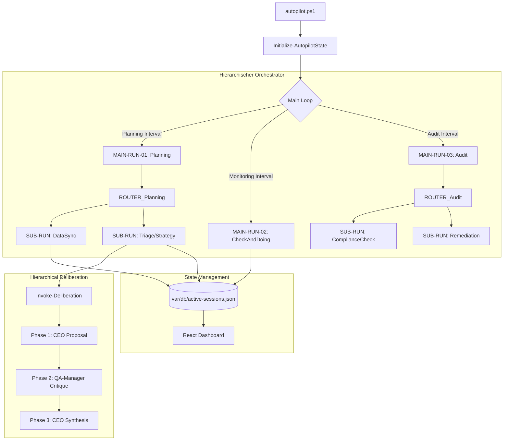

# Vorce-Autopilot 2.0 - Architektur & Workflows (IST-ZUSTAND)

Dieses Dokument beschreibt die Architektur des Vorce-Autopiloten in Version 2.0, basierend auf der aktuellen Implementierung.

## 1. Zentrale Architektur-Prinzipien

- **Hierarchische Orchestrierung:** Die Steuerung erfolgt über eine strikte Hierarchie:
  - **MAIN-RUN:** Die 4 Haupt-Phasen (Planning, Monitoring, Audit, Optimizer).
  - **ROUTER:** Dynamische Logik, die basierend auf dem System-State entscheidet, welche Sub-Runs aktiv sind.
  - **SUB-RUN:** Modulare Arbeitsschritte innerhalb einer Phase.
  - **PART-RUN:** Einzelne KI-Interaktionen.
- **Rollen-Trennung:**
  - **CEO:** Verantwortlich für Strategie, Planung und Delegation.
  - **QA-Manager:** Verantwortlich für Audit, Compliance-Prüfung und autonome Reparatur (Remediation).
- **Deliberation (Zwei-Instanzen-Prüfung):** Kritische Entscheidungen werden in einem strukturierten Dialog zwischen CEO (Proposal) und QA-Manager (Critique) getroffen, um die Qualität zu maximieren.

## 2. System-Architektur

## 3. Kern-Workflows

### 3.1 Planning Workflow (V2.0)
1. **DataSync:** Synchronisiert GitHub Issues und Jules-Sessions in den State.
2. **Router-Entscheidung:** Der Router prüft, ob neue Issues eine Triage oder eine Strategie-Anpassung erfordern.
3. **Strategy (Deliberation):** Der CEO erstellt einen Plan, der QA-Manager prüft diesen auf Compliance und Risiken.
4. **Delegation:** Finale Aufgaben werden an Jules oder lokale Agenten verteilt.

### 3.2 Audit & "Remediate before Escalate"
1. **Compliance Check:** Der QA-Manager scannt das System nach Fehlern oder Abweichungen.
2. **Autonomous Remediation:** Der QA-Manager generiert bei bekannten Problemen direkt Reparatur-Befehle.
3. **Execution:** Der Autopilot führt diese Befehle aus, bevor der User benachrichtigt wird.
4. **Escalation:** Nur bei Fehlschlag der Reparatur wird ein Alert im Dashboard für den User erstellt.

## 4. State Management

Der Prozess nutzt drei Ebenen von States, um Isolation und Nachvollziehbarkeit zu gewährleisten:
- **GlobalState:** Das Langzeitgedächtnis und die Sitzungsverwaltung.
- **MainState:** Zwischenspeicher für Daten innerhalb eines Main-Runs (z.B. gefundene Issue-Kandidaten).
- **SubState:** Detailliertes Protokoll und Artefakte eines einzelnen Arbeitsschritts.

---
*Vorce-Autopilot 2.0 - IST-Zustand Dokumentation - Build 2026-06-11*
