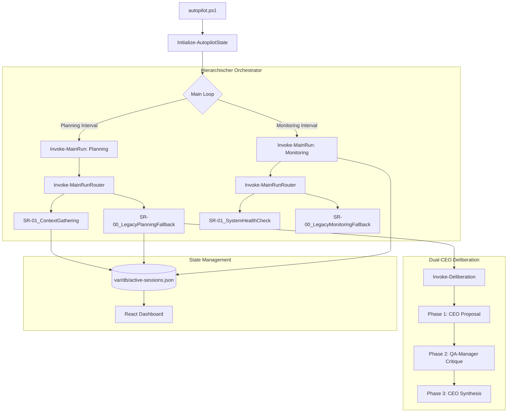

# Vorce-Autopilot 2.0 - Architektur & Workflows

Dieses Dokument beschreibt die neuen Strukturen und Abläufe des Vorce-Autopiloten in Version 2.0.

## 1. Zentrale Änderungen (Refactoring)

- **Terminology-Migration:** 
  - *CEO Alpha* -> **CEO** (Strategischer Entscheider)
  - *CEO Beta* -> **QA-Manager** (Kritische Instanz & Auditor)
- **Hierarchischer Orchestrator:** Einführung von `Invoke-MainRun` und `Invoke-MainRunRouter`. Phasen (Planning, Monitoring, Audit) sind keine monolithischen Funktionen mehr, sondern dynamische Sequenzen von *Sub-Runs*.
- **Data-Driven Routing:** Die Prozesslogik wird über `router_rules` in der `autopilot-config.json` gesteuert.
- **Staging-Audit:** Erweiterte "Remediate before Escalate"-Logik im System-Audit.

## 2. System-Architektur

## 3. Workflows

### 3.1 Planning Workflow (V2.0)
1. **Context Gathering:** Synchronisiert GitHub Issues und Jules-Sessions.
2. **Analysis:** CEO evaluiert die aktuelle Lage.
3. **Deliberation:** Bei komplexen Aufgaben (z.B. Re-Planning nach Fehlern) wird der QA-Manager zur Gegenprüfung hinzugezogen.
4. **Delegation:** Aufgaben werden an Jules oder andere Agenten delegiert.

### 3.2 Audit & Remediation Workflow
1. **Audit Wake-Up:** Der QA-Manager scannt das System.
2. **Autonomous Remediation:** Wenn ein Problem gefunden wird, generiert der QA-Manager einen PowerShell-Befehl zur Behebung.
3. **Execution:** Der Autopilot führt den Befehl autonom aus.
4. **Escalation:** Erst wenn die Reparatur fehlschlägt, wird eine `decision_pending` (Alert) im Dashboard erstellt.
5. **User Interaction:** Der User hat nun im Dashboard drei Optionen:
   - *Befehl erneut ausführen* (Manuelle Remediation).
   - *CEO Sondersession anfordern* (Eskalation an CEO).
   - *Schließen/Ignorieren* (Abschluss des Alerts).

## 4. Dashboard Neuerungen

- **Router Control:** Sub-Runs können in den Einstellungen einzeln aktiviert/deaktiviert werden.
- **Enhanced Alerts:** Klare Unterscheidung zwischen Problem, Reparaturversuch und Eskalationsstatus.
- **Protocol View:** Detaillierte Einsicht in die Dual-CEO Deliberation-Runden.

---
*Vorce-Autopilot 2.0 - Build 2026-06-10*
