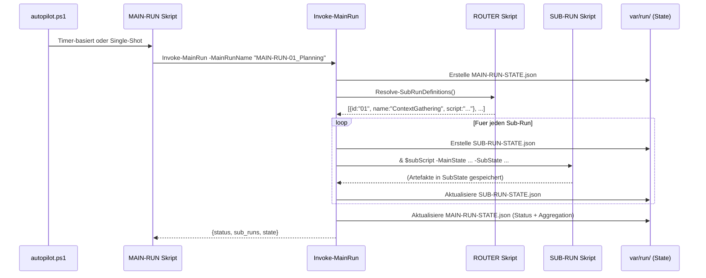

# VORCE-AUTOPILOT 2.0 – ARCHITEKTUR-DOKUMENTATION

## 1. Übersicht

Vorce-Autopilot 2.0 verwendet eine baumartige, hierarchische Orchestrierung. Jede Phase (Planning, Monitoring, Audit) wird als **MAIN-RUN** ausgeführt, der über einen **ROUTER** dynamisch entscheidet, welche **SUB-RUN**s nötig sind. Legacy-Code bleibt über Fallback-SUB-RUNs aktiv, während die Logik schrittweise in dedizierte SUB-RUNs migriert wird.

## 2. Verzeichnisstruktur

```
Vorce-Autopilot_2.0/
├── autopilot.ps1                    # Haupt-Loop (Timer-gesteuert)
├── Start-Autopilot.ps1              # Suite-Starter (Dashboard + Sync + Backend)
├── config/
│   └── autopilot-config.json        # Zentrale Konfiguration inkl. Router-Regeln
├── src/
│   ├── orchestrator/
│   │   └── Invoke-MainRun.ps1       # Orchestrator: Steuert Main→Router→Sub Lifecycle
│   ├── runs/
│   │   ├── MAIN-RUN/                # Einstiegsskripte pro Phase
│   │   │   ├── MAIN-RUN-01_Planning.ps1
│   │   │   ├── MAIN-RUN-02_Monitoring.ps1
│   │   │   └── MAIN-RUN-03_Audit.ps1
│   │   ├── ROUTER/                  # Router-Skripte pro Main-Run
│   │   │   ├── ROUTER_MAIN-RUN-01_Planning.ps1
│   │   │   ├── ROUTER_MAIN-RUN-02_Monitoring.ps1
│   │   │   └── ROUTER_MAIN-RUN-03_Audit.ps1
│   │   └── SUB-RUN/                 # Alle Sub-Run Implementierungen
│   │       ├── SUB-RUN-01_MR-01_Planning__ContextGathering.ps1
│   │       ├── SUB-RUN-02_MR-01_Planning__LegacyFallback.ps1
│   │       ├── SUB-RUN-01_MR-02_Monitoring__SystemHealthCheck.ps1
│   │       ├── SUB-RUN-02_MR-02_Monitoring__LegacyFallback.ps1
│   │       ├── SUB-RUN-01_MR-03_Audit__ConsistencyAudit.ps1
│   │       └── SUB-RUN-02_MR-03_Audit__LegacyFallback.ps1
│   ├── phases/                      # Legacy-Logik (wird von Fallback-SUB-RUNs aufgerufen)
│   │   ├── planning-wakeup.ps1
│   │   ├── monitoring-wakeup.ps1
│   │   ├── audit-wakeup.ps1
│   │   └── interval-stats.ps1
│   ├── lib/                         # Shared Libraries
│   │   ├── run-state-manager.ps1    # Hierarchisches State-Management
│   │   ├── state-manager.ps1        # Globaler Autopilot-State
│   │   ├── cli-router.ps1           # LLM/CLI Provider-Routing
│   │   ├── quota-manager.ps1        # API-Quota Tracking
│   │   └── ...                      # Weitere Utility-Module
│   ├── agents/                      # (Reserviert fuer dedizierte Agent-Logik)
│   └── workers/                     # (Reserviert fuer Micro-Worker Skripte)
├── var/
│   ├── db/                          # Persistenter State (JSON)
│   ├── log/                         # Laufzeit-Logs
│   └── run/                         # Hierarchische Run-States pro Ausfuehrung
└── dashboard/                       # React/Vite Web-Dashboard
```

## 3. Kernkomponenten

### 3.1 Der Orchestrator (`Invoke-MainRun.ps1`)

Der zentrale Einstiegspunkt für jede Phase. Verantwortlich für:

1. **Run-Initialisierung**: Erstellt eine eindeutige Run-ID und Verzeichnisstruktur in `var/run/`.
2. **Router-Auflösung**: Ruft das passende ROUTER-Skript auf. Falls keines existiert, nutzt er die `router_rules` aus der Config als Fallback.
3. **Sub-Run-Ausführung**: Iteriert sequentiell über die vom Router definierten Sub-Runs und übergibt hierarchische States.
4. **Fehler-Isolation**: Ein fehlgeschlagener Sub-Run bricht NICHT den gesamten Main-Run ab.
5. **State-Aggregation**: Dokumentiert den Status jedes Sub-Runs (inkl. übersprungener) im `MAIN-RUN-STATE`.

**Neue Features:**
- **`-ForceAllSubRuns`**: Erzwingt die Ausführung aller Sub-Runs, auch wenn der Router sie überspringen würde.
- **Config-Fallback**: Wenn kein ROUTER-Skript existiert, werden die `router_rules` aus `autopilot-config.json` gelesen.
- **Partial-Status**: Wenn nur einige Sub-Runs fehlschlagen, erhält der Main-Run den Status `partial` statt `failed`.

### 3.2 Die Router (`src/runs/ROUTER/`)

Jeder Main-Run hat ein eigenes Router-Skript, das entscheidet welche Sub-Runs ausgeführt werden:

- Liest Sub-Run-Definitionen primär aus `Config.router_rules`
- Kann zusätzliche Entscheidungslogik implementieren (z.B. basierend auf `$GlobalState`)
- Falls keine Config-Regeln existieren, nutzt ein hardcodierter Fallback
- Gibt ein Array von Sub-Run-Definitionen zurück: `@{ id; name; script }`

### 3.3 Sub-Runs (`src/runs/SUB-RUN/`)

Jeder Sub-Run ist ein eigenständiges Skript mit einheitlicher Signatur:

```powershell
param($MainState, $SubState, $GlobalState, $Config, $QuotaRegistry, $DryRun)
```

**Namenskonvention:** `SUB-RUN-{Nr}_MR-{Nr}_{Phase}__{Funktion}.ps1`

Beispiel: `SUB-RUN-01_MR-01_Planning__ContextGathering.ps1`

### 3.4 Legacy-Fallback-Strategie

SUB-RUNs mit dem Suffix `__LegacyFallback` rufen die alten Wakeup-Funktionen auf:

```
MAIN-RUN-01_Planning
  └── ROUTER → [ContextGathering, LegacyFallback]
       ├── SUB-RUN-01: Sync (GitHub, Jules, PRs) → NEU
       └── SUB-RUN-02: Invoke-PlanningWakeUp -SkipSync → ALT
```

## 4. Datenfluss



## 5. Konfiguration

Die `router_rules` in `autopilot-config.json` steuern, welche Sub-Runs aktiv sind:

```json
{
  "router_rules": {
    "Planning": [
      { "id": "01", "name": "ContextGathering", "script": "src/runs/SUB-RUN/...", "enabled": true },
      { "id": "02", "name": "LegacyFallback", "script": "src/runs/SUB-RUN/...", "enabled": true }
    ]
  }
}
```

Sub-Runs können über `"enabled": false` deaktiviert werden, ohne Code zu ändern.

## 6. Vorteile

- **Transparenz**: Jeder Run hinterlässt einen JSON-State in `var/run/`.
- **Resilienz**: Fehler in einem Sub-Run isolieren sich; der Main-Run kann fortfahren.
- **Effizienz**: Der Router überspringt unnötige Sub-Runs.
- **Konfigurierbarkeit**: Sub-Runs können per Config aktiviert/deaktiviert werden.
- **Wartbarkeit**: Klare Trennung von Orchestrierung und Logik.
- **Abwärtskompatibilität**: Legacy-Fallbacks garantieren unterbrechungsfreien Betrieb.
