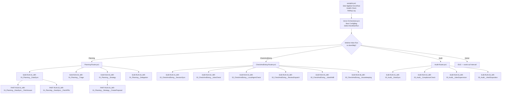

# Vorce-Factory - Historischer Refactoring-Plan v3

> Historisch: Dieser Plan enthaelt alte Pfade/Namen. Aktuelle offene Punkte stehen in `CURRENT_IMPLEMENTATION_GAP_PLAN.md`.

> **Stand:** 2026-06-14  
> **Autor:** Antigravity (Review & Neustrukturierung des bestehenden Plans)  
> **Ziel:** Vollständig funktionsfähiges, modulares Autopilot-Framework mit 5 MAIN-RUNs, konsequenter PART-RUN-Verschachtelung, CLI-delegierbaren Arbeitseinheiten und Echtzeit-Dashboard-Sync via WebSocket.

## Review-Korrekturen vom 2026-06-14

- Der kanonische Ordnername ist `MAIN-RUN-04_Optimizer`; die frühere Bezeichnung `MAIN-RUN-04_Autopilot-Optimizer` war nicht mit Code, Router und Scheduling vereinbar.
- Die Long-Naming-Konvention gilt auch für PART-RUN-Dateien, damit Dateinamen außerhalb ihres Elternordners eindeutig bleiben.
- Jeder ausführbare SUB-RUN besitzt mindestens einen `PART-RUNS/`-Unterordner mit mindestens einem fachlich benannten PART-RUN. SUB-RUNs koordinieren und aggregieren; fachliche Arbeit findet in PART-RUNs statt.
- Prompts werden über `var/prompts/prompt-registry.json` mit stabilen IDs aufgelöst. Physische Dateien folgen der Hierarchie `system/`, `shared/`, `agents/` und `runs/<MAIN-RUN>/<SUB-RUN>/`.
- Jeder der fünf MAIN-RUNs besitzt ein eigenes Scheduling-Intervall: Planning, CheckAndDoing, Audit, Optimizer und MemoryOptimization.
- Router erhalten `-ConfigBag` und `-MainState`; SUB-RUNs erhalten `-ConfigBag` und `-ParentState`.
- `-DryRun` führt genau einen netzwerkfreien Orchestrator-Zyklus aus und beendet danach den Autopilot.
- `global-state.json` mit leerem Inhalt oder `null` wird als fehlender State behandelt und durch einen gültigen Default-State ersetzt.

---

## 🟢 Entscheidungen zu Open Questions (Final)

> [!IMPORTANT]
> **Strukturbruch behoben:** Der alte Plan hatte PART-RUNS als flachen Ordner NEBEN den SUB-RUNS (geschwisterlich). Jeder SUB-RUN ist ein **Ordner**, dessen `.ps1`-Skript ausschließlich koordiniert und aggregiert. Jeder SUB-RUN besitzt einen `PART-RUNS/`-Unterordner; dort liegen die ausführbaren fachlichen Arbeitseinheiten.
>
> **MAIN-RUN-04 & 05 INTEGRIERT (CORE):** MAIN-RUN-04_Optimizer und MAIN-RUN-05_MemoryOptimization sind **keine** optionalen Phasen mehr — sie wurden als CORE-RUNS in Phase 6 fest integriert. Der Optimizer optimiert anhand von Statistiken Workflows, Text-Prompts und RUNs. MemoryOptimization prüft und bereinigt Memory-Einträge.
>
> **Naming-Konvention (Long-Version — verbindlich):** Es gilt ausschließlich die Long-Version mit MAIN-RUN-Prefix im SUB-RUN-Namen:
> - Statt `SUB-RUN-01_DataSync` → `SUB-RUN-01_MR-01_Planning__DataSync`
> - Statt `SUB-RUN-02_Triage` → `SUB-RUN-02_MR-01_Planning__Triage`
> - Das logische System ("MR-XX_Name__SubName") macht Verknüpfungen über alle Hierarchieebenen hinweg eindeutig klar.
>
> **CLI-Fallback-Chain (Alle RUNs):** Alle 7 CLIs final in Fallback-Chain integriert: `gemini` (Primary), `claude` (Secondary), `codex`, `kiro`, `copilot`, `cursor-agent`, `hermes` (Fallback 1-5).
>
> **`src/tools/` Ordner:** Wird mit Background-Services (GitHub Sync, Jules Monitoring, Dashboard WebSocket-Server) aufgenommen.
>
> **Dashboard-Sync:** Setzt auf **WebSocket** für Echtzeit-Synchronisation. WebSocket-Server in `src/tools/services/sync-service.ps1` pusht Status-Änderungen.
>
> **Text-Prompts:** Alle Prompts besitzen stabile IDs in `var/prompts/prompt-registry.json`. System-, Shared-, Agent- und RUN-Prompts liegen getrennt und verwenden optimierte Long-Namen.

### Kanonische Prompt-Struktur

```text
var/prompts/
├── prompt-registry.json
├── system/
│   ├── SYSTEM-PROMPT-01_Autopilot__CEO-Orchestrator.md
│   └── SYSTEM-PROMPT-02_Autopilot__Dashboard-Context-Policy.md
├── shared/
│   └── deliberation/
│       ├── SHARED-PROMPT-01_Deliberation__Proposal.md
│       ├── SHARED-PROMPT-02_Deliberation__Critique.md
│       └── SHARED-PROMPT-03_Deliberation__Synthesis.md
├── agents/
│   └── jules/
│       └── AGENT-PROMPT-[NN]_Jules__[Task].md
└── runs/
    └── MAIN-RUN-[NN]_[Name]/
        ├── MAIN-RUN-PROMPT-[NN]_MR-[NN]_[Name]__[Task].md
        └── SUB-RUN-[NN]_MR-[NN]_[Name]__[SubName]/
            └── PART-RUN-PROMPT-[NN]_MR-[NN]_[Name]__[SubName]__[Task].md
```

Prompt-Dateien werden nicht über ihren Dateinamen als API-Vertrag angesprochen, sondern über stabile Registry-IDs wie `planning_session`, `pr_review` oder `deliberation_proposal`.

> [!WARNING]
> **Restore-Dateien als Referenz:** In `Vorce-Autopilot_Restore/Vorce-Autopilot_3.0_draft/` existieren substantiell implementierte Dateien (quota-manager.ps1 mit 156 Zeilen, Router mit echter Logik, DataSync mit 78 Zeilen). Diese können als **Referenz** dienen, sollen aber gemäß Zero-Legacy-Regel nicht direkt kopiert werden. Die CLI-Prompts referenzieren die Draft-Dateien explizit als "Logik-Referenz".

---

## 1. Fehleranalyse: Alter Plan vs. IST-Zustand

### 1.1 Strukturfehler im alten Plan

| # | Problem | Detail | Auswirkung |
|---|---------|--------|------------|
| **S1** | PART-RUNS sind Geschwister-Ordner statt Kinder | Im IST: `MAIN-RUN-01_Planning/PART-RUNS/` und `MAIN-RUN-01_Planning/SUB-RUNS/` nebeneinander. Richtig wäre: PART-RUNS **innerhalb** jedes SUB-RUN-Ordners. | PART-RUNs sind keinem SUB-RUN zugeordnet → unklar welcher PART-RUN zu welchem SUB-RUN gehört |
| **S2** | SUB-RUNs sind Dateien statt Ordner | Im IST: `SUB-RUNS/SUB-RUN-01_MR-01_Planning__DataSync.ps1` (Datei). Richtig: `SUB-RUNS/SUB-RUN-01_MR-01_Planning__DataSync/` (Ordner) mit koordinierendem `.ps1` und verpflichtendem `PART-RUNS/` Unterordner. | Kein Platz für PART-RUNs, keine Isolation |
| **S3** | Fehlende MAIN-RUNs 02-05 | Nur `MAIN-RUN-01_Planning/` existiert als Ordner. Die im Plan beschriebenen MAIN-RUN-02 und 03 existieren nicht. Draft hat 5. | Kein Monitoring, kein Audit, kein Optimizer |
| **S4** | `var/log/` fehlt im Dateisystem | Plan sagt es existiert nicht, `autopilot.ps1` erstellt es zur Laufzeit → aber **keine** Garantie beim ersten Start | `Rotate-Logs` wirft keinen Fehler, aber `Write-VorceLog` schreibt ins Nichts |
| **S5** | `var/db/proposals/` fehlt | Weder als Ordner noch als Datei vorhanden | `CreateProposal` PART-RUN würde crashen |
| **S6** | Lib-Struktur ist flach statt kategorisiert | Im IST: `src/lib/*.ps1` (10 Dateien flach). Draft hat: `src/lib/engines/`, `src/lib/integrations/`, `src/lib/state/`, `src/lib/utils/` | Bei 15+ Modulen wird die flache Struktur unübersichtlich |

### 1.2 Code-Bugs (aus altem Plan bestätigt + NEU gefundene)

| # | Datei | Bug | Schwere |
|---|-------|-----|---------|
| **C1** | [StateManager.ps1](file:///c:/Users/Vinyl/Desktop/VJMapper/VjMapper/Vorce-Autopilot_NEW/src/lib/StateManager.ps1) | `$PSScriptRoot` relativ → bricht in Job-Kontext und bei verschachteltem Dot-Sourcing | 🔴 BLOCKER |
| **C2** | [RunEngine.ps1](file:///c:/Users/Vinyl/Desktop/VJMapper/VjMapper/Vorce-Autopilot_NEW/src/lib/RunEngine.ps1#L58-L66) | Background-Job hat keinen Zugriff auf `$VarDir`; `$PSScriptRoot` in Zeile 66 zeigt auf Job-Kontext, nicht auf `lib/` | 🔴 BLOCKER |
| **C3** | [ApiClient.ps1](file:///c:/Users/Vinyl/Desktop/VJMapper/VjMapper/Vorce-Autopilot_NEW/src/lib/ApiClient.ps1#L31) | `Export-ModuleMember` in Dot-Source-Datei → wirft Fehler | 🔴 BLOCKER |
| **C4** | [Vorce-Orchestrator.ps1](file:///c:/Users/Vinyl/Desktop/VJMapper/VjMapper/Vorce-Autopilot_NEW/src/orchestrator/Vorce-Orchestrator.ps1#L20) | Hardkodiert auf `MAIN-RUN-01_Planning`, keine Scheduling-Logik | 🔴 BLOCKER |
| **C5** | [SUB-RUN-01_MR-01_Planning__DataSync.ps1](file:///c:/Users/Vinyl/Desktop/VJMapper/VjMapper/Vorce-Autopilot_NEW/src/runs/MAIN-RUN-01_Planning/SUB-RUNS/SUB-RUN-01_MR-01_Planning__DataSync.ps1#L6-L7) | Lädt `RunEngine` aber **nicht** `StateManager` und `GitHubClient` die intern gebraucht werden | 🔴 BLOCKER |
| **C6** | PART-RUN-04_CreateProposal.ps1 | Hardkodierte Strings (Repo-Name, Dashboard-Pfade) | 🟡 MEDIUM |
| **C7** | [autopilot.ps1](file:///c:/Users/Vinyl/Desktop/VJMapper/VjMapper/Vorce-Autopilot_NEW/autopilot.ps1#L12-L13) | Setzt `$ScriptDir`/`$VarDir` als lokale Variablen statt `$global:VorceRoot` → Module können nicht darauf zugreifen | 🔴 BLOCKER (NEU) |
| **C8** | [Vorce-Orchestrator.ps1](file:///c:/Users/Vinyl/Desktop/VJMapper/VjMapper/Vorce-Autopilot_NEW/src/orchestrator/Vorce-Orchestrator.ps1#L8-L9) | Nutzt `$PSScriptRoot` für `$RunsDir` statt `$global:VorceRoot` → bricht wenn per `&` aufgerufen | 🟡 MEDIUM (NEU) |
| **C9** | [Vorce-Orchestrator.ps1](file:///c:/Users/Vinyl/Desktop/VJMapper/VjMapper/Vorce-Autopilot_NEW/src/orchestrator/Vorce-Orchestrator.ps1#L49-L61) | Kein Try/Catch um Sub-Run-Aufrufe → ein fehlerhafter Sub-Run killt den gesamten Orchestrator-Lauf | 🔴 BLOCKER (NEU) |
| **C10** | [autopilot.ps1](file:///c:/Users/Vinyl/Desktop/VJMapper/VjMapper/Vorce-Autopilot_NEW/autopilot.ps1#L68) | Catch-Block nutzt `"Red"` als 2. Parameter, aber `Write-VorceLog` erwartet `-Status` (String "Red" ist kein gültiger Status) | 🟡 MEDIUM (NEU) |
| **C11** | [RunEngine.ps1](file:///c:/Users/Vinyl/Desktop/VJMapper/VjMapper/Vorce-Autopilot_NEW/src/lib/RunEngine.ps1#L31) | `$statePath` nutzt `$PSScriptRoot` in `Invoke-VorcePartRun` → identischer Bug wie C1 | 🔴 BLOCKER (NEU) |

### 1.3 Workflow-/Logik-Probleme

| # | Problem | Detail |
|---|---------|--------|
| **W1** | **Kein ConfigBag-Pattern** | Jeder SUB-RUN muss individuell Config laden. Besser: Orchestrator baut ein `$ConfigBag` Hashtable mit allen nötigen Daten (Config, GlobalState, QuotaRegistry) und gibt es durch. |
| **W2** | **Router hat keine standardisierte Signatur** | `Planning-Router.ps1` nimmt `$MainState`, Draft-Router nimmt `$GlobalState, $Config, $MainState, $QuotaRegistry`. Es braucht EIN Standard-Interface. |
| **W3** | **Keine Retry-Logik** | Wenn ein Agent-Aufruf fehlschlägt (Timeout, Rate-Limit), gibt es keinen Retry-Mechanismus. |
| **W4** | **Kein Health-Check vor Start** | Der Autopilot startet blind ohne zu prüfen ob `gh` CLI verfügbar ist, ob Internet-Verbindung besteht, ob `var/` beschreibbar ist. |
| **W5** | **`global-state.json` enthält nur `null`** | Die Datei existiert mit 6 Bytes → ist vermutlich `null` oder `false`. `Read-VorceGlobalState` fängt das nicht ab (gibt `null` zurück statt Default). |
| **W6** | **Orchestrator übergibt `$GlobalState` nicht an Sub-Runs** | Der Orchestrator hat `$GlobalState` als Parameter, gibt aber nur `$ParentState` weiter. Sub-Runs die `$GlobalState` brauchen (z.B. für `active_delegations`) bekommen ihn nicht. |

---

## 2. Korrigierte Kanonische Verzeichnisstruktur

```text
Vorce-Autopilot_NEW/
├── autopilot.ps1                          # Wächter-Loop (setzt $global:VorceRoot)
├── Start-Autopilot.ps1                    # Bootstrapper (Dashboard, Health-Check)
│
├── src/
│   ├── lib/                               # Wiederverwendbare Module
│   │   ├── state/                         # Zustandsverwaltung
│   │   │   ├── StateManager.ps1           # Global-State & Run-State I/O
│   │   │   └── RunStateManager.ps1        # Initialize/Update/Complete-RunState
│   │   │
│   │   ├── engines/                       # Kern-Engines
│   │   │   ├── RunEngine.ps1              # Parallele PART-RUN Ausführung
│   │   │   ├── DeliberationEngine.ps1     # Dual-Agent Deliberation
│   │   │   └── QuotaManager.ps1           # [NEU] Quoten-Prüfung & Provider-Routing
│   │   │
│   │   ├── integrations/                  # Externe Dienst-Anbindungen
│   │   │   ├── GitHubClient.ps1           # GitHub Issues/PRs via gh CLI
│   │   │   ├── AgentRunner.ps1            # KI-Agent CLI Ausführung (Fallback-Chain)
│   │   │   └── ApiClient.ps1              # Basis REST-Client
│   │   │
│   │   └── utils/                         # Hilfsfunktionen
│   │       ├── StatusPrinter.ps1          # Terminal-Ausgaben (Icons, Farben)
│   │       ├── PromptManager.ps1          # Prompt-Laden & Template-Ersetzung
│   │       ├── ProjectManager.ps1         # GitHub Project V2 Board Sync
│   │       └── TriageUtils.ps1            # Issue-Filterung
│   │
│   ├── tools/                             # [NEU] Background-Services & Agent-Tools
│   │   ├── agents/                        # Agent-Ausführungsskripte
│   │   │   ├── run-local-agent-task.ps1
│   │   │   ├── run-background-review.ps1
│   │   │   └── run-ceo-phase.ps1
│   │   │
│   │   └── services/                      # Hintergrund-Dienste
│   │       ├── sync-service.ps1           # GitHub-Dashboard Sync (WebSocket)
│   │       └── jules-monitor.ps1          # Jules Session Monitoring
│   │
│   ├── orchestrator/
│   │   └── Vorce-Orchestrator.ps1         # Haupt-Dispatcher (Scheduling, ConfigBag)
│   │
│   └── runs/
│       ├── MAIN-RUN-01_Planning/
│       │   ├── Planning-Router.ps1        # Dynamische SUB-RUN-Auswahl
│       │   └── SUB-RUNS/
│       │       ├── SUB-RUN-01_MR-01_Planning__DataSync/
│       │       │   ├── SUB-RUN-01_MR-01_Planning__DataSync.ps1
│       │       │   └── PART-RUNS/
│       │       │       ├── PART-RUN-01_MR-01_Planning__DataSync__FetchIssues.ps1
│       │       │       └── PART-RUN-02_MR-01_Planning__DataSync__FetchPRs.ps1
│       │       │
│       │       ├── SUB-RUN-02_MR-01_Planning__Triage/
│       │       │   ├── SUB-RUN-02_MR-01_Planning__Triage.ps1
│       │       │   └── PART-RUNS/
│       │       │       └── PART-RUN-01_MR-01_Planning__Triage__FilterIssues.ps1
│       │       │
│       │       ├── SUB-RUN-03_MR-01_Planning__Strategy/
│       │       │   ├── SUB-RUN-03_MR-01_Planning__Strategy.ps1
│       │       │   └── PART-RUNS/
│       │       │       └── PART-RUN-01_MR-01_Planning__Strategy__CreateProposal.ps1
│       │       │
│       │       └── SUB-RUN-04_MR-01_Planning__Delegation/
│       │           ├── SUB-RUN-04_MR-01_Planning__Delegation.ps1
│       │           └── PART-RUNS/
│       │               └── PART-RUN-01_MR-01_Planning__Delegation__CreateDelegations.ps1
│       │
│       ├── MAIN-RUN-02_CheckAndDoing/
│       │   ├── CheckAndDoing-Router.ps1
│       │   └── SUB-RUNS/
│       │       ├── SUB-RUN-01_MR-02_CheckAndDoing__SessionSync/
│       │       │   ├── SUB-RUN-01_MR-02_CheckAndDoing__SessionSync.ps1
│       │       │   └── PART-RUNS/PART-RUN-01_MR-02_CheckAndDoing__SessionSync__SyncActiveSessions.ps1
│       │       │
│       │       ├── SUB-RUN-02_MR-02_CheckAndDoing__JulesCheck/
│       │       │   ├── SUB-RUN-02_MR-02_CheckAndDoing__JulesCheck.ps1
│       │       │   └── PART-RUNS/PART-RUN-01_MR-02_CheckAndDoing__JulesCheck__InspectJulesSessions.ps1
│       │       │
│       │       ├── SUB-RUN-03_MR-02_CheckAndDoing__LocalAgentCheck/
│       │       │   ├── SUB-RUN-03_MR-02_CheckAndDoing__LocalAgentCheck.ps1
│       │       │   └── PART-RUNS/PART-RUN-01_MR-02_CheckAndDoing__LocalAgentCheck__InspectLocalAgents.ps1
│       │       │
│       │       ├── SUB-RUN-04_MR-02_CheckAndDoing__ReviewDispatch/
│       │       │   ├── SUB-RUN-04_MR-02_CheckAndDoing__ReviewDispatch.ps1
│       │       │   └── PART-RUNS/PART-RUN-01_MR-02_CheckAndDoing__ReviewDispatch__DispatchReviews.ps1
│       │       │
│       │       ├── SUB-RUN-05_MR-02_CheckAndDoing__JulesRefill/
│       │       │   ├── SUB-RUN-05_MR-02_CheckAndDoing__JulesRefill.ps1
│       │       │   └── PART-RUNS/PART-RUN-01_MR-02_CheckAndDoing__JulesRefill__RefillJulesQueue.ps1
│       │       │
│       │       └── SUB-RUN-06_MR-02_CheckAndDoing__Housekeeping/
│       │           ├── SUB-RUN-06_MR-02_CheckAndDoing__Housekeeping.ps1
│       │           └── PART-RUNS/PART-RUN-01_MR-02_CheckAndDoing__Housekeeping__CleanupRuntimeState.ps1
│       │
│       ├── MAIN-RUN-03_Audit/
│       │   ├── Audit-Router.ps1
│       │   └── SUB-RUNS/
│       │       ├── SUB-RUN-01_MR-03_Audit__DataSync/
│       │       │   ├── SUB-RUN-01_MR-03_Audit__DataSync.ps1
│       │       │   └── PART-RUNS/PART-RUN-01_MR-03_Audit__DataSync__ValidateDataSources.ps1
│       │       ├── SUB-RUN-02_MR-03_Audit__ComplianceCheck/
│       │       │   ├── SUB-RUN-02_MR-03_Audit__ComplianceCheck.ps1
│       │       │   └── PART-RUNS/PART-RUN-01_MR-03_Audit__ComplianceCheck__EvaluateCompliance.ps1
│       │       ├── SUB-RUN-03_MR-03_Audit__JulesSupervision/     # [NEU aus Draft]
│       │       │   ├── SUB-RUN-03_MR-03_Audit__JulesSupervision.ps1
│       │       │   └── PART-RUNS/PART-RUN-01_MR-03_Audit__JulesSupervision__SuperviseJulesSessions.ps1
│       │       └── SUB-RUN-04_MR-03_Audit__AlertDisposition/     # [NEU aus Draft]
│       │           ├── SUB-RUN-04_MR-03_Audit__AlertDisposition.ps1
│       │           └── PART-RUNS/PART-RUN-01_MR-03_Audit__AlertDisposition__DispositionAlerts.ps1
│       │
│       ├── MAIN-RUN-04_Optimizer/          # CORE (nicht optional)
│       │   ├── Optimizer-Router.ps1
│       │   └── SUB-RUNS/
│       │       ├── SUB-RUN-01_MR-04_Optimizer__PerformanceDataCollection/
│       │       │   ├── SUB-RUN-01_MR-04_Optimizer__PerformanceDataCollection.ps1
│       │       │   └── PART-RUNS/PART-RUN-01_MR-04_Optimizer__PerformanceDataCollection__CollectPerformanceMetrics.ps1
│       │       └── SUB-RUN-02_MR-04_Optimizer__SystemAnalysis/
│       │           ├── SUB-RUN-02_MR-04_Optimizer__SystemAnalysis.ps1
│       │           └── PART-RUNS/PART-RUN-01_MR-04_Optimizer__SystemAnalysis__AnalyzeSystemPerformance.ps1
│       │
│       └── MAIN-RUN-05_MemoryOptimization/           # CORE (nicht optional)
│           ├── MemoryOptimization-Router.ps1
│           └── SUB-RUNS/
│               └── SUB-RUN-01_MR-05_MemoryOptimization__MemoryMaintenance/
│                   ├── SUB-RUN-01_MR-05_MemoryOptimization__MemoryMaintenance.ps1
│                   └── PART-RUNS/PART-RUN-01_MR-05_MemoryOptimization__MemoryMaintenance__OptimizeMemoryStore.ps1
│
├── test/
│   ├── Test-Boot.ps1                      # [NEU] Phase 1 Validierung
│   ├── Test-OrchestratorDryRun.ps1        # [NEU] Phase 2 Validierung
│   ├── Test-PlanningRun.ps1               # [NEU] Phase 3 Validierung
│   └── Test-StartProcess.ps1              # Vorhanden
│
├── web/Dashboard/                         # Vite/React Dashboard
│
└── var/                                   # EINZIGER Schreibort für Laufzeitdaten
    ├── config/
    │   ├── autopilot-config.json
    │   └── quota-registry.json
    ├── db/
    │   ├── global-state.json
    │   ├── github-issues.json
    │   ├── pull-requests.json
    │   ├── triaged-issues.json
    │   ├── task-journal.json
    │   └── proposals/                     # [ORDNER ANLEGEN]
    ├── log/                               # [ORDNER ANLEGEN]
    ├── prompts/
    │   ├── prompt-registry.json
    │   ├── system/
    │   ├── shared/deliberation/
    │   ├── agents/jules/
    │   └── runs/MAIN-RUN-*/SUB-RUN-*/
    ├── run-states/
    └── tmp/
```

---

## 3. Standardisierte Interfaces (NEU)

### 3.1 ConfigBag-Pattern

Der Orchestrator baut **einmalig** ein ConfigBag-Hashtable und gibt es an Router → SUB-RUNs → PART-RUNs durch:

```powershell
$ConfigBag = @{
    VorceRoot     = $global:VorceRoot
    VarDir        = $global:VarDir
    LibDir        = $global:LibDir
    Config        = $Config          # aus autopilot-config.json
    GlobalState   = $GlobalState     # aus global-state.json
    QuotaRegistry = $QuotaRegistry   # aus quota-registry.json
    DryRun        = $DryRun
}
```

### 3.2 Router-Signatur (einheitlich)

```powershell
# Jeder Router MUSS diese Signatur haben:
param(
    [Parameter(Mandatory)][hashtable]$ConfigBag,
    [Parameter(Mandatory)][object]$MainState
)
# Rückgabe: Array von @{ id; name; script } Hashtables
```

### 3.3 SUB-RUN-Signatur (einheitlich)

```powershell
param(
    [Parameter(Mandatory)][hashtable]$ConfigBag,
    [Parameter(Mandatory)][object]$ParentState
)
# Rückgabe: PSCustomObject mit .status und .results
```

---

## 4. Implementierungs-Phasen

---

### Phase 1 — Fundament fixieren (Pfade, Ordner, Globals)

**Ziel:** Boot läuft fehlerfrei, alle Module ladbar, Logging aktiv.

#### Phase 1.1 — Ordner umstrukturieren

**Was zu tun ist:** Die bestehende flache Struktur in die neue kategorisierte Struktur überführen.

> **📋 CLI-PROMPT #1 — Ordnerstruktur Migration**
> ```
> Du arbeitest in: C:\Users\Vinyl\Desktop\VJMapper\VjMapper\Vorce-Autopilot_NEW
>
> Aufgabe: Erstelle die neue Ordnerstruktur und verschiebe bestehende Dateien.
> KEINE Dateiinhalte ändern — nur Ordner erstellen und Dateien verschieben!
>
> 1. Erstelle diese NEUEN Ordner (falls nicht vorhanden):
>    - src/lib/state/
>    - src/lib/engines/
>    - src/lib/integrations/
>    - src/lib/utils/
>    - var/log/
>    - var/db/proposals/
>
> 2. Verschiebe die bestehenden lib-Dateien:
>    - src/lib/StateManager.ps1       → src/lib/state/StateManager.ps1
>    - src/lib/RunEngine.ps1          → src/lib/engines/RunEngine.ps1
>    - src/lib/DeliberationEngine.ps1 → src/lib/engines/DeliberationEngine.ps1
>    - src/lib/GitHubClient.ps1       → src/lib/integrations/GitHubClient.ps1
>    - src/lib/AgentRunner.ps1        → src/lib/integrations/AgentRunner.ps1
>    - src/lib/ApiClient.ps1          → src/lib/integrations/ApiClient.ps1
>    - src/lib/StatusPrinter.ps1      → src/lib/utils/StatusPrinter.ps1
>    - src/lib/PromptManager.ps1      → src/lib/utils/PromptManager.ps1
>    - src/lib/ProjectManager.ps1     → src/lib/utils/ProjectManager.ps1
>    - src/lib/TriageUtils.ps1        → src/lib/utils/TriageUtils.ps1
>
> 3. Konvertiere SUB-RUN Dateien zu Ordnern (für MAIN-RUN-01_Planning):
>    - Erstelle: src/runs/MAIN-RUN-01_Planning/SUB-RUNS/SUB-RUN-01_MR-01_Planning__DataSync/
>    - Verschiebe: src/runs/MAIN-RUN-01_Planning/SUB-RUNS/SUB-RUN-01_MR-01_Planning__DataSync.ps1
>      → src/runs/MAIN-RUN-01_Planning/SUB-RUNS/SUB-RUN-01_MR-01_Planning__DataSync/SUB-RUN-01_MR-01_Planning__DataSync.ps1
>    - Erstelle: src/runs/MAIN-RUN-01_Planning/SUB-RUNS/SUB-RUN-01_MR-01_Planning__DataSync/PART-RUNS/
>    - Verschiebe die PART-RUN Dateien aus src/runs/MAIN-RUN-01_Planning/PART-RUNS/:
>      - PART-RUN-01_MR-01_Planning__DataSync__FetchIssues.ps1  → SUB-RUN-01_MR-01_Planning__DataSync/PART-RUNS/PART-RUN-01_MR-01_Planning__DataSync__FetchIssues.ps1
>      - PART-RUN-02_MR-01_Planning__DataSync__FetchPRs.ps1     → SUB-RUN-01_MR-01_Planning__DataSync/PART-RUNS/PART-RUN-02_MR-01_Planning__DataSync__FetchPRs.ps1
>    - Wiederhole für SUB-RUN-02_MR-01_Planning__Triage:
>      - PART-RUN-03_FilterIssues.ps1 → SUB-RUN-02_MR-01_Planning__Triage/PART-RUNS/PART-RUN-01_MR-01_Planning__Triage__FilterIssues.ps1 (UMBENENNUNG: Nummerierung beginnt pro SUB-RUN bei 01!)
>    - Wiederhole für SUB-RUN-03_MR-01_Planning__Strategy:
>      - PART-RUN-04_CreateProposal.ps1 → SUB-RUN-03_MR-01_Planning__Strategy/PART-RUNS/PART-RUN-01_MR-01_Planning__Strategy__CreateProposal.ps1
>    - Erstelle: SUB-RUN-04_MR-01_Planning__Delegation/ (leerer Ordner + leere SUB-RUN-04_MR-01_Planning__Delegation.ps1 Datei mit Kommentar "# TODO: Implementierung in Phase 3")
>    - Lösche den jetzt leeren Ordner: src/runs/MAIN-RUN-01_Planning/PART-RUNS/
>
> 4. Erstelle leere Verzeichnisse für MAIN-RUN-02 bis 03:
>    - src/runs/MAIN-RUN-02_CheckAndDoing/
>    - src/runs/MAIN-RUN-02_CheckAndDoing/SUB-RUNS/
>    - src/runs/MAIN-RUN-03_Audit/
>    - src/runs/MAIN-RUN-03_Audit/SUB-RUNS/
>
> Überprüfe danach mit `Get-ChildItem -Recurse src/` und `Get-ChildItem -Recurse var/` dass alles stimmt.
> ```

---

#### Phase 1.2 — Globale Variablen & Pfad-Bugs fixen

> **📋 CLI-PROMPT #2 — autopilot.ps1 Global Variables (C7)**
> ```
> Du arbeitest in: C:\Users\Vinyl\Desktop\VJMapper\VjMapper\Vorce-Autopilot_NEW\autopilot.ps1
>
> Aufgabe: Ersetze die lokalen Variablen durch globale Variablen.
>
> VORHER (Zeile 12-15):
>   $ScriptDir = $PSScriptRoot
>   $VarDir = Join-Path $ScriptDir "var"
>   $LogDir = Join-Path $VarDir "log"
>   $DbDir = Join-Path $VarDir "db"
>
> NACHHER:
>   $global:VorceRoot = $PSScriptRoot
>   $global:VarDir    = Join-Path $global:VorceRoot "var"
>   $global:SrcDir    = Join-Path $global:VorceRoot "src"
>   $global:LibDir    = Join-Path $global:SrcDir "lib"
>   $LogDir = Join-Path $global:VarDir "log"
>   $DbDir  = Join-Path $global:VarDir "db"
>
> Zusätzlich: Aktualisiere ALLE Stellen in autopilot.ps1 die $ScriptDir nutzen:
>   - Zeile 18: "src/lib/StatusPrinter.ps1" → "src/lib/utils/StatusPrinter.ps1"
>   - Zeile 19: "src/lib/StateManager.ps1" → "src/lib/state/StateManager.ps1"
>   - Alle $ScriptDir Referenzen → $global:VorceRoot
>   - Zeile 45: $configPath → nutze $global:VarDir
>   - Zeile 60: $orchestratorPath → nutze $global:VorceRoot
>
> Fix C10: Zeile 68: Write-VorceLog "..." "Red" → Write-VorceLog "..." -Status "ERROR"
>
> Füge nach den globalen Variablen einen Health-Check ein (W4):
>   # --- Health-Check ---
>   $requiredDirs = @($global:VarDir, $LogDir, $DbDir,
>       (Join-Path $global:VarDir "run-states"),
>       (Join-Path $global:VarDir "tmp"),
>       (Join-Path $DbDir "proposals"))
>   foreach ($dir in $requiredDirs) {
>       if (-not (Test-Path $dir)) { New-Item -ItemType Directory -Path $dir -Force | Out-Null }
>   }
> ```

> **📋 CLI-PROMPT #3 — StateManager.ps1 Pfad-Fix (C1)**
> ```
> Du arbeitest in: C:\Users\Vinyl\Desktop\VJMapper\VjMapper\Vorce-Autopilot_NEW\src\lib\state\StateManager.ps1
> (ACHTUNG: Datei wurde in Phase 1.1 nach src/lib/state/ verschoben!)
>
> Aufgabe: Ersetze ALLE $PSScriptRoot-basierten Pfade durch $global:VarDir.
>
> VORHER:
>   function Get-VorceGlobalStatePath {
>       return Join-Path $PSScriptRoot "../../var/db/global-state.json"
>   }
>
> NACHHER:
>   function Get-VorceGlobalStatePath {
>       return Join-Path $global:VarDir "db/global-state.json"
>   }
>
> VORHER (Zeile 34):
>   $statePath = Join-Path $PSScriptRoot "../../var/run-states/$($RunType)_$($RunName).json"
>
> NACHHER:
>   $statePath = Join-Path $global:VarDir "run-states/$($RunType)_$($RunName).json"
>
> Zusätzlich: In Read-VorceGlobalState, füge nach dem Test-Path Check hinzu:
>   $raw = Get-Content $path -Raw
>   if ([string]::IsNullOrWhiteSpace($raw) -or $raw -eq "null") {
>       # Datei existiert aber enthält ungültige Daten (W5)
>       return [pscustomobject]@{
>           version = "3.0.0"
>           last_run = (Get-Date).ToString("o")
>           last_runs = @{}
>           active_delegations = @()
>           review_queue = @()
>           escalated_issues = @()
>           stats = @{ runs_completed = 0; errors = 0 }
>       }
>   }
>   return $raw | ConvertFrom-Json
> ```

> **📋 CLI-PROMPT #4 — ApiClient.ps1 Export-Fix (C3)**
> ```
> Du arbeitest in: C:\Users\Vinyl\Desktop\VJMapper\VjMapper\Vorce-Autopilot_NEW\src\lib\integrations\ApiClient.ps1
> (ACHTUNG: Datei wurde in Phase 1.1 nach src/lib/integrations/ verschoben!)
>
> Aufgabe: Entferne die letzte Zeile "Export-ModuleMember -Function Invoke-VorceApiRequest"
> und den Kommentar darüber. Ersetze durch:
>   # Keine Export-ModuleMember nötig — diese Datei wird per Dot-Sourcing (.) geladen.
> ```

> **📋 CLI-PROMPT #5 — RunEngine.ps1 Pfad-Fix (C2, C11)**
> ```
> Du arbeitest in: C:\Users\Vinyl\Desktop\VJMapper\VjMapper\Vorce-Autopilot_NEW\src\lib\engines\RunEngine.ps1
> (ACHTUNG: Datei wurde in Phase 1.1 nach src/lib/engines/ verschoben!)
>
> Aufgabe: Alle $PSScriptRoot-Pfade durch $global:VarDir ersetzen.
>
> In Invoke-VorcePartRun:
>   VORHER (Zeile 31):
>     $statePath = Join-Path $PSScriptRoot "../../var/run-states/PART_$($PartName).json"
>   NACHHER:
>     $statePath = Join-Path $global:VarDir "run-states/PART_$($PartName).json"
>
> In Invoke-VorceSubRunParallel:
>   VORHER (Zeile 98):
>     $statePath = Join-Path $PSScriptRoot "../../var/run-states/SUB_$($SubRunName).json"
>   NACHHER:
>     $statePath = Join-Path $global:VarDir "run-states/SUB_$($SubRunName).json"
>
>   VORHER (Zeile 58-66 — Job-Block):
>     Der Background-Job nutzt $PSScriptRoot als LibDir → FALSCH
>   NACHHER:
>     $job = Start-Job -ScriptBlock {
>         param($pName, $pScript, $pLibDir, $pVarDir)
>         # Globale Variablen im Job-Kontext setzen
>         $global:VarDir = $pVarDir
>         # Libs im Job-Kontext laden
>         . (Join-Path $pLibDir "utils/StatusPrinter.ps1")
>         . (Join-Path $pLibDir "state/StateManager.ps1")
>         . (Join-Path $pLibDir "engines/RunEngine.ps1")
>         Invoke-VorcePartRun -PartName $pName -ScriptPath $pScript
>     } -ArgumentList $part.name, $part.script, $global:LibDir, $global:VarDir
> ```

---

#### Phase 1.3 — Alle Dot-Source-Pfade aktualisieren

> **📋 CLI-PROMPT #6 — Dot-Source-Pfade überall aktualisieren**
> ```
> Du arbeitest in: C:\Users\Vinyl\Desktop\VJMapper\VjMapper\Vorce-Autopilot_NEW
>
> Aufgabe: Suche in ALLEN .ps1 Dateien nach Dot-Source-Zeilen (Zeilen die mit ". (" beginnen)
> und aktualisiere die Pfade auf die neue lib-Unterordner-Struktur.
>
> Suche mit: Get-ChildItem -Recurse -Filter "*.ps1" | Select-String '\. \(Join-Path'
>
> Mapping der alten zu neuen Pfaden:
>   "../lib/StatusPrinter.ps1"      → "../lib/utils/StatusPrinter.ps1"
>   "../lib/StateManager.ps1"       → "../lib/state/StateManager.ps1"
>   "../lib/ProjectManager.ps1"     → "../lib/utils/ProjectManager.ps1"
>   "../lib/RunEngine.ps1"          → "../lib/engines/RunEngine.ps1"
>   "../lib/GitHubClient.ps1"       → "../lib/integrations/GitHubClient.ps1"
>   "../lib/AgentRunner.ps1"        → "../lib/integrations/AgentRunner.ps1"
>   "../lib/PromptManager.ps1"      → "../lib/utils/PromptManager.ps1"
>   "../lib/DeliberationEngine.ps1" → "../lib/engines/DeliberationEngine.ps1"
>   "../lib/TriageUtils.ps1"        → "../lib/utils/TriageUtils.ps1"
>   "../lib/ApiClient.ps1"          → "../lib/integrations/ApiClient.ps1"
>
> WICHTIG: Ersetze auch relative Pfade (../../../lib/) entsprechend!
> Nutze dabei $global:LibDir statt relativer Pfade wo möglich:
>   Statt:  . (Join-Path $ScriptDir "../../../lib/utils/StatusPrinter.ps1")
>   Nutze:  . (Join-Path $global:LibDir "utils/StatusPrinter.ps1")
>
> Dateien die geändert werden müssen:
>   - src/orchestrator/Vorce-Orchestrator.ps1 (lädt 4 Module)
>   - src/runs/MAIN-RUN-01_Planning/SUB-RUNS/SUB-RUN-01_MR-01_Planning__DataSync/SUB-RUN-01_MR-01_Planning__DataSync.ps1
>   - Alle anderen .ps1 die Module laden
> ```

---

#### Phase 1.4 — Test-Boot.ps1 schreiben

> **📋 CLI-PROMPT #7 — Test-Boot.ps1 erstellen**
> ```
> Du arbeitest in: C:\Users\Vinyl\Desktop\VJMapper\VjMapper\Vorce-Autopilot_NEW\test\Test-Boot.ps1
>
> Aufgabe: Erstelle ein PowerShell Test-Skript das prüft ob Phase 1 korrekt abgeschlossen ist.
>
> Das Skript soll folgende Checks durchführen und Ergebnis als PASS/FAIL ausgeben:
>
> 1. ORDNER-CHECKS:
>    - src/lib/state/ existiert
>    - src/lib/engines/ existiert
>    - src/lib/integrations/ existiert
>    - src/lib/utils/ existiert
>    - var/log/ existiert
>    - var/db/proposals/ existiert
>    - src/runs/MAIN-RUN-01_Planning/SUB-RUNS/SUB-RUN-01_MR-01_Planning__DataSync/ ist ein ORDNER (kein File)
>    - src/runs/MAIN-RUN-01_Planning/SUB-RUNS/SUB-RUN-01_MR-01_Planning__DataSync/PART-RUNS/ existiert
>    - src/runs/MAIN-RUN-01_Planning/PART-RUNS/ existiert NICHT mehr (alter Ordner gelöscht)
>
> 2. MODUL-CHECKS:
>    - Setze $global:VorceRoot auf den Parent-Ordner von test/
>    - Setze $global:VarDir, $global:SrcDir, $global:LibDir
>    - Versuche alle 10 Module per Dot-Source zu laden (jedes in Try/Catch)
>    - StatusPrinter.ps1, StateManager.ps1, RunEngine.ps1, etc.
>    - Prüfe dass KEINE Datei Export-ModuleMember enthält
>
> 3. GLOBAL-VARIABLE-CHECKS:
>    - Prüfe dass autopilot.ps1 die Strings "$global:VorceRoot" und "$global:VarDir" enthält
>    - Prüfe dass KEIN Modul in src/lib/ den String "$PSScriptRoot" für var/-Pfade nutzt
>
> 4. CONFIG-CHECKS:
>    - var/config/autopilot-config.json existiert und ist gültiges JSON
>    - var/config/quota-registry.json existiert und ist gültiges JSON
>
> Ausgabeformat:
>   [PASS] Ordner src/lib/state/ existiert
>   [FAIL] Modul ApiClient.ps1 enthält noch Export-ModuleMember!
>   ---
>   Ergebnis: 18/20 Checks bestanden
> ```

**✅ Checkpoint 1:** `Test-Boot.ps1` läuft mit 100% PASS durch.

---

### Phase 2 — Orchestrator-Kern stabilisieren

**Ziel:** Orchestrator kann dynamisch den richtigen Main-Run wählen, überlebt Sub-Run-Fehler, und baut das ConfigBag.

> **📋 CLI-PROMPT #8 — Vorce-Orchestrator.ps1 komplett überarbeiten (C4, C8, C9, W1, W6)**
> ```
> Du arbeitest in: C:\Users\Vinyl\Desktop\VJMapper\VjMapper\Vorce-Autopilot_NEW\src\orchestrator\Vorce-Orchestrator.ps1
>
> Aufgabe: Komplette Überarbeitung des Orchestrators.
>
> Der Orchestrator soll:
>
> A) Module laden (mit neuen Pfaden via $global:LibDir):
>    . (Join-Path $global:LibDir "utils/StatusPrinter.ps1")
>    . (Join-Path $global:LibDir "state/StateManager.ps1")
>    . (Join-Path $global:LibDir "utils/ProjectManager.ps1")
>    . (Join-Path $global:LibDir "engines/RunEngine.ps1")
>    . (Join-Path $global:LibDir "engines/QuotaManager.ps1")
>
> B) Config und Quota laden:
>    $Config = Get-Content (Join-Path $global:VarDir "config/autopilot-config.json") -Raw | ConvertFrom-Json
>    $QuotaRegistry = Get-Content (Join-Path $global:VarDir "config/quota-registry.json") -Raw | ConvertFrom-Json
>
> C) ConfigBag bauen (W1):
>    $ConfigBag = @{
>        VorceRoot = $global:VorceRoot; VarDir = $global:VarDir; LibDir = $global:LibDir
>        Config = $Config; GlobalState = $GlobalState; QuotaRegistry = $QuotaRegistry
>        DryRun = $DryRun
>    }
>
> D) Scheduling-Logik implementieren (C4):
>    function Select-NextMainRun {
>        param([object]$GlobalState, [object]$Config)
>        $runs = @(
>            @{ Name="MAIN-RUN-01_Planning"; IntervalKey="planning_minutes" },
>            @{ Name="MAIN-RUN-02_CheckAndDoing"; IntervalKey="check_and_doing_minutes" },
>            @{ Name="MAIN-RUN-03_Audit"; IntervalKey="monitoring_minutes" }
>        )
>        $now = Get-Date
>        $best = $null; $bestOverdue = -1
>        foreach ($run in $runs) {
>            $interval = [int]$Config.wake_intervals.($run.IntervalKey)
>            $lastRun = $null
>            if ($GlobalState.last_runs -and $GlobalState.last_runs.PSObject.Properties.Name -contains $run.Name) {
>                $lastRun = [datetime]$GlobalState.last_runs.($run.Name)
>            }
>            $overdue = if ($null -eq $lastRun) { [int]::MaxValue } else { ($now - $lastRun).TotalMinutes - $interval }
>            if ($overdue -gt $bestOverdue) { $best = $run; $bestOverdue = $overdue }
>        }
>        # Nur ausführen wenn mindestens ein Run überfällig ist
>        if ($bestOverdue -gt 0) { return $best.Name } else { return $null }
>    }
>
> E) Dynamischen Router-Aufruf (C8):
>    $RunsDir = Join-Path $global:SrcDir "runs"
>    $mainRunName = Select-NextMainRun -GlobalState $GlobalState -Config $Config
>    if ($null -eq $mainRunName) { Write-VorceStep "Kein Run überfällig." -Status "INFO"; return }
>    $RouterPath = Join-Path $RunsDir "$mainRunName/*-Router.ps1"  # Wildcard
>    $routerFile = Get-ChildItem -Path (Join-Path $RunsDir $mainRunName) -Filter "*-Router.ps1" | Select-Object -First 1
>
> F) Try/Catch um jeden Sub-Run (C9):
>    foreach ($sub in $SubRuns) {
>        try {
>            $subScript = Join-Path $global:VorceRoot $sub.script
>            $subResult = & $subScript -ConfigBag $ConfigBag -ParentState $MainState
>            $MainState.results += $subResult
>        } catch {
>            Write-VorceStep "Sub-Run $($sub.name) fehlgeschlagen: $($_.Exception.Message)" -Status "ERROR"
>            $MainState.results += @{ name=$sub.name; status="failed"; error=$_.Exception.Message }
>        }
>    }
>
> G) Nach Abschluss last_runs Timestamp aktualisieren:
>    if (-not $GlobalState.last_runs) { $GlobalState | Add-Member -MemberType NoteProperty -Name "last_runs" -Value @{} -Force }
>    $GlobalState.last_runs | Add-Member -MemberType NoteProperty -Name $mainRunName -Value (Get-Date).ToString("o") -Force
>    Save-VorceGlobalState -State $GlobalState
>
> REFERENZ: Sieh dir die Draft-Version an für Inspiration:
> C:\Users\Vinyl\Desktop\VJMapper\VjMapper\Vorce-Autopilot_Restore\Vorce-Autopilot_3.0_draft\src\core\Invoke-MainRun.ps1
> ```

> **📋 CLI-PROMPT #9 — QuotaManager.ps1 neu erstellen (L1)**
> ```
> Du arbeitest in: C:\Users\Vinyl\Desktop\VJMapper\VjMapper\Vorce-Autopilot_NEW\src\lib\engines\QuotaManager.ps1
>
> Aufgabe: Erstelle QuotaManager.ps1 als NEUES Modul.
>
> REFERENZ zur Logik (NICHT kopieren, nur als Logik-Referenz nutzen):
> C:\Users\Vinyl\Desktop\VJMapper\VjMapper\Vorce-Autopilot_Restore\Vorce-Autopilot_3.0_draft\src\lib\engines\quota-manager.ps1
>
> Das Modul soll folgende Funktionen haben:
>
> 1. Read-VorceQuotaRegistry
>    - Liest aus: $global:VarDir/config/quota-registry.json
>    - Gibt PSCustomObject zurück
>    - Bei Fehler: Warning + $null
>
> 2. Save-VorceQuotaRegistry
>    param([Parameter(Mandatory)][object]$Registry)
>    - Speichert nach: $global:VarDir/config/quota-registry.json
>    - Setzt $global:VorceExhaustedProviders zurück
>
> 3. Test-VorceQuota
>    param([string]$AgentName, [string]$ModelTier = "default")
>    - Prüft ob Provider enabled, nicht erschöpft, unter daily_limit, unter daily_budget_usd
>    - Prüft ob CLI-Command verfügbar (Get-Command)
>    - Gibt $true/$false zurück
>
> 4. Register-VorceQuotaUsage
>    param([string]$AgentName, [string]$ModelTier = "default", [double]$Cost = 0)
>    - Inkrementiert usage_today.calls
>    - Addiert Cost zu estimated_cost_usd
>    - Setzt last_synced_at Timestamp
>    - Speichert Registry
>
> 5. Get-VorceQuotaSummary
>    param([object]$Registry)
>    - Gibt Zusammenfassung aller Provider als String zurück
>
> WICHTIG:
> - KEIN Export-ModuleMember (Dot-Sourcing!)
> - KEIN hardkodierter Pfad (alles via $global:VarDir)
> - Keine DEBUG Write-Host Zeilen
> ```

> **📋 CLI-PROMPT #10 — Test-OrchestratorDryRun.ps1 erstellen**
> ```
> Du arbeitest in: C:\Users\Vinyl\Desktop\VJMapper\VjMapper\Vorce-Autopilot_NEW\test\Test-OrchestratorDryRun.ps1
>
> Aufgabe: Erstelle ein Test-Skript das den Orchestrator im DryRun-Modus prüft.
>
> 1. Setze $global:VorceRoot manuell
> 2. Lade alle benötigten Module
> 3. Erstelle einen Mock-GlobalState mit leeren last_runs
> 4. Rufe Select-NextMainRun auf → sollte einen Run zurückgeben (weil keiner je gelaufen ist)
> 5. Prüfe dass das Ergebnis ein gültiger MAIN-RUN Name ist
> 6. Erstelle einen Mock-GlobalState mit aktuellem Timestamp für alle Runs
> 7. Rufe Select-NextMainRun auf → sollte $null zurückgeben (weil keiner überfällig)
> 8. Prüfe dass der ConfigBag alle erwarteten Keys hat
>
> Ausgabe: PASS/FAIL pro Check
> ```

**✅ Checkpoint 2:** `Test-OrchestratorDryRun.ps1` läuft grün.

---

### Phase 3 — MAIN-RUN-01_Planning vollständig machen

**Ziel:** Ein kompletter Planning-Lauf (DataSync → Triage → Strategy → Delegation) läuft durch.

> **📋 CLI-PROMPT #11 — Planning-Router.ps1 mit echter Logik (L10)**
> ```
> Du arbeitest in: C:\Users\Vinyl\Desktop\VJMapper\VjMapper\Vorce-Autopilot_NEW\src\runs\MAIN-RUN-01_Planning\Planning-Router.ps1
>
> Aufgabe: Ersetze den Stub durch echte Routing-Logik.
>
> SIGNATUR (einheitlich):
>   param(
>       [Parameter(Mandatory)][hashtable]$ConfigBag,
>       [Parameter(Mandatory)][object]$MainState
>   )
>
> LOGIK (orientiert an Draft-Router):
> 1. DataSync läuft IMMER
> 2. Triage läuft IMMER
> 3. Strategy läuft NUR wenn weniger als N Issues in der Pipeline
>    - Lese $ConfigBag.Config.max_issues_per_planning_cycle
>    - Zähle aktuelle Issues aus var/db/github-issues.json
>    - Wenn Anzahl < max_issues → Strategy aktivieren
> 4. Delegation läuft IMMER
>
> RÜCKGABE: Array von Hashtables:
>   @{ id="01"; name="DataSync"; script="src/runs/MAIN-RUN-01_Planning/SUB-RUNS/SUB-RUN-01_MR-01_Planning__DataSync/SUB-RUN-01_MR-01_Planning__DataSync.ps1" }
>
> REFERENZ:
> C:\Users\Vinyl\Desktop\VJMapper\VjMapper\Vorce-Autopilot_Restore\Vorce-Autopilot_3.0_draft\src\runs\MAIN-RUN-01_Planning\ROUTER_MAIN-RUN-01_Planning.ps1
> ```

> **📋 CLI-PROMPT #12 — SUB-RUN-01_MR-01_Planning__DataSync.ps1 vollständig (C5)**
> ```
> Du arbeitest in: C:\Users\Vinyl\Desktop\VJMapper\VjMapper\Vorce-Autopilot_NEW\src\runs\MAIN-RUN-01_Planning\SUB-RUNS\SUB-RUN-01_MR-01_Planning__DataSync\SUB-RUN-01_MR-01_Planning__DataSync.ps1
>
> Aufgabe: Überarbeite den DataSync SUB-RUN.
>
> SIGNATUR:
>   param(
>       [Parameter(Mandatory)][hashtable]$ConfigBag,
>       [Parameter(Mandatory)][object]$ParentState
>   )
>
> BENÖTIGTE MODULE LADEN (via $global:LibDir):
>   - utils/StatusPrinter.ps1
>   - state/StateManager.ps1
>   - integrations/GitHubClient.ps1
>   - engines/RunEngine.ps1
>
> LOGIK:
> 1. PART-RUNs definieren (Pfade relativ zu $global:VorceRoot):
>    $myDir = $PSScriptRoot  # = .../SUB-RUN-01_MR-01_Planning__DataSync/
>    $PartRuns = @(
>        @{ name="FetchIssues"; script=(Join-Path $myDir "PART-RUNS/PART-RUN-01_MR-01_Planning__DataSync__FetchIssues.ps1") },
>        @{ name="FetchPRs";    script=(Join-Path $myDir "PART-RUNS/PART-RUN-02_MR-01_Planning__DataSync__FetchPRs.ps1") }
>    )
> 2. Invoke-VorceSubRunParallel aufrufen
> 3. Ergebnis zurückgeben
>
> REFERENZ:
> C:\Users\Vinyl\Desktop\VJMapper\VjMapper\Vorce-Autopilot_Restore\Vorce-Autopilot_3.0_draft\src\runs\MAIN-RUN-01_Planning\SUB-RUNS\SUB-RUN-01_MR-01_Planning__DataSync\SUB-RUN-01_MR-01_Planning__DataSync.ps1
> ```

> **📋 CLI-PROMPT #13 — SUB-RUN-02_MR-01_Planning__Triage.ps1 vollständig implementieren**
> ```
> Du arbeitest in: C:\Users\Vinyl\Desktop\VJMapper\VjMapper\Vorce-Autopilot_NEW\src\runs\MAIN-RUN-01_Planning\SUB-RUNS\SUB-RUN-02_MR-01_Planning__Triage\SUB-RUN-02_MR-01_Planning__Triage.ps1
>
> Aufgabe: Implementiere die Triage-Logik (aktuell Stub).
>
> SIGNATUR: param([hashtable]$ConfigBag, [object]$ParentState)
>
> LOGIK:
> 1. Lade Issues aus var/db/github-issues.json
> 2. Rufe Get-VorceTriagedIssues auf (aus TriageUtils.ps1 — lade via $global:LibDir "utils/TriageUtils.ps1")
> 3. Übergib $ConfigBag.Config.issue_filters als Filterregeln
> 4. Speichere Ergebnis in var/db/triaged-issues.json
> 5. Gib State mit Status und Anzahl zurück
>
> Hat einen PART-RUN: PART-RUN-01_MR-01_Planning__Triage__FilterIssues.ps1 im PART-RUNS/ Unterordner.
> Der SUB-RUN kann entweder direkt filtern ODER den PART-RUN via RunEngine aufrufen.
> Empfehlung: Direkter Aufruf (kein paralleler PART-RUN nötig bei nur 1 Task).
> ```

> **📋 CLI-PROMPT #14 — SUB-RUN-03_MR-01_Planning__Strategy.ps1 vollständig implementieren**
> ```
> Du arbeitest in: C:\Users\Vinyl\Desktop\VJMapper\VjMapper\Vorce-Autopilot_NEW\src\runs\MAIN-RUN-01_Planning\SUB-RUNS\SUB-RUN-03_MR-01_Planning__Strategy\SUB-RUN-03_MR-01_Planning__Strategy.ps1
>
> Aufgabe: Implementiere die Strategie/Deliberation-Logik (aktuell Stub).
>
> SIGNATUR: param([hashtable]$ConfigBag, [object]$ParentState)
>
> LOGIK:
> 1. Lade triagierte Issues aus var/db/triaged-issues.json
> 2. Für jedes Issue (bis max_issues_per_planning_cycle):
>    a. Quota prüfen via Test-VorceQuota
>    b. Invoke-VorceDeliberation aufrufen (aus DeliberationEngine.ps1)
>    c. Ergebnis als Proposal in var/db/proposals/ speichern (als proposal_[IssueNumber].json)
> 3. State mit Anzahl Proposals zurückgeben
>
> Benötigte Module: state/StateManager, engines/DeliberationEngine, engines/QuotaManager, utils/StatusPrinter
> ```

> **📋 CLI-PROMPT #15 — SUB-RUN-04_MR-01_Planning__Delegation.ps1 neu erstellen (L4)**
> ```
> Du arbeitest in: C:\Users\Vinyl\Desktop\VJMapper\VjMapper\Vorce-Autopilot_NEW\src\runs\MAIN-RUN-01_Planning\SUB-RUNS\SUB-RUN-04_MR-01_Planning__Delegation\SUB-RUN-04_MR-01_Planning__Delegation.ps1
>
> Aufgabe: Erstelle die Delegation-Logik (fehlt komplett).
>
> SIGNATUR: param([hashtable]$ConfigBag, [object]$ParentState)
>
> LOGIK:
> 1. Lese alle Proposals aus var/db/proposals/*.json
> 2. Für jedes Proposal:
>    a. Prüfe ob Jules-Quota verfügbar (Test-VorceQuota -AgentName "jules")
>    b. Erstelle Jules-Task via gh CLI:
>       gh issue create --repo $ConfigBag.Config.repository --title "..." --label "jules-task,autopilot-created"
>    c. Oder markiere Issue als delegiert im task-journal.json
> 3. Speichere Delegierungs-Ergebnisse in var/db/task-journal.json
> 4. Aktualisiere $ConfigBag.GlobalState.active_delegations
> 5. State zurückgeben
>
> REFERENZ für Jules-Integration:
> C:\Users\Vinyl\Desktop\VJMapper\VjMapper\Vorce-Autopilot_Restore\Vorce-Autopilot_3.0_draft\src\lib\integrations\jules-client.ps1
> ```

> **📋 CLI-PROMPT #16 — PART-RUN-01_MR-01_Planning__Strategy__CreateProposal.ps1 Config-Fix (C6)**
> ```
> Du arbeitest in: C:\Users\Vinyl\Desktop\VJMapper\VjMapper\Vorce-Autopilot_NEW\src\runs\MAIN-RUN-01_Planning\SUB-RUNS\SUB-RUN-03_MR-01_Planning__Strategy\PART-RUNS\PART-RUN-01_MR-01_Planning__Strategy__CreateProposal.ps1
> (Wurde umbenannt von PART-RUN-04 zu PART-RUN-01 und verschoben nach SUB-RUN-03_MR-01_Planning__Strategy/PART-RUNS/)
>
> Aufgabe: Ersetze alle hardkodierten Werte durch Config-Lesungen.
>
> VORHER (hardkodiert):
>   "Vorce-Studios/Vorce"
>   Dashboard-Pfade
>
> NACHHER:
>   $repo = $ConfigBag.Config.repository
>   $proposalsDir = Join-Path $global:VarDir "db/proposals"
>
> Die Datei soll ihren $ConfigBag als Parameter akzeptieren.
> Prüfe auch: Zeile die $triaged[0] liest → sicherstellen dass $triaged ein Array ist und nicht leer.
> ```

**✅ Checkpoint 3:** `Test-PlanningRun.ps1` — DryRun mit Mock-Daten läuft durch, JSON-Spuren in `var/run-states/` und Proposals in `var/db/proposals/`

> **📋 CLI-PROMPT #17 — Test-PlanningRun.ps1 erstellen**
> ```
> Du arbeitest in: C:\Users\Vinyl\Desktop\VJMapper\VjMapper\Vorce-Autopilot_NEW\test\Test-PlanningRun.ps1
>
> Aufgabe: Erstelle einen End-to-End Test für den kompletten Planning-Lauf.
>
> 1. Setze globale Variablen
> 2. Lade alle Module
> 3. Erstelle einen Mock-GlobalState
> 4. Rufe Planning-Router auf → prüfe dass SUB-RUN-Definitionen zurückkommen
> 5. Prüfe ob die referenzierten SUB-RUN Skripte existieren
> 6. Prüfe ob die referenzierten PART-RUN Skripte innerhalb jedes SUB-RUN Ordners existieren
> 7. Optional: Führe SUB-RUN-01_MR-01_Planning__DataSync im DryRun-Modus aus
> ```

---

### Phase 4 — MAIN-RUN-02_CheckAndDoing implementieren

**Ziel:** Kontinuierliches Monitoring von Jules-Sessions, PR-Status, und Agent-Health.

> **📋 CLI-PROMPT #18 — CheckAndDoing Ordnerstruktur + Router**
> ```
> Du arbeitest in: C:\Users\Vinyl\Desktop\VJMapper\VjMapper\Vorce-Autopilot_NEW\src\runs\MAIN-RUN-02_CheckAndDoing\
>
> Aufgabe: Erstelle die komplette Ordnerstruktur und den Router.
>
> 1. Erstelle CheckAndDoing-Router.ps1 mit der einheitlichen Router-Signatur
> 2. Erstelle SUB-RUNS/ Ordner mit 6 SUB-RUN Unterordnern:
>    - SUB-RUN-01_MR-02_CheckAndDoing__SessionSync/
>    - SUB-RUN-02_MR-02_CheckAndDoing__JulesCheck/
>    - SUB-RUN-03_MR-02_CheckAndDoing__LocalAgentCheck/
>    - SUB-RUN-04_MR-02_CheckAndDoing__ReviewDispatch/
>    - SUB-RUN-05_MR-02_CheckAndDoing__JulesRefill/
>    - SUB-RUN-06_MR-02_CheckAndDoing__Housekeeping/
>
> Router-Logik:
>   - SessionSync: IMMER aktiv
>   - JulesCheck: NUR wenn GlobalState.active_delegations Jules-Sessions enthält
>   - LocalAgentCheck: NUR wenn lokale Agent-Sessions laufen
>   - ReviewDispatch: NUR wenn offene PRs/Reviews existieren
>   - JulesRefill: NUR wenn monitoring_refill_enabled und freie Slots
>   - Housekeeping: IMMER aktiv
>
> REFERENZ:
> C:\Users\Vinyl\Desktop\VJMapper\VjMapper\Vorce-Autopilot_Restore\Vorce-Autopilot_3.0_draft\src\runs\MAIN-RUN-02_CheckAndDoing\ROUTER_MAIN-RUN-02_CheckAndDoing.ps1
> ```

> **📋 CLI-PROMPT #19 — SUB-RUN-01_MR-02_CheckAndDoing__SessionSync.ps1 implementieren**
> ```
> Du arbeitest in: C:\Users\Vinyl\Desktop\VJMapper\VjMapper\Vorce-Autopilot_NEW\src\runs\MAIN-RUN-02_CheckAndDoing\SUB-RUNS\SUB-RUN-01_MR-02_CheckAndDoing__SessionSync\SUB-RUN-01_MR-02_CheckAndDoing__SessionSync.ps1
>
> Aufgabe: Erstelle SessionSync — synchronisiert den Status aller aktiven Sessions.
>
> SIGNATUR: param([hashtable]$ConfigBag, [object]$ParentState)
>
> LOGIK:
> 1. Lese active_delegations aus GlobalState
> 2. Für jede Delegation: Prüfe PR-Status via gh CLI (gh pr view --json state)
> 3. Aktualisiere den Status in GlobalState (merged, closed, open, draft)
> 4. Speichere aktualisierten GlobalState
>
> REFERENZ:
> C:\Users\Vinyl\Desktop\VJMapper\VjMapper\Vorce-Autopilot_Restore\Vorce-Autopilot_3.0_draft\src\runs\MAIN-RUN-02_CheckAndDoing\SUB-RUNS\SUB-RUN-01_MR-02_CheckAndDoing__SessionSync\SUB-RUN-01_MR-02_CheckAndDoing__SessionSync.ps1
> ```

> **📋 CLI-PROMPT #20 — SUB-RUN-02_MR-02_CheckAndDoing__JulesCheck.ps1 implementieren**
> ```
> Erstelle: SUB-RUN-02_MR-02_CheckAndDoing__JulesCheck.ps1
> Pfad: .../MAIN-RUN-02_CheckAndDoing/SUB-RUNS/SUB-RUN-02_MR-02_CheckAndDoing__JulesCheck/SUB-RUN-02_MR-02_CheckAndDoing__JulesCheck.ps1
> SIGNATUR: param([hashtable]$ConfigBag, [object]$ParentState)
> LOGIK: Prüfe Status aktiver Jules-Sessions (Session-Status, Errors, Timeout).
> ```

> **📋 CLI-PROMPT #21 — SUB-RUN-03 bis 06 implementieren**
> ```
> Erstelle die verbleibenden 4 SUB-RUNs für MAIN-RUN-02_CheckAndDoing.
> Jede Datei in ihrem eigenen Ordner unter SUB-RUNS/.
> SIGNATUR: Immer param([hashtable]$ConfigBag, [object]$ParentState)
>
> SUB-RUN-03_MR-02_CheckAndDoing__LocalAgentCheck.ps1:
>   - Prüfe laufende lokale Agent-Prozesse (claude, gemini)
>   - Lese Prozess-Status und Exit-Codes
>
> SUB-RUN-04_MR-02_CheckAndDoing__ReviewDispatch.ps1:
>   - Finde PRs mit Status "ready for review"
>   - Dispatche an Gemini/Claude für Code-Review
>   - Speichere Review-Ergebnis in var/db/
>
> SUB-RUN-05_MR-02_CheckAndDoing__JulesRefill.ps1:
>   - Prüfe ob freie Jules-Slots verfügbar
>   - Suche unassigned Tasks aus task-journal.json
>   - Erstelle neue Jules-Sessions für freie Slots
>
> SUB-RUN-06_MR-02_CheckAndDoing__Housekeeping.ps1:
>   - Bereinige abgeschlossene Delegierungen aus active_delegations
>   - Räume var/tmp/ auf (Dateien älter als 24h)
>   - Aktualisiere Statistiken in global-state.json
>
> REFERENZ-ORDNER:
> C:\Users\Vinyl\Desktop\VJMapper\VjMapper\Vorce-Autopilot_Restore\Vorce-Autopilot_3.0_draft\src\runs\MAIN-RUN-02_CheckAndDoing\SUB-RUNS\
> ```

**✅ Checkpoint 4:** CheckAndDoing-Router gibt korrekte SUB-RUN-Definitionen zurück, SessionSync liest PRs.

---

### Phase 5 — MAIN-RUN-03_Audit + Dashboard + Polishing

**Ziel:** Audit-Run minimal implementiert, Dashboard zeigt Echtzeit-Daten, System produktionsreif.

> **📋 CLI-PROMPT #22 — MAIN-RUN-03_Audit Ordnerstruktur + Router + Stubs**
> ```
> Erstelle in: C:\Users\Vinyl\Desktop\VJMapper\VjMapper\Vorce-Autopilot_NEW\src\runs\MAIN-RUN-03_Audit\
>
> 1. Audit-Router.ps1 (einheitliche Router-Signatur)
>    - DataSync: IMMER (leichtgewichtiger Sync-Check)
>    - ComplianceCheck: IMMER
>    - JulesSupervision: NUR wenn aktive Jules-Sessions
>    - AlertDisposition: NUR wenn Alerts/Warnungen in global-state
>
> 2. SUB-RUNS/ mit 4 Unterordnern + je eine .ps1 Datei:
>    - SUB-RUN-01_MR-03_Audit__DataSync/SUB-RUN-01_MR-03_Audit__DataSync.ps1
>    - SUB-RUN-02_MR-03_Audit__ComplianceCheck/SUB-RUN-02_MR-03_Audit__ComplianceCheck.ps1
>    - SUB-RUN-03_MR-03_Audit__JulesSupervision/SUB-RUN-03_MR-03_Audit__JulesSupervision.ps1
>    - SUB-RUN-04_MR-03_Audit__AlertDisposition/SUB-RUN-04_MR-03_Audit__AlertDisposition.ps1
>
> Alle SUB-RUNs können vorerst minimal sein (Status-Check, Log-Eintrag, kein Agent-Aufruf).
> ```

> **📋 CLI-PROMPT #23 — autopilot-config.json aktualisieren**
> ```
> Du arbeitest in: C:\Users\Vinyl\Desktop\VJMapper\VjMapper\Vorce-Autopilot_NEW\var\config\autopilot-config.json
>
> Aufgabe: Aktualisiere die Config auf den neuen Stand.
>
> 1. router_rules aktualisieren — Skript-Pfade auf neue Ordnerstruktur:
>    Statt: "MAIN-RUN-01_Planning/SUB-RUNS/SUB-RUN-01_MR-01_Planning__DataSync.ps1"
>    Nutze: "src/runs/MAIN-RUN-01_Planning/SUB-RUNS/SUB-RUN-01_MR-01_Planning__DataSync/SUB-RUN-01_MR-01_Planning__DataSync.ps1"
>
> 2. Neue router_rules für CheckAndDoing ergänzen (6 SUB-RUNs statt 4)
>
> 3. Neue router_rules für Audit ergänzen
>
> 4. CLI-Fallback-Chain konfigurieren (alle 7 CLIs)
>
> 5. Ergänze "jules.monitoring_refill_enabled": true
>
> 6. Ergänze wake_intervals für Optimizer und Memory: optimizer_minutes: 720, memory_optimization_minutes: 60
> ```

> **📋 CLI-PROMPT #24 — Dashboard WebSocket-Server implementieren (D4)**
> ```
> Du arbeitest im Dashboard: C:\Users\Vinyl\Desktop\VJMapper\VjMapper\Vorce-Autopilot_NEW\web\Dashboard\
>
> Aufgabe: Implementiere Echtzeit-Datensync.
>
> ARCHITEKTUR:
> 1. WebSocket-Server in src/tools/services/sync-service.ps1 (PowerShell):
>
>    - Lauscht auf Port 5174 (separat vom Vite-Dev-Server auf 5173)
>   function useAutoRefresh(jsonPath, intervalMs = 5000) {
>       const [data, setData] = useState(null);
>       useEffect(() => {
>           const load = async () => {
>               const res = await fetch(jsonPath);
>               setData(await res.json());
>           };
>           load();
>           const timer = setInterval(load, intervalMs);
>           return () => clearInterval(timer);
>       }, [jsonPath, intervalMs]);
>       return data;
>   }
>
> Nutze das für: global-state.json, run-states/*.json, task-journal.json
>
> In vite.config.ts: Nur den Static-File-Server auf var/ zeigen lassen:
>   server: {
>       proxy: { '/api/data': { target: 'file:///...var/' } }
>   }
> Oder besser: Ein kleines Express-Backend das var/db/ served.
> ```

> **📋 CLI-PROMPT #25 — Log-Rotation und Cleanup**
> ```
> Du arbeitest in: C:\Users\Vinyl\Desktop\VJMapper\VjMapper\Vorce-Autopilot_NEW\autopilot.ps1
>
> Aufgabe: Stelle sicher dass:
> 1. Die Rotate-Logs Funktion korrekt ist (max 10 Logs)
> 2. var/log/ erstellt wird wenn nicht vorhanden (sollte durch Health-Check aus Prompt #2 erledigt sein)
> 3. Alte tmp-Dateien bereinigt werden (> 24h) beim Start
> 4. DEBUG Write-VorceStep Zeilen in AgentRunner.ps1 optional gemacht werden
>    (über Config-Flag "debug_mode": true/false)
> ```

---

### Phase 6 — MAIN-RUN-04_Optimizer & MAIN-RUN-05_MemoryOptimization (CORE)

> [!NOTE]
> Diese Phase ist CORE – MAIN-RUN-04 und MAIN-RUN-05 werden vollständig implementiert.

> **📋 CLI-PROMPT #26 — MAIN-RUN-04_Optimizer Ordnerstruktur**
> ```
> Erstelle MAIN-RUN-04_Optimizer/ mit:
> - Optimizer-Router.ps1
> - SUB-RUNS/SUB-RUN-01_MR-04_Optimizer__PerformanceDataCollection/ (Perf-Daten sammeln)
> - SUB-RUNS/SUB-RUN-02_MR-04_Optimizer__SystemAnalysis/ (Analyse der Run-Zeiten, Quota-Verbrauch)
> Alle mit einheitlicher Signatur.
> ```

> **📋 CLI-PROMPT #27 — MAIN-RUN-05_MemoryOptimization Ordnerstruktur**
> ```
> Erstelle MAIN-RUN-05_MemoryOptimization/ mit:
> - MemoryOptimization-Router.ps1
> - SUB-RUNS/SUB-RUN-01_MR-05_MemoryOptimization__MemoryMaintenance/ (Autopilot-Memories bereinigen/optimieren)
> Alle mit einheitlicher Signatur.
> ```

---

## 5. Naming-Konventionen (verbindlich, erweitert)

| Typ | Konvention | Beispiel |
|-----|-----------|---------|
| Lib-Unterordner | Kategorie (lowercase) | `state/`, `engines/`, `integrations/`, `utils/` |
| PowerShell-Modul | `[Kontext].ps1` (PascalCase) | `StateManager.ps1` |
| PowerShell-Funktion | `[Verb]-Vorce[Kontext]` | `Invoke-VorceAgent` |
| Main-Run Ordner | `MAIN-RUN-[NN]_[Name]/` | `MAIN-RUN-01_Planning/` |
| Router | `[RunName]-Router.ps1` | `Planning-Router.ps1` |
| SUB-RUN **Ordner** | `SUB-RUN-[NN]_[Name]/` | `SUB-RUN-01_MR-01_Planning__DataSync/` |
| SUB-RUN Skript | `SUB-RUN-[NN]_[Name].ps1` (im Ordner) | `SUB-RUN-01_MR-01_Planning__DataSync.ps1` |
| PART-RUN Ordner | `PART-RUNS/` (Pflicht innerhalb jedes SUB-RUN) | `SUB-RUN-01_MR-01_Planning__DataSync/PART-RUNS/` |
| PART-RUN Skript | `PART-RUN-[NN]_[Name].ps1` | `PART-RUN-01_MR-01_Planning__DataSync__FetchIssues.ps1` |
| PART-RUN Nummerierung | Pro SUB-RUN bei 01 beginnend; mindestens ein PART-RUN | NN ist relativ zum SUB-RUN |
| Prompt-Registry-ID | stabil, eindeutig, `snake_case` | `planning_session`, `deliberation_proposal` |
| System-Prompt | `SYSTEM-PROMPT-[NN]_[Kontext]__[Aufgabe].md` | `SYSTEM-PROMPT-01_Autopilot__CEO-Orchestrator.md` |
| Shared-Prompt | `SHARED-PROMPT-[NN]_[Kontext]__[Aufgabe].md` | `SHARED-PROMPT-01_Deliberation__Proposal.md` |
| Agent-Prompt | `AGENT-PROMPT-[NN]_[Agent]__[Aufgabe].md` | `AGENT-PROMPT-01_Jules__Implementation.md` |
| Main-Run-Prompt | `MAIN-RUN-PROMPT-[NN]_[MainRun]__[Aufgabe].md` | `MAIN-RUN-PROMPT-01_MR-01_Planning__Session.md` |
| Part-Run-Prompt | `PART-RUN-PROMPT-[NN]_[MainRun]__[SubRun]__[Aufgabe].md` | `PART-RUN-PROMPT-01_MR-01_Planning__DataSync__Jules-Session-Sync.md` |
| Run-State JSON | `[TYP]_[Name].json` | `MAIN_Planning.json` |
| DB-Datei | `[kontext]-[typ].json` (kebab-case) | `github-issues.json` |
| Tools-Ordner | agents/services | `src/tools/agents/`, `src/tools/services/` |
| CLI-Clients | Fallback-Chain P1-P7 | `gemini`, `claude`, `codex`, `kiro`, `copilot`, `cursor-agent`, `hermes` |

---

## 6. Globale Variablen (Pflicht)

`autopilot.ps1` **muss** als allererstes setzen:
```powershell
$global:VorceRoot = $PSScriptRoot
$global:VarDir    = Join-Path $global:VorceRoot "var"
$global:SrcDir    = Join-Path $global:VorceRoot "src"
$global:LibDir    = Join-Path $global:SrcDir "lib"
```
Alle Module lösen Pfade relativ zu `$global:VorceRoot` auf — **niemals** relativ zu `$PSScriptRoot` des Moduls selbst (außer `$PSScriptRoot` innerhalb eines SUB-RUN-Ordners für den Zugriff auf eigene PART-RUNS).

---

## 7. Workflow-Diagramm (korrigiert)



---

## Verification Plan

### Automatisierte Tests (pro Phase)

```powershell
# Phase 1
.\test\Test-Boot.ps1

# Phase 2
.\test\Test-OrchestratorDryRun.ps1

# Phase 3
.\test\Test-PlanningRun.ps1

# Phase 4
.\test\Test-CheckAndDoingRun.ps1

# Phase 5
.\test\Test-AuditRun.ps1

# Phase 6
.\test\Test-OptimizerRun.ps1

# Gesamt-Check: Alle Module ladbar, keine $PSScriptRoot Fehler
Get-ChildItem -Recurse -Filter "*.ps1" src/ | Select-String '\$PSScriptRoot.*var/' | Should -BeNullOrEmpty
```

# Long-Naming-Konvention eingehalten?
Get-ChildItem -Recurse -Directory src/runs/ | Where-Object { $_.Name -match '^SUB-RUN-' } | ForEach-Object {
    if ($_.Name -notmatch 'MR-\d{2}_') { Write-Warning "FEHLER: $($_.Name) hat kein MR-Prefix!" }
}
```

### Manuelle Verifikation

- Nach Phase 1: `Get-ChildItem -Recurse src/lib/` zeigt die neue Kategorisierung
- Nach Phase 3: `.\autopilot.ps1 -DryRun` läuft einmal durch ohne Crash
- Nach Phase 4: `global-state.json` hat gültige Daten nach einem Lauf
- Nach Phase 5: Dashboard zeigt aktualisierten Status
