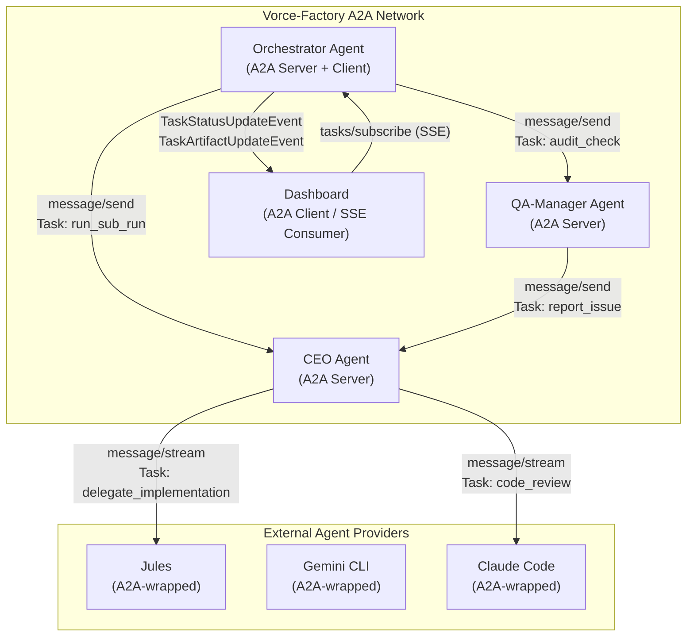

# Vorce-Factory — IST-Zustand-Analyse & Neuer Umsetzungsplan

Stand: 2026-06-24

---

## Teil 1: Prüfung des CURRENT_IMPLEMENTATION_GAP_PLAN.md

Jeder Punkt aus dem Gap-Plan vom 2026-06-19 wurde gegen den aktuellen Code geprüft.

### Legende
- ✅ **Vollständig umgesetzt** — kein weiterer Handlungsbedarf
- ⚠️ **Teilweise umgesetzt** — Kernfunktion vorhanden, Nacharbeit nötig
- ❌ **Noch offen** — nicht oder kaum implementiert

---

### P0 — Dashboard-Run-Hierarchie kanonisch bauen

**Ergebnis: ✅ Vollständig umgesetzt**

| Kriterium | Status | Beleg |
|---|---|---|
| `/run-hierarchy.json` Endpoint | ✅ | [App.tsx](file:///c:/Users/Vinyl/Desktop/VJMapper/VjMapper/Vorce-Factory/web/Dashboard/src/App.tsx#L99) fetcht `/run-hierarchy.json` |
| 5 MAIN-RUNs als Root | ✅ | [runHierarchy.js](file:///c:/Users/Vinyl/Desktop/VJMapper/VjMapper/Vorce-Factory/web/Dashboard/src/runHierarchy.js#L223) baut Hierarchy aus Manifest mit 5 Main-Runs |
| PART-RUNs unter SUB-RUN | ✅ | [RunHierarchyView.tsx](file:///c:/Users/Vinyl/Desktop/VJMapper/VjMapper/Vorce-Factory/web/Dashboard/src/components/RunHierarchyView.tsx#L121-L160) rendert Parts unterhalb von Subs |
| Keine `unknown`-Root-Knoten | ✅ | Legacy-States werden als `legacy_orphan_states` separat gezählt ([runHierarchy.js:245-258](file:///c:/Users/Vinyl/Desktop/VJMapper/VjMapper/Vorce-Factory/web/Dashboard/src/runHierarchy.js#L245-L258)) |
| `run-topology.manifest.json` | ✅ | Kanonische Quelle existiert ([run-topology.manifest.json](file:///c:/Users/Vinyl/Desktop/VJMapper/VjMapper/Vorce-Factory/web/Dashboard/src/run-topology.manifest.json)) |

---

### P0 — Router-Entscheidungen persistieren

**Ergebnis: ✅ Vollständig umgesetzt**

| Kriterium | Status | Beleg |
|---|---|---|
| Router-Decision-State | ✅ | [runHierarchy.js:120-147](file:///c:/Users/Vinyl/Desktop/VJMapper/VjMapper/Vorce-Factory/web/Dashboard/src/runHierarchy.js#L120-L147) — `buildRouterDecision()` erstellt vollständigen Decision-Snapshot |
| Pro Sub-Run: configured, active, reason | ✅ | Felder `configured_enabled`, `active`, `reason` in Decision-Objekt |
| Dashboard zeigt aktiv/inaktiv + Grund | ✅ | [RunHierarchyView.tsx:166-207](file:///c:/Users/Vinyl/Desktop/VJMapper/VjMapper/Vorce-Factory/web/Dashboard/src/components/RunHierarchyView.tsx#L166-L207) zeigt `statusText`, `inactive_reason` |
| RouterEngine mit deterministischen Conditions | ✅ | [RouterEngine.ps1](file:///c:/Users/Vinyl/Desktop/VJMapper/VjMapper/Vorce-Factory/src/lib/engines/RouterEngine.ps1) — 969 Zeilen mit 17 whitelisted Conditions |

---

### P0 — Planning Strategy Argument-Passing reparieren

**Ergebnis: ✅ Vollständig umgesetzt**

| Kriterium | Status | Beleg |
|---|---|---|
| Strategy erstellt Part-Runs mit `arguments` | ✅ | [Strategy.ps1:44-53](file:///c:/Users/Vinyl/Desktop/VJMapper/VjMapper/Vorce-Factory/src/runs/MAIN-RUN-01_Planning/SUB-RUNS/SUB-RUN-03_MR-01_Planning__Strategy/SUB-RUN-03_MR-01_Planning__Strategy.ps1#L44-L53) — `IssueNumber`, `IssueTitle`, `IssueBody` |
| RunEngine übergibt `part.arguments` | ✅ | [RunEngine.ps1:406-410](file:///c:/Users/Vinyl/Desktop/VJMapper/VjMapper/Vorce-Factory/src/lib/engines/RunEngine.ps1#L406-L410) — `Invoke-VorceSubRunSequential` iteriert `$part.arguments` in `$arguments` |
| Parallele Ausführung mit separaten Args | ✅ | `Invoke-VorceSubRunParallel` nutzt `Start-Job` mit `part.name` als Job-Name und `part.input_fingerprint` |

---

### P0 — State-Namen normalisieren

**Ergebnis: ⚠️ Teilweise umgesetzt**

| Kriterium | Status | Beleg |
|---|---|---|
| DataSync PART-RUN-Ordner korrekt benannt | ✅ | Ordner: `PART-RUN-01_MR-01_Planning__DataSync__FetchIssues.ps1`, `PART-RUN-02_MR-01_Planning__DataSync__FetchPRs.ps1` |
| **DataSync Sub-Run nutzt lange Namen** | ❌ | [DataSync.ps1:26-27](file:///c:/Users/Vinyl/Desktop/VJMapper/VjMapper/Vorce-Factory/src/runs/MAIN-RUN-01_Planning/SUB-RUNS/SUB-RUN-01_MR-01_Planning__DataSync/SUB-RUN-01_MR-01_Planning__DataSync.ps1#L26-L27): Part-Run `name` ist weiterhin **`FetchIssues`** und **`FetchPRs`** (Kurzname) |
| **DataSync SubRunName im Aufruf kurz** | ❌ | [DataSync.ps1:39](file:///c:/Users/Vinyl/Desktop/VJMapper/VjMapper/Vorce-Factory/src/runs/MAIN-RUN-01_Planning/SUB-RUNS/SUB-RUN-01_MR-01_Planning__DataSync/SUB-RUN-01_MR-01_Planning__DataSync.ps1#L39): `Invoke-VorceSubRunParallel -SubRunName "DataSync"` → erzeugt State-Datei `SUB_DataSync.json` |
| Legacy-State-Handling | ✅ | [runHierarchy.js:245-252](file:///c:/Users/Vinyl/Desktop/VJMapper/VjMapper/Vorce-Factory/web/Dashboard/src/runHierarchy.js#L245-L252) filtert Legacy-States |

> [!WARNING]
> **DataSync nutzt weiterhin Kurznamen** im Code: `name="FetchIssues"`, `name="FetchPRs"`, `SubRunName="DataSync"`. Das erzeugt Runtime-Dateien wie `SUB_DataSync.json`, `PART_FetchIssues.json`, `PART_FetchPRs.json`, die zwar als Legacy behandelt werden, aber die kanonische Hierarchie nicht exakt abbilden.

---

### P0 — Logging-Modul und Live-Log reparieren

**Ergebnis: ✅ Vollständig umgesetzt**

| Kriterium | Status | Beleg |
|---|---|---|
| `Write-Log.ps1` als dot-sourcebares Modul | ✅ | [Write-Log.ps1](file:///c:/Users/Vinyl/Desktop/VJMapper/VjMapper/Vorce-Factory/src/lib/logging/Write-Log.ps1) — 930 Zeilen, definiert `Write-VorceLogEntry`, `Write-VorceRunEvent`, `Write-VorceProviderEvent` etc. als Funktionen |
| Session-basiertes Logging | ✅ | `Get-VorceLogPath` schreibt in `var/log/sessions/<session_id>.log` und `var/log/events/vorce-events-<datum>.jsonl` |
| JSONL Event-Logging | ✅ | Strukturiertes JSONL mit `session_id`, `correlation_id`, `run_id`, `level`, `event_type` |
| Secret-Redaction | ✅ | `Protect-VorceSecretText`, `Protect-VorceLogValue` redaktieren API-Keys, Tokens etc. |
| Mutex-basiertes Thread-safe Logging | ✅ | `Add-VorceLogLine` mit `System.Threading.Mutex` |
| Test vorhanden | ✅ | [Test-Logging.ps1](file:///c:/Users/Vinyl/Desktop/VJMapper/VjMapper/Vorce-Factory/test/Test-Logging.ps1) (9.685 Bytes) |

---

### P0 — LLM/CLI-Fallback aus Registry implementieren

**Ergebnis: ✅ Vollständig umgesetzt**

| Kriterium | Status | Beleg |
|---|---|---|
| `Invoke-VorceAgentWithFallback` existiert | ✅ | [AgentRunner.ps1:785](file:///c:/Users/Vinyl/Desktop/VJMapper/VjMapper/Vorce-Factory/src/lib/integrations/AgentRunner.ps1#L785) — Funktion mit Provider-Chain-Logik |
| Provider-Chain aus Config/Registry | ✅ | DeliberationEngine nutzt `$dualCeo.ceo_chain` und `$dualCeo.qa_manager_chain` ([DeliberationEngine.ps1:201-206](file:///c:/Users/Vinyl/Desktop/VJMapper/VjMapper/Vorce-Factory/src/lib/engines/DeliberationEngine.ps1#L201-L206)) |
| Fehlerklassifizierung | ✅ | `error_class` Feld in State-Objekten, `chain_exhausted`, `waiting_provider` etc. |
| Provider-Smoke-Test ersetzt alten Test | ✅ | [Test-StartProcess.ps1](file:///c:/Users/Vinyl/Desktop/VJMapper/VjMapper/Vorce-Factory/test/Test-StartProcess.ps1) delegiert an [Test-LLMProviders.ps1](file:///c:/Users/Vinyl/Desktop/VJMapper/VjMapper/Vorce-Factory/test/Test-LLMProviders.ps1) (27.830 Bytes) |
| DeliberationEngine kein hartes Gemini mehr | ✅ | Nutzt `Invoke-VorceAgentWithFallback` mit `PreferredChain` statt hartem Provider |

---

### P1 — MAIN-RUN-04 Optimizer fachlich ausbauen

**Ergebnis: ✅ Vollständig umgesetzt**

| Kriterium | Status | Beleg |
|---|---|---|
| Erweiterte Sub-Runs | ✅ | 5 Sub-Runs: `PerformanceDataCollection`, `SystemAnalysis`, `ProposalGeneration`, `ApprovedChangeDispatch`, `ChangeEvaluation` |
| Router-basierte Aktivierung | ✅ | `Optimizer-Router.ps1` existiert, RouterEngine hat Conditions: `optimizer_has_sufficient_samples`, `optimizer_has_findings`, `optimizer_has_approved_changes`, `optimizer_has_changes_to_evaluate` |
| Dashboard zeigt Optimizer-Vorschläge | ✅ | [DashboardPage.tsx:646-799](file:///c:/Users/Vinyl/Desktop/VJMapper/VjMapper/Vorce-Factory/web/Dashboard/src/pages/DashboardPage.tsx#L646-L799) — `OptimizerQueuePanel` mit approve/reject/run-now |

---

### P1 — MAIN-RUN-05 MemoryOptimization restriktiv machen

**Ergebnis: ⚠️ Teilweise umgesetzt**

| Kriterium | Status | Beleg |
|---|---|---|
| Sub-Run existiert | ✅ | `SUB-RUN-01_MR-05_MemoryOptimization__MemoryMaintenance` |
| Router-Conditions | ✅ | `memory_maintenance_due`, `memory_has_candidates` in RouterEngine |
| **Memory-Felder (scope, applies_to_runs, expires_at etc.)** | ❌ | Nicht geprüft in aktuellen Memory-Einträgen. Kein Beweis für erweiterte Felder im Memory-Schema |
| **Token-Budget für Memories** | ❌ | Kein `token_cost_estimate` oder Token-Budget-Logik gefunden |
| **Kontext-Injektion pro Run** | ❌ | Kein sichtbarer Mechanismus für run-spezifische Memory-Injektion |

---

### P1 — Produktname auf Vorce-Factory umstellen

**Ergebnis: ✅ Vollständig umgesetzt**

| Kriterium | Status | Beleg |
|---|---|---|
| Dashboard-Titel | ✅ | [App.tsx:185](file:///c:/Users/Vinyl/Desktop/VJMapper/VjMapper/Vorce-Factory/web/Dashboard/src/App.tsx#L185): `Vorce-Factory` |
| Dashboard-Footer | ✅ | [App.tsx:247](file:///c:/Users/Vinyl/Desktop/VJMapper/VjMapper/Vorce-Factory/web/Dashboard/src/App.tsx#L247): `Vorce-Factory Dashboard` |
| Status-Banner | ✅ | [DashboardPage.tsx:254](file:///c:/Users/Vinyl/Desktop/VJMapper/VjMapper/Vorce-Factory/web/Dashboard/src/pages/DashboardPage.tsx#L254): `Vorce-Factory` |
| Keine `Vorce Autopilot` Treffer in src/ | ✅ | grep-Suche: 0 Treffer |
| Keine `Vorce Autopilot` Treffer in Prompts | ✅ | grep-Suche: 0 Treffer |

---

### P1 — Tests aktualisieren

**Ergebnis: ✅ Vollständig umgesetzt**

| Kriterium | Status | Beleg |
|---|---|---|
| Test-PlanningRun auf Vorce-Factory | ✅ | [Test-PlanningRun.ps1:24](file:///c:/Users/Vinyl/Desktop/VJMapper/VjMapper/Vorce-Factory/test/Test-PlanningRun.ps1#L24): prüft `$global:VorceRoot -like "*Vorce-Factory"` |
| Neue Tests vorhanden | ✅ | 26 Testdateien: `Test-RunTopology`, `Test-RunHierarchy`, `Test-Routers`, `Test-RunEngineParallel`, `Test-LLMProviders`, `Test-Logging`, `Test-RunStateSchema`, `Test-Retention` etc. |
| Test-StartProcess delegiert an Provider-Suite | ✅ | [Test-StartProcess.ps1](file:///c:/Users/Vinyl/Desktop/VJMapper/VjMapper/Vorce-Factory/test/Test-StartProcess.ps1) → `Test-LLMProviders.ps1` |

---

### P2 — Prompt-Registry vervollständigen

**Ergebnis: ⚠️ Teilweise umgesetzt**

| Kriterium | Status | Beleg |
|---|---|---|
| Prompts für MR-01 (Planning) | ✅ | 6 Einträge in [prompt-registry.json](file:///c:/Users/Vinyl/Desktop/VJMapper/VjMapper/Vorce-Factory/var/prompts/prompt-registry.json) |
| Prompts für MR-02 (CheckAndDoing) | ✅ | 6 Einträge |
| Prompts für MR-03 (Audit) | ✅ | 4 Einträge |
| **Prompts für MR-04 (Optimizer)** | ❌ | 0 Einträge in Registry |
| **Prompts für MR-05 (MemoryOptimization)** | ❌ | 0 Einträge in Registry |

---

## Teil 2: Neu entdeckte Probleme

### N1 — sync-service.ps1 nutzt `Write-Log` falsch

**Schwere: P1**

[sync-service.ps1:18](file:///c:/Users/Vinyl/Desktop/VJMapper/VjMapper/Vorce-Factory/src/tools/services/sync-service.ps1#L18) ruft `Write-Log` auf, aber die Logging-Funktion heißt jetzt `Write-VorceLogEntry`. Das Modul definiert keine `Write-Log`-Funktion.

```powershell
# Zeile 18: FALSCH
Write-Log -Level INFO -Message "Starting sync service" ...
# Korrekt wäre:
Write-VorceLogEntry -Level INFO -Message "Starting sync service" ...
```

> [!WARNING]
> Der sync-service startet wahrscheinlich mit Fehlern, da `Write-Log` nicht existiert.

---

### N2 — DataSync DryRun-Pfad gibt Kurznamen zurück

**Schwere: P1**

[DataSync.ps1:37](file:///c:/Users/Vinyl/Desktop/VJMapper/VjMapper/Vorce-Factory/src/runs/MAIN-RUN-01_Planning/SUB-RUNS/SUB-RUN-01_MR-01_Planning__DataSync/SUB-RUN-01_MR-01_Planning__DataSync.ps1#L37): Im DryRun-Pfad wird `sub_run = "DataSync"` gesetzt statt des langen Namens. Die Parts-Names sind ebenfalls kurz.

---

### N3 — Fehlender `Invoke-VorceAgentChain` Wrapper

**Schwere: P2**

Der Gap-Plan forderte `Invoke-VorceAgentChain -TaskType <type>`. Stattdessen wurde `Invoke-VorceAgentWithFallback` implementiert, was funktional äquivalent ist. Der Name weicht aber vom Plan ab — kein echtes Problem, nur eine Dokumentations-Diskrepanz.

---

## Teil 3: Aufgeräumter IST-Zustand — Verbleibende offene Punkte

### Noch offen (nach Priorität sortiert)

#### P0 — DataSync State-Namen normalisieren

- [ ] [DataSync.ps1](file:///c:/Users/Vinyl/Desktop/VJMapper/VjMapper/Vorce-Factory/src/runs/MAIN-RUN-01_Planning/SUB-RUNS/SUB-RUN-01_MR-01_Planning__DataSync/SUB-RUN-01_MR-01_Planning__DataSync.ps1): Part-Run Names von `FetchIssues`/`FetchPRs` auf `PART-RUN-01_MR-01_Planning__DataSync__FetchIssues`/`PART-RUN-02_MR-01_Planning__DataSync__FetchPRs` ändern
- [ ] SubRunName von `"DataSync"` auf `"SUB-RUN-01_MR-01_Planning__DataSync"` ändern
- [ ] DryRun-Pfad ebenfalls die langen Namen verwenden

#### P1 — sync-service.ps1 Write-Log → Write-VorceLogEntry

- [ ] `Write-Log` Aufrufe (Zeilen 18, 66, 93) auf `Write-VorceLogEntry` umstellen
- [ ] Testen dass sync-service fehlerfrei startet

#### P1 — MemoryOptimization fachlich vervollständigen

- [ ] Memory-Schema um Felder erweitern: `scope`, `applies_to_runs`, `applies_to_issue`, `expires_at`, `last_used_at`, `use_count`, `token_cost_estimate`, `retention`
- [ ] Token-Budget-Limiter für Memory-Injektion implementieren
- [ ] Run-spezifische Memory-Injektion: Nur relevante Memories pro Run laden
- [ ] Master-Issue-Kontext: Temporäre Memories mit Issue-Scope und Ablaufdatum
- [ ] Audit-Bericht über Memory-Aktionen (behalten/herabstufen/archivieren/löschen)

#### P2 — Prompt-Registry für MR-04 und MR-05 vervollständigen

- [ ] Prompts für Optimizer-Sub-Runs erstellen und in [prompt-registry.json](file:///c:/Users/Vinyl/Desktop/VJMapper/VjMapper/Vorce-Factory/var/prompts/prompt-registry.json) registrieren:
  - `optimizer_performance_collection`, `optimizer_system_analysis`, `optimizer_proposal_generation`, `optimizer_change_dispatch`, `optimizer_change_evaluation`
- [ ] Prompts für MemoryOptimization-Sub-Runs erstellen und registrieren:
  - `memory_maintenance_analysis`, `memory_cleanup`

### Bereits erledigt (Zusammenfassung)

| Gap-Plan Punkt | Status |
|---|---|
| P0 Dashboard-Run-Hierarchie | ✅ Vollständig |
| P0 Router-Entscheidungen persistieren | ✅ Vollständig |
| P0 Strategy Argument-Passing | ✅ Vollständig |
| P0 Logging-Modul/Live-Log | ✅ Vollständig |
| P0 LLM/CLI-Fallback | ✅ Vollständig |
| P1 MAIN-RUN-04 Optimizer ausbauen | ✅ Vollständig |
| P1 Produktname Vorce-Factory | ✅ Vollständig |
| P1 Tests aktualisieren | ✅ Vollständig |

---

## Teil 4: Agent-to-Agent (A2A) Kommunikation

### Empfohlene Library: Google A2A Protocol mit `a2a-js` SDK

**Warum A2A statt Alternativen?**

| Kriterium | A2A Protocol | MCP | Eigenbau (WebSocket) |
|---|---|---|---|
| Agent ↔ Agent Kommunikation | ✅ Kernfokus | ❌ Agent ↔ Tool | ⚠️ Manuell |
| Task-Lifecycle (working/completed/failed) | ✅ Eingebaut | ❌ Kein Task-Konzept | ⚠️ Manuell |
| Streaming (SSE) | ✅ Standard | ❌ N/A | ⚠️ Manuell |
| Agent Discovery (Agent Cards) | ✅ `.well-known/agent.json` | ❌ N/A | ❌ N/A |
| Open Standard (Linux Foundation) | ✅ | ✅ | ❌ |
| JS/TS SDK | ✅ `@a2a-js/sdk` | ✅ Diverse | ❌ |
| PowerShell Integration | ⚠️ HTTP/JSON-RPC | ⚠️ HTTP | ✅ Nativ |

**A2A ist ideal** weil Vorce-Factory bereits ein Multi-Agent-System ist (CEO, QA-Manager, Jules, Gemini CLI, Claude Code, Codex, Kiro, etc.) und die Kernprobleme genau auf A2A abzielen:
- Delegierte Aufgaben live überwachen
- Run-Steuerung (MAIN→SUB→PART) mit Status-Updates
- QA-Manager meldet Probleme direkt an CEO

### Architektur-Überblick



### Implementierungsanweisungen

#### Phase 1: Agent Cards und A2A-Server (Dashboard-Node.js-Seite)

**Datei: `web/Dashboard/a2a/agent-cards/orchestrator.json`** [NEW]

```json
{
  "name": "Vorce-Factory Orchestrator",
  "description": "Zentrale Steuerung der Run-Hierarchie mit dynamischer Scheduling",
  "url": "http://localhost:5175/a2a",
  "version": "1.0.0",
  "capabilities": {
    "streaming": true,
    "pushNotifications": false
  },
  "skills": [
    {
      "id": "execute_main_run",
      "name": "Execute Main-Run",
      "description": "Startet einen der 5 MAIN-RUNs und streamt Status-Updates"
    },
    {
      "id": "get_run_hierarchy",
      "name": "Get Run Hierarchy",
      "description": "Liefert die aktuelle Run-Hierarchie mit Status aller Sub/Part-Runs"
    },
    {
      "id": "delegate_task",
      "name": "Delegate Task",
      "description": "Delegiert eine Implementierungsaufgabe an einen Provider-Agent"
    }
  ],
  "defaultInputModes": ["text/plain", "application/json"],
  "defaultOutputModes": ["application/json"]
}
```

**Datei: `web/Dashboard/a2a/agent-cards/qa-manager.json`** [NEW]

```json
{
  "name": "Vorce-Factory QA Manager",
  "description": "Prüft Code-Qualität, führt Audits durch und meldet Probleme",
  "url": "http://localhost:5176/a2a",
  "version": "1.0.0",
  "capabilities": {
    "streaming": true,
    "pushNotifications": true
  },
  "skills": [
    {
      "id": "report_issue",
      "name": "Report Issue to CEO",
      "description": "Meldet ein gefundenes Problem direkt an den CEO-Agent"
    },
    {
      "id": "run_audit",
      "name": "Run System Audit",
      "description": "Führt einen vollständigen System-Audit durch"
    }
  ]
}
```

#### Phase 2: A2A-Server Implementierung (Node.js/Express)

**Datei: `web/Dashboard/a2a/server.ts`** [NEW]

```typescript
// Kern-Implementierung eines A2A-konformen JSON-RPC 2.0 Servers
// Nutzt: npm install @a2a-js/sdk express
//
// Funktionen:
// 1. /.well-known/agent.json → Agent Card
// 2. POST /a2a → JSON-RPC message/send, message/stream, tasks/get
// 3. SSE-Streaming für message/stream Requests
//
// Task-Lifecycle: submitted → working → completed/failed/input_required
//
// Integration mit bestehendem System:
// - Liest Run-States aus var/run-states/*.json
// - Schreibt Task-Events in var/log/events/
// - Nutzt bestehende WebSocket-Verbindung für Dashboard-Updates
```

**Kernkonzepte der Implementierung:**

1. **Task-Registry**: Jeder laufende Run (MAIN/SUB/PART) wird als A2A-Task registriert mit Task-ID = Run-State-ID
2. **Status-Mapping**:
   - `running` → A2A `working`
   - `completed` / `reused` → A2A `completed`
   - `failed` → A2A `failed`
   - `waiting_provider` → A2A `input_required`
3. **SSE-Streaming**: Bei `message/stream` wird ein SSE-Stream geöffnet der `TaskStatusUpdateEvent` sendet wenn sich Run-States ändern

#### Phase 3: PowerShell A2A-Client

**Datei: `src/lib/integrations/A2AClient.ps1`** [NEW]

```powershell
# A2A-Client für PowerShell
# Kommuniziert via HTTP/JSON-RPC 2.0 mit A2A-Servern
#
# Funktionen:
#   Get-VorceA2AAgentCard -Url <agent-url>
#   Send-VorceA2AMessage -AgentUrl <url> -TaskId <id> -Content <text/json>
#   Get-VorceA2ATaskStatus -AgentUrl <url> -TaskId <id>
#   Watch-VorceA2ATaskStream -AgentUrl <url> -TaskId <id> -OnUpdate <scriptblock>
#
# Beispiel: QA-Manager meldet Problem an CEO
#   Send-VorceA2AMessage `
#     -AgentUrl "http://localhost:5175/a2a" `
#     -TaskId "alert_$(New-Guid)" `
#     -Content @{
#       skill = "report_issue"
#       issue = @{
#         topic = "PR-Naming Violation"
#         severity = "medium"
#         context = "PR #779 hat falsche Benennung"
#         remediation_command = "gh pr edit 779 --title '...'"
#       }
#     }
```

#### Phase 4: Dashboard A2A-Integration

**Datei: `web/Dashboard/src/hooks/useA2AStream.ts`** [NEW]

```typescript
// React-Hook der SSE-basierte A2A Task-Updates empfängt
//
// Funktionen:
// 1. Verbindet sich mit dem Orchestrator-Agent via message/stream
// 2. Empfängt TaskStatusUpdateEvent und TaskArtifactUpdateEvent
// 3. Updated die Run-Hierarchie in Echtzeit
// 4. Zeigt live Agent-zu-Agent Nachrichten (CEO ↔ QA-Manager)
//
// Verwendung im Dashboard:
//   const { tasks, messages } = useA2AStream('http://localhost:5175/a2a');
//   // tasks: Map<taskId, TaskState>
//   // messages: Array<A2AMessage>
```

**Neue Dashboard-Komponente: `A2AAgentPanel.tsx`** [NEW]

- Zeigt alle registrierten A2A-Agents mit ihren Agent Cards
- Live-Status jedes Agents (online/offline/busy)
- Task-Timeline: Chronologische Ansicht aller A2A-Tasks
- Agent-zu-Agent Nachrichtenverlauf (CEO ↔ QA-Manager Kommunikation)

#### Phase 5: Use-Case Implementierung

##### Use-Case 1: Delegierte Aufgaben live überwachen

```
Orchestrator → message/stream → Jules Agent
  ↓ SSE: TaskStatusUpdateEvent(status: "working", progress: "Creating branch...")
  ↓ SSE: TaskStatusUpdateEvent(status: "working", progress: "Implementing changes...")
  ↓ SSE: TaskArtifactUpdateEvent(artifact: {type: "pr_url", value: "..."})
  ↓ SSE: TaskStatusUpdateEvent(status: "completed")
Dashboard ← tasks/subscribe ← Orchestrator
  → Zeigt Live-Fortschritt im Run-Hierarchie-View
```

##### Use-Case 2: Run-Steuerung (MAIN→SUB→PART)

```
Orchestrator erstellt A2A-Task pro Run-Level:
  Task "main_planning_2026-06-24" (status: working)
    ├── Task "sub_datasync" (status: completed)
    ├── Task "sub_triage" (status: working)
    │   ├── Task "part_analyze" (status: completed)
    │   └── Task "part_filter" (status: working)
    └── Task "sub_strategy" (status: submitted → queued)

Dashboard subscribed auf Orchestrator → bekommt alle Updates in Echtzeit
```

##### Use-Case 3: QA-Manager → CEO Direktmeldung

```
QA-Manager Agent:
  1. Findet Problem bei Audit
  2. Sendet A2A message/send an CEO-Agent:
     { skill: "report_issue", content: { topic: "...", severity: "high" } }
  3. CEO-Agent empfängt, triggert CEO-Sondersession
  4. Ergebnis wird als Task-Artifact zurückgegeben
  5. Dashboard zeigt neuen Alert mit CEO-Response
```

### Installations- und Einrichtungsschritte

```bash
# 1. A2A SDK installieren
cd web/Dashboard
npm install @a2a-js/sdk

# 2. Agent Cards deployen
mkdir -p public/.well-known
cp a2a/agent-cards/orchestrator.json public/.well-known/agent.json

# 3. A2A Server starten (separater Prozess oder in Vite-Dev-Server integriert)
# → Integration in bestehenden Express-API-Server (vite.config.ts)

# 4. PowerShell A2A-Client laden
. src/lib/integrations/A2AClient.ps1
```

### Umsetzungsreihenfolge

1. **Agent Cards** definieren für Orchestrator, CEO, QA-Manager (1-2h)
2. **A2A Server** in bestehendem Dashboard-API-Server integrieren (4-6h)
3. **PowerShell A2A-Client** implementieren (3-4h)
4. **Dashboard SSE-Hook** und Agent-Panel bauen (4-6h)
5. **Use-Cases** verdrahten und testen (4-6h)
6. **Tests** schreiben (`Test-A2ACommunication.ps1`, `Test-A2AStream.mjs`) (2-3h)

---

## Verifikationsplan

### Automatisierte Tests

```powershell
# Bestehende Tests nach Fixes erneut ausführen
powershell -File test/Test-Boot.ps1
powershell -File test/Test-RunTopology.ps1
powershell -File test/Test-RunHierarchy.ps1
powershell -File test/Test-Routers.ps1
powershell -File test/Test-Logging.ps1
powershell -File test/Test-LLMProviders.ps1 -DiscoveryOnly

# Neue Tests nach A2A-Integration
powershell -File test/Test-A2ACommunication.ps1
node test/Test-A2AStream.mjs
```

### Manuelle Verifikation

- [ ] DataSync-Kurzname-Fix: Prüfen dass keine `SUB_DataSync.json` / `PART_FetchIssues.json` mehr entstehen
- [ ] sync-service startet ohne `Write-Log`-Fehler
- [ ] Dashboard zeigt A2A-Agent-Status (wenn Phase 4+5 umgesetzt)
- [ ] `npm run build` im Dashboard läuft weiterhin durch
