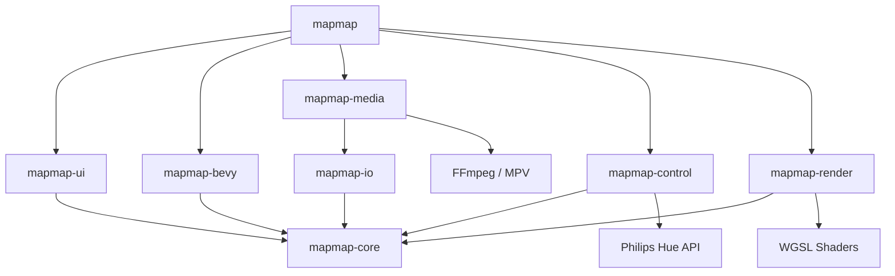

# DOC-B1: MapFlow System Architecture

Dieses Dokument dient als zentrale technische Referenz für die interne Funktionsweise von MapFlow. Es beschreibt das System-Design, die Crate-Hierarchie und den Datenfluss.

## 1. System-Design & Crates

MapFlow basiert auf einer modernen, modularen Architektur in **Rust**, die **Bevy** als ECS-Engine und **WGPU** für das Rendering nutzt. Das Projekt ist als Cargo Workspace organisiert.

### Crate-Ökosystem

| Crate | Logische Rolle | Wichtigste Typen / Zuständigkeiten |
| :--- | :--- | :--- |
| `mapmap` | **Main App** | Einstiegspunkt, Event-Loop, App-State Orchestrierung. |
| `mapmap-core` | **Logik-Kern** | Datenmodelle (Layer, Mapping, Paint), Graph-Evaluierung, Math. |
| `mapmap-render` | **Renderer** | WGPU-Abstraktion, Shader-Verwaltung, Compositing, Texture-Pooling. |
| `mapmap-ui` | **User Interface** | Egui-Implementierung, Panels, Node-Editor, Timeline. |
| `mapmap-media` | **Media Engine** | Frame-Pipeline, Video-Decoding (FFmpeg), Bild-Loading. |
| `mapmap-control` | **Peripherie** | MIDI, OSC, Philips Hue, Shortcuts. |
| `mapmap-io` | **I/O & Netz** | NDI, Spout, Datei-System, Persistenz. |
| `mapmap-bevy` | **3D/Particles** | Bevy ECS Integration für komplexe 3D-Inhalte. |
| `mapmap-mcp` | **AI Interface** | Model Context Protocol Server für Agenten-Integration. |

---

## 2. Globaler Frame-Loop

MapFlow trennt strikt zwischen Logik-Update (fest 60Hz) und Render-Update (VSync).

### Phase A: Logic Update (`logic.rs`)
1. **Input Sampling**: Gather MIDI/OSC/Keyboard Events.
2. **Audio Analysis**: FFT-Berechnung (9 Bänder) via `AudioAnalyzer`.
3. **Graph Evaluation**: `ModuleEvaluator` berechnet Knoten-Zustände, Trigger und Signalfluss.
4. **Smoothing**: Anwendung von Attack/Release-Filtern auf reaktive Parameter.
5. **Command Generation**: Erzeugung von `SourceCommands` und `RenderOps`.

### Phase B: Render Update (`render.rs`)
1. **Texture Preparation**: Upload frischer Frames in GPU-Texturen.
2. **Effect Processing**: Abarbeitung der WGSL-Shader-Ketten pro Layer.
3. **Compositing**: Finale Mischung aller Layer auf die Ziel-Outputs (Warping/Masking).
4. **UI Overlay**: Egui-Rendering als letzter Pass über Output 0.

---

## 3. Datenfluss: Die PAP-Kette

Der fachliche Datenfluss folgt dem Prinzip:
`TRIGGER → SOURCE → MODULIZER → LAYER → OUTPUT`

*   **Trigger**: Signale (Audio, MIDI, Random), die Parameter steuern.
*   **Source**: Video, Bild, Shader-Generator oder Live-Input.
*   **Modulizer**: Effekte, Blend-Modes und Masken.
*   **Layer**: Gruppierung und räumliche Anordnung.
*   **Output**: Physikalische Ausgänge (Projektoren) inkl. Edge-Blending.

---

## 4. Render-Pipeline & Threading

Aktuell nutzt MapFlow ein asynchrones Modell für Medien-Frames:
- **Decode-Thread**: Erzeugt Frames aus Video-Quellen.
- **Upload-Thread**: Lädt Daten via Staging-Buffer in GPU-Texturen (WGPU).
- **Render-Thread**: Nutzt die Texturen für die Komposition.

Synchronisation erfolgt über bounded `crossbeam_channels`, um Backpressure zu kontrollieren.

---

## 5. UI-Architektur

Das UI basiert auf `egui` (Retained Mode Style).
- **Unified Inspector**: Kontextsensitive Steuerung, die sich automatisch an das selektierte Element (Module, Layer, Output) anpasst.
- **Module Canvas**: Custom-Knoteneditor für die visuelle Programmierung (keine externen Node-Libs).

---
*Referenzen: docs/project/MODULE_TREE.md (Physische Struktur)*
