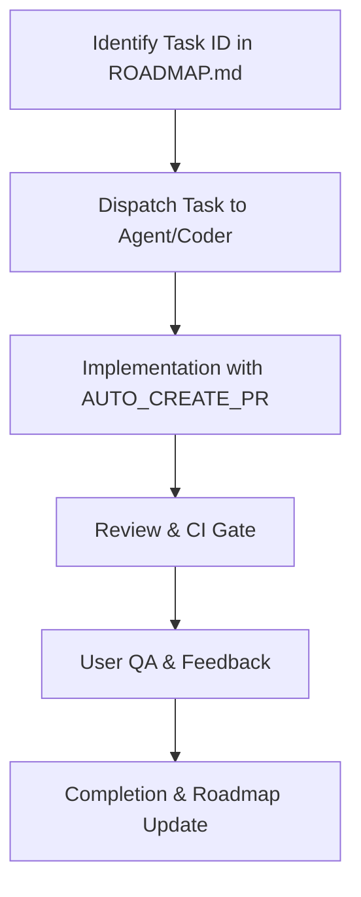

# MapFlow Official Development Workflow

This document describes the standardized development process for MapFlow, ensuring consistency between documentation, task tracking, and code implementation.

## Workflow Overview

The MapFlow workflow is strictly **Task-ID driven**. Every change must correspond to a task in the [ROADMAP.md](../../ROADMAP.md).

---

## 1. Task Identification

Before any work begins:
- Identify the correct **MF-ID** (e.g., `MF-016-FEATURE-STATUS-BASELINE`) in [ROADMAP.md](../../ROADMAP.md).
- If the task does not exist, it must be created by the **Architect** or **TechLead**.
- Ensure the **Dev-Status** in the Roadmap is set to 🟠 `In Analyse` or 🔵 `In Umsetzung`.

## 2. Dispatch (Jules/Coder)

When delegating work to agents (like Jules or Coder):
- **Task-ID Delegation**: Only the MF-ID should be passed to the dispatcher.
- **Context Lookup**: The agent is responsible for reading the task details directly from `ROADMAP.md` and the `docs/project/TEST_MATRIX.md`.
- **AUTO_CREATE_PR**: All agent-based work must be configured with `AUTO_CREATE_PR=true`.

## 3. Implementation Rules

- **Branch Naming**: All branches MUST be named `MF-###-SLUG`.
- **PR Naming**: All PR titles MUST be prefixed with `[MF-###-SLUG]`.
- **Atomic Commits**: Keep changes focused on the task at hand. Avoid unrelated refactoring.
- **Tests**: Every bugfix or feature requires corresponding unit/integration tests.

## 4. Review & CI Gate

Once a Pull Request is created:
- **CI Checks**: The `pr_branch_manager` ensures all CI checks (linting, tests, build) are green.
- **Code Review**: A human or automated reviewer checks the implementation for architectural consistency.
- **Status Update**: Upon success, set **Dev-Status** to 🟢 `Bereit fuer QA` in `ROADMAP.md`.

## 5. User QA

Final verification is performed by the user:
- **Manual Verification**: The user tests the feature or fix in the actual application.
- **Feedback**: If issues are found, status is set to 🟣 `Nacharbeit`.
- **Approval**: If successful, status is set to 🟢 `QA Erfolgreich` in `ROADMAP.md`.

## 6. Completion

A task is considered complete when:
- The PR is merged into `main`.
- The **Dev-Status** and **QA-Status** in `ROADMAP.md` are set to ✅ `Abgeschlossen`.
- The `CHANGELOG.md` is updated.
- Documentation in the `docs/` folder is synchronized.

---

## Governance & Compliance

### Naming Compliance
Branches and PRs that do not follow the `MF-###` naming convention will be blocked by the CI system and will not be reviewed.

### Source of Truth
- **ROADMAP.md**: The source of truth for task status and high-level progress.
- **TEST_MATRIX.md**: The source of truth for detailed feature mapping and regression test scenarios.
- **CHANGELOG.md**: The source of truth for released changes.

### Automated Checks
The project uses various scripts (e.g., `scripts/pre-commit-check.ps1`) to enforce these rules. Ensure these scripts pass locally before pushing.
