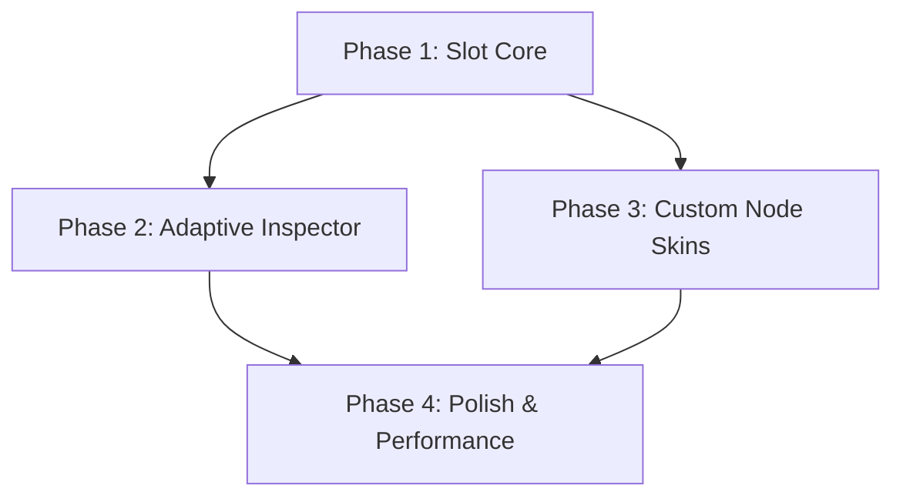

# Phasenplan: Moderne & Modulare Vorce-UI

## Plan-Überblick

Dieser Plan beschreibt die schrittweise Transformation der Vorce-UI in ein hochflexibles, slot-basiertes System mit adaptiven Widgets und Node-Skins.

- **Gesamtphasen**: 4
- **Beteiligte Agenten**: architect, ux_designer, design_system_engineer, performance_engineer, code_reviewer
- **Strategie**: Fundament (Slots) -> Ergonomie (Inspector) -> Ästhetik (Nodes) -> Polish (Cleanup).

## Abhängigkeitsgraph

## Ausführungsstrategie

| Phase | Agent | Typ | Beschreibung |
|-------|-------|-----|--------------|
| 1 | `architect` | Core | Implementierung des Slot-Managers und des Layout-Trees. |
| 2 | `ux_designer` | UI | Adaptive Grids und Widget-Skalierung im Inspector. |
| 3 | `design_system_engineer` | Design | Skin-System und Node-Integration (Flow-Animationen). |
| 4 | `performance_engineer` | Perf | Animation-Optimierung und Audit-Fixes. |

## Phasen-Details

### Phase 1: Slot Core (Foundations)

- **Ziel**: Einführung des `LayoutTree` und der Slot-Logik zur Trennung von Inhalt und Bereich.
- **Agent**: `architect`
- **Dateien erstellen**:
  - `crates/Vorce-ui/src/core/layout.rs`: Definition der Slots (Top, Bottom, Left, Right, Center) und des LayoutManagers.
- **Dateien ändern**:
  - `crates/Vorce-ui/src/app_ui.rs`: Refactor der Render-Logik von festen Panels zu Slot-basierten Rendern.
- **Validierung**: `cargo check --workspace` & Manuelle Prüfung des Slot-Resizing.

### Phase 2: Adaptive Inspector (Ergonomics)

- **Ziel**: Spaltensystem und Skalierbarkeit für den Inspector-Inhalt.
- **Agent**: `ux_designer`
- **Dateien ändern**:
  - `crates/Vorce-ui/src/panels/inspector/panel.rs`: Implementierung des `AdaptiveGrid`.
  - `crates/Vorce-ui/src/panels/inspector/ui.rs`: Integration der `DensityScale` (Widget-Skalierung).
- **Validierung**: Unit Tests für das Spalten-Umbruch-Verhalten.

### Phase 3: Custom Node Skins (Aesthetics)

- **Ziel**: Data-Driven Skinning und interaktive Node-Animationen.
- **Agent**: `design_system_engineer`
- **Dateien ändern**:
  - `crates/Vorce-ui/src/editors/node_editor.rs`: Integration des `SkinLoaders` und der Shader-Glow-Effekte.
  - `crates/Vorce-ui/src/editors/module_canvas/types.rs`: Erweiterung der Node-Daten um visuelle Metadaten.
- **Validierung**: Visuelle Prüfung der Flow-Animationen im Graph.

### Phase 4: Polish & Performance (Cleanup)

- **Ziel**: Behebung der Audit-Reports und Optimierung der UI-Performance.
- **Agent**: `performance_engineer`
- **Dateien ändern**:
  - `crates/Vorce-ui/src/editors/node_editor.rs`: Verbesserung der Socket-Erkennung (Audit Ref: 560).
  - `crates/Vorce-ui/src/mesh_editor.rs`: Entfernung von Dead Code (Audit Report).
- **Validierung**: `cargo clippy` & Performance-Messung der Transition-Engine.

## Kostenabschätzung

| Phase | Agent | Modell | Est. Input | Est. Output | Est. Cost |
|-------|-------|-------|-----------|------------|----------|
| 1 | architect | flash | 50K | 5K | $0.07 |
| 2 | ux_designer | flash | 40K | 4K | $0.06 |
| 3 | design_system_engineer | flash | 60K | 8K | $0.10 |
| 4 | performance_engineer | flash | 40K | 4K | $0.06 |
| **Total** | | | **190K** | **21K** | **$0.29** |

---
*Genehmigt autonom durch Agent Jules (VjMapper Orchestrator).*
