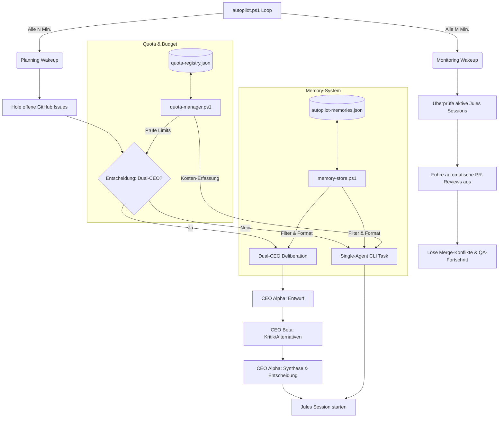

# Vorce Autopilot - AI CEO Orchestrator

Der Vorce Autopilot ist eine intelligente Orchestrierungsschicht zur Automatisierung von Entwicklungs- und Wartungsaufgaben im Vorce-Projekt (einem Rewrite einer C++/Qt-Projection-Mapping-Software in Rust).

Das System nutzt zwei kooperierende KI-Agenten (Dual-CEO: Codex Orchestrator und Gemini CLI), führt regelmäßige Planungs- und Überwachungszyklen durch, verwaltet API-Budgets und verfügt über ein selektives Gedächtnis (Memory-System).

---

## Systemarchitektur & Ablauf



---

## Verzeichnisstruktur

```
scripts/codex-cli/
├── Start-Autopilot.ps1          # Zentraler Suite-Starter (Prozess-Manager & Steuerkonsole)
├── autopilot.ps1                # Haupteinstiegspunkt (Wake-Up-Loop)
├── autopilot-config.json         # Systemeinstellungen & Intervalle
├── autopilot-memories.json       # Persistierte Erinnerungen (Gedächtnis)
├── autopilot-state.json          # Laufzeit-Zustand des Autopiloten
├── quota-registry.json           # API-Provider-Konfiguration & Tagesbudgets
├── historical-quota-db.json      # Historische Quota-Datenbank
├── lib/
│   ├── autopilot-prompts.ps1     # Definitionen der System-Prompts
│   ├── autopilot-session-manager.ps1 # Steuert das Starten sichtbarer Codex-Terminals
│   ├── cli-router.ps1            # Routet Tasks zu LLMs (Fallback-Ketten)
│   ├── database-manager.ps1      # Verwaltet Quota-Datenbankschreibvorgänge
│   ├── deliberation-engine.ps1   # Dual-CEO Abstimmungsprozess mit sichtbaren Terminals
│   ├── memory-store.ps1          # Filtert & verwaltet System-Erinnerungen
│   ├── quota-manager.ps1         # Budget- & Limit-Überwachung
│   ├── state-manager.ps1         # Zustand-Serialisierung & Session-Bereinigung
│   └── telemetry-manager.ps1     # Aggregiert Telemetriedaten lokaler Provider
├── phases/
│   ├── interval-stats.ps1        # Dashboard Sync-Service (schreibt in /public)
│   ├── planning-wakeup.ps1       # Issue-Planung & Jules-Delegierung
│   └── monitoring-wakeup.ps1     # Überwachung, CI-Checks, PR-Merges
└── tools/
    ├── run-visible-ceo-phase.ps1     # Wrapper für allgemeine CEO-Phasen in separatem Fenster
    └── run-visible-codex-session.ps1 # Wrapper für Codex-TUI in sichtbarem Fenster
```

---

## Kernkomponenten

### 1. Dual-CEO Deliberation (Mit sichtbaren Terminals)

Um die bestmöglichen Entscheidungen zu treffen und blinde Flecken zu vermeiden, kann der Autopilot wichtige Aufgaben im Dual-CEO-Verfahren lösen:

* **CEO Alpha (z.B. Codex)** erstellt einen detaillierten Vorschlag inklusive Risikoanalyse.
* **CEO Beta (z.B. Gemini CLI)** prüft diesen Entwurf kritisch, zeigt Schwachstellen auf und schlägt Alternativen vor.
* **CEO Alpha** synthetisiert das Feedback zu einer finalen, optimierten Lösung.

**Sichtbare Ausführung (Visible Terminals)**:
Jede der drei Phasen wird in einem **separaten, sichtbaren Terminalfenster** gestartet, damit der Benutzer die Abstimmungen und Ausführungen der CEOs live mitverfolgen und bei Bedarf interagieren kann:

* **Phase 1 (Proposal - CEO Alpha)**: Startet ein sichtbares Terminal-Fenster unter dem Namen `"Vorce CEO: CEO Alpha: Proposal"` über den `run-visible-codex-session.ps1`-Wrapper (falls Codex) oder über `run-visible-ceo-phase.ps1` (für andere Provider).
* **Phase 2 (Critique - CEO Beta)**: Startet ein sichtbares Terminal-Fenster unter dem Namen `"Vorce CEO: CEO Beta: Critique"` über `run-visible-ceo-phase.ps1`.
* **Phase 3 (Synthesis - CEO Alpha)**: Startet wieder ein sichtbares Terminal-Fenster unter dem Namen `"Vorce CEO: CEO Alpha: Synthesis"`.

Der Aufruf wartet jeweils auf das Beenden der Phase, liest die JSON-Ergebnisse der vorherigen Phase ein, stellt sie als Kontext zur Verfügung und speichert die finalen Ergebnisse ab. Bei Fehlern in einer Phase wird das Terminalfenster geöffnet gehalten (`Read-Host`), damit der Fehler abgelesen werden kann. Bei Erfolg schließt sich das Fenster nach 5 Sekunden automatisch. Dies minimiert Fehlentscheidungen und dient gleichzeitig als Fallback, falls die Quoten eines Anbieters erschöpft sind.

### 2. Selective Memory Injection (Das Gedächtnis)

Um Prompt-Stuffing und hohe Tokenkosten zu vermeiden, speichert das System Erinnerungen in `autopilot-memories.json` mit zwei vordefinierten Typen:

* **permanent**: Statische Richtlinien und fundamentale Entwicklungsregeln (z.B. cargo fmt, Formatvorgaben).
* **temporary**: Dynamischer Projektkontext (aktueller Stand der Aufgaben, blockierte/hängende Tasks im Monitoring, zuletzt erledigte Arbeiten).

Vor jedem Aufruf eines KI-Modells lädt `memory-store.ps1` alle aktiven Erinnerungen, sortiert sie intelligent (`temporary` vor `permanent`, gefolgt von der Priorität) und stellt sie als Markdown-Block dem Prompt voran. So wissen beide CEOs (auch bei Provider-Fallback) stets über den Status Bescheid. Das System erzwingt ein Hard-Limit von maximal 30 aktiven Erinnerungen.

### 3. Quota & Cost Management

Jeder API-Call wird erfasst. Wenn Provider JSON-Kostenrückmeldungen liefern (z.B. Claude Code oder Gemini CLI), werden die exakten Kosten verbucht. Andernfalls werden Schätzwerte verwendet.
Erreicht ein Provider sein Tageslimit oder sein Budgetlimit in USD, weicht der Router (`cli-router.ps1`) automatisch auf den nächsten Provider in der konfigurierten Fallback-Kette aus.

---

## Konfiguration

### `autopilot-config.json`

Steuert das Verhalten des Autopiloten, die Zyklen und die Dual-CEO-Einstellungen.

```json
{
  "repository": "Vorce-Studios/Vorce",
  "wake_intervals": {
    "planning_minutes": 120,
    "monitoring_minutes": 15
  },
  "jules": {
    "max_daily_sessions": 10,
    "max_concurrent_sessions": 3,
    "auto_approve_plans": true,
    "auto_retry_feedback_max": 2
  },
  "dual_ceo": {
    "enabled": true,
    "ceo_alpha_chain": ["codex_orchestrator:planning", "claude_code:balanced"],
    "ceo_beta_chain": ["gemini_cli:balanced", "kiro_cli:default"],
    "max_deliberation_rounds": 3,
    "deliberation_tasks": ["planning", "complex_review"]
  }
}
```

### `quota-registry.json`

Enthält die Fallback-Ketten (Routing Rules) für jeden Task-Typ und die Limits der einzelnen Provider.

```json
{
  "providers": {
    "gemini_cli": {
      "enabled": true,
      "daily_limit": 500,
      "daily_budget_usd": 10.0,
      "usage_today": { "calls": 0, "estimated_cost_usd": 0.0 }
    }
  },
  "routing_rules": {
    "planning": ["codex_orchestrator:planning", "gemini_cli:balanced"],
    "code_review": ["gemini_cli:balanced", "claude_code:balanced"]
  }
}
```

---

## Betrieb & Verwendung

### 1. Empfohlene Methode: Autopilot-Suite (Start-Autopilot.ps1)

Das Ausführen von `Start-Autopilot.ps1` ist die empfohlene Methode im Produktivbetrieb. Es fungiert als Manager für alle Autopilot-Komponenten:

* Startet den **Vite Dashboard Web-Server** im Hintergrund (versteckt).
* Startet den **Dashboard Sync Service** (`interval-stats.ps1`) im Hintergrund zur regelmäßigen Datenaktualisierung.
* Startet das **Autopilot Backend** (`autopilot.ps1`) in einem **separaten, sichtbaren PowerShell-Fenster**. Dieses Fenster dient als **Live-Logging (Livelog)**, in dem Sie Echtzeit-Ausgaben aller CEOs und Jules-Aktivitäten mitverfolgen können.
* Hält das Hauptfenster als **Steuerkonsole (Control Console)** aktiv.

Startbefehl:

```powershell
powershell -ExecutionPolicy Bypass -File .\Start-Autopilot.ps1
```

Steuerbefehle in der Konsole:

* **`Q` oder `Ctrl+C`**: Beendet die Steuerkonsole und stoppt automatisch alle gestarteten Hintergrundprozesse (Backend-Loop, Vite-Server, Sync-Service) sauber und proaktiv.
* **`S`**: Zeigt den Status und die PIDs aller aktiven Suite-Prozesse an.
* **`W`**: Schreibt ein Wake-Up Signal in `autopilot.wakeup`, was das Autopilot-Backend veranlasst, den aktuellen Sleep-Zyklus sofort abzubrechen und die Zyklen (Planning/Monitoring) direkt auszuführen.

---

### 2. Manuelle Ausführung des Backend-Loops (autopilot.ps1)

Alternativ kann das Backend-Skript ohne Dashboard-Prozessmanagement direkt gestartet werden:

```powershell
powershell -ExecutionPolicy Bypass -File .\autopilot.ps1
```

### 3. Einmaliger Planungsdurchlauf (PlanOnce)

Führt nur den Planungszyklus aus und beendet sich danach:

```powershell
powershell -ExecutionPolicy Bypass -File .\autopilot.ps1 -PlanOnce
```

### 4. Einmaliger Überwachungsdurchlauf (MonitorOnce)

Führt nur den Überwachungszyklus aus und beendet sich danach:

```powershell
powershell -ExecutionPolicy Bypass -File .\autopilot.ps1 -MonitorOnce
```

### 5. Testmodus (DryRun)

Simuliert den Ablauf, ohne echte API-Calls an die Provider zu senden:

```powershell
powershell -ExecutionPolicy Bypass -File .\autopilot.ps1 -PlanOnce -DryRun
```

---

## Web-Dashboard

Der Autopilot enthält ein modernes Web-Dashboard zur Überwachung und Konfiguration in Echtzeit.

### Starten des Dashboards (Manuell)

Wenn Sie nicht die komplette Suite über `Start-Autopilot.ps1` starten, können Sie das Dashboard manuell starten:

```powershell
cd dashboard
npm install
npm run dev
```

Das Dashboard öffnet sich standardmäßig unter [http://localhost:5173](http://localhost:5173).

### Features des Dashboards

1. **Overview**: Übersicht über aktive Jules-Sessions, offene GitHub Issues, Quota-Status und Token-Kosten.
2. **Jules Sessions**: Liste aller aktiven Delegationen mit Live-Status und Fehlversuchen.
3. **Manager Reporting Tool**: Eine hochentwendete Analyse-Seite für Manager:
   * **Themenanalyse**: Verfolgung des Fortschritts von Bugs, Features und Jules-Delegationen basierend auf GitHub-Labels.
   * **Produktivitäts-Metriken**: Durchschnittliche Lösungszeiten geschlossener Issues und Consensus-Raten des Dual-CEO-Systems.
   * **Kosten & Quoten**: Echtzeit-Verbrauchsanalyse aller Provider im Vergleich zum Tageslimit/Tagesbudget.
   * **CEO Chat & Deliberation Log**: Einsehen der genauen Abstimmungsprotokolle der kooperierenden CEOs.
4. **System-Settings**: Komfortable Oberfläche zum Ändern aller Intervalle, Filter und API-Schwellenwerte.
5. **Memory-System Panel**: CRUD-Interface zum Hinzufügen, Filtern und Löschen von permanenten und temporären System-Erinnerungen.
6. **Dual-CEO Toggle**: Manueller Switch zur Aktivierung/Deaktivierung des Dual-CEO-Modus bei wichtigen Tasks.
