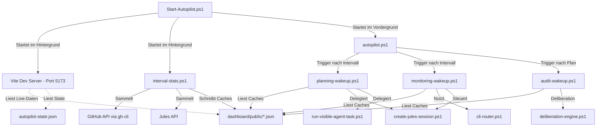

# Analyse und Optimierungsbericht: Vorce Autopilot

Dieses Dokument enthält eine detaillierte Analyse der aktuellen Struktur des **Vorce Autopilot** (AI CEO Orchestrator) und schlägt konkrete Optimierungen für die Code-Struktur, das Prozess-Management, die Prompt-Pflege sowie die allgemeine Architektur vor.

---

## 1. Aktuelle Architektur und Ordnerstruktur (Ist-Zustand)

Der Vorce Autopilot ist als PowerShell-basiertes Orchestrierungs-Framework implementiert, das mit einer React/Vite-Web-App (Dashboard) zur Überwachung und externen LLM/CLI-Werkzeugen (Codex, Gemini CLI, Jules) interagiert.

Das aktuelle Verzeichnis `scripts/codex-cli/` ist wie folgt gegliedert:

```text
scripts/codex-cli/
├── Start-Autopilot.ps1          # Zentrales Start- und Kontrollskript (Vite, Sync, Loop)
├── autopilot.ps1                # Die Hauptschleife (Timer-gesteuertes Wake-up, Retention)
├── autopilot-config.json        # Zentrale Konfiguration (Intervalle, Prompts, Filter)
├── autopilot-state.json         # Persistenter Zustands-Speicher für Recovery
├── autopilot-tasks.md           # Gemeinsames Lagebild (Journal)
├── autopilot-session-lock.md    # Session-Lock zur Verhinderung von Überlappungen
├── historical-quota-db.json     # Historische API-Nutzungsstatistiken
├── quota-registry.json          # Live-Statistiken und Routing-Regeln der Provider
├── telemetry-state.json         # Interner Telemetrie-Abfrage-Status
├── phases/                      # Die Phasen-Skripte des Loops
│   ├── planning-wakeup.ps1      # Issue-Scan, Re-Planning, Jules-Delegation
│   ├── monitoring-wakeup.ps1    # PR-Überwachung, Konfliktlösung, Auto-Approval
│   ├── audit-wakeup.ps1         # Unabhängiges Daten- & Performance-Audit (CEO Beta)
│   └── interval-stats.ps1       # Hintergrund-Synchronisierung für das Dashboard
├── lib/                         # Hilfsbibliotheken (Zustand, Quota, Router, etc.)
│   ├── autopilot-prompts.ps1    # Prompt-Deklarationen und Platzhalter-Ersetzung
│   ├── autopilot-session-manager.ps1 # Verwaltung von Codex/Jules-Sitzungen
│   ├── cli-router.ps1           # Dynamisches Routing der API-Aufrufe mit Fallbacks
│   ├── database-manager.ps1     # Schreib-/Lesezugriffe auf historical-quota-db.json
│   ├── deliberation-engine.ps1  # Dual-CEO Deliberation (Alpha + Beta Dialoge)
│   ├── memory-store.ps1         # Verwaltung von persistenten KI-Erinnerungen
│   ├── quota-manager.ps1        # Budgetüberwachung der LLM-Provider
│   ├── state-manager.ps1        # Atomares Speichern, Validierung und Bereinigung
│   └── telemetry-manager.ps1    # Telemetrie-Sammeln aus lokalen Logs
├── tools/                       # Kleine Dienstprogramme für die Ausführung
│   ├── gemini-quota.mjs         # JS-Skript zur Abfrage des Gemini-API-Limits
│   ├── run-visible-agent-task.ps1 # Ausführung lokaler CLI-Aufgaben in Fenstern
│   ├── run-visible-ceo-phase.ps1 # Ausführung von Deliberations-Phasen in Fenstern
│   └── run-visible-codex-session.ps1 # Ausführung von Codex-Planning in Fenstern
└── dashboard/                   # React/Vite/Tailwind Dashboard-Quellcode
```

### Datenfluss & Kommunikationsmatrix

Das folgende Diagramm veranschaulicht, wie die verschiedenen Komponenten des Vorce Autopiloten zur Laufzeit interagieren:



---

## 2. Schwachstellen und Optimierungspotenziale (Pain Points)

Bei genauerer Betrachtung des Codes und der Struktur lassen sich folgende architektonische Verbesserungspotenziale identifizieren:

### 2.1. Redundante API- und CLI-Aufrufe (Code-Duplikation)
- **Problem:** Die Phasen-Skripte (`planning-wakeup.ps1`, `monitoring-wakeup.ps1` und `audit-wakeup.ps1`) rufen an verschiedenen Stellen direkt das `gh`-CLI oder Jules-API-Skripte auf. Beispielsweise enthält `planning-wakeup.ps1` ein Inline-Skript-Block `$GetCandidates`, um Issues zu filtern und zu sortieren, während `monitoring-wakeup.ps1` an anderen Stellen direkte CLI-Aufrufe absetzt.
- **Folge:** Fehler in der Befehlssyntax, API-Änderungen oder Authentifizierungsfehler müssen an mehreren Stellen repariert werden. Testbarkeit (Mocking) wird erschwert.

### 2.2. Prompts-im-Code-Antimuster
- **Problem:** Die Prompt-Vorlagen für LLM-Aktionen sind über zwei Stellen verteilt:
  1. Direkt in `autopilot-config.json` unter dem Schlüssel `"prompts"` als JSON-Escaped-Strings (z. B. mit mühsamen `\n`- und `\"`-Escapes).
  2. Fest kodiert in PowerShell-Here-Strings innerhalb von `lib/autopilot-prompts.ps1`.
- **Folge:** Prompt-Engineering ist fehleranfällig, da JSON-Syntax-Fehler leicht die gesamte Konfiguration zerstören. Es gibt kein Markdown-Highlighting für die Prompts im Code-Editor, was die Lesbarkeit komplexer Anweisungen drastisch verschlechtert.

### 2.3. Unkontrollierte Zustandstransaktionen (State Mutation Separation)
- **Problem:** Jede Phase (`planning`, `monitoring`, `audit`) erhält das globale `$State`-Objekt per Referenz, manipuliert dessen Eigenschaften direkt (z. B. `$State.active_delegations += ...`) und ruft nach Belieben `Save-AutopilotState` auf.
- **Folge:** Es gibt keinen "Single Source of Truth"-Controller für Zustandsänderungen. Tritt in einer Phase ein ungefangener Fehler auf, kann ein teil-mutierter Zustand gespeichert werden, was die Recovery erschwert.

### 2.4. Prozess-Management und verwaiste Sessions
- **Problem:** `Start-Autopilot.ps1` nutzt Text-Pattern-Matching (`Get-CimInstance Win32_Process`), um laufende Prozesse zu finden und zu beenden. Dies ist unpräzise und birgt das Risiko, andere PowerShell-Sitzungen oder parallele Arbeitsumgebungen zu beeinträchtigen, wenn Pfadstrukturen übereinstimmen. Zudem werden temporäre Dateien (`ceo-args-*.json`, etc.) oft erst in periodischen Cleanup-Zyklen der Hauptschleife bereinigt.
- **Folge:** Wenn die Suite abstürzt oder unsauber beendet wird, bleiben Node-Prozesse (`Vite`) oder verwaiste CLI-Agent-Fenster offen.

### 2.5. Synchronisations-Hänger (Start-ThreadJob)
- **Problem:** `interval-stats.ps1` verwendet `Start-ThreadJob` zur parallelen Abfrage von GitHub-Issues, PRs und Jules-Sitzungen. Es gibt jedoch keine harten Timeouts innerhalb der Skriptblöcke selbst (z. B. bei langsamen GitHub-Verbindungen). 
- **Folge:** Bleibt ein Job hängen, schlägt zwar der `Wait-Job`-Timeout nach 60 Sekunden an, aber der Thread läuft im Hintergrund weiter und blockiert Ressourcen.

### 2.6. Sicherheitsrisiko durch `Invoke-Expression`
- **Problem:** In `audit-wakeup.ps1` wird das von der KI generierte `remediation_command` per `Invoke-Expression` ausgeführt.
- **Folge:** Dies stellt ein potenzielles Sicherheitsrisiko dar (Code-Injection), falls ein LLM fehlerhafte oder schädliche Befehle generiert. Zudem ist es fehleranfällig bei Leerzeichen in Pfaden.

---

## 3. Konkrete Optimierungsvorschläge (Soll-Zustand)

Um die Wartbarkeit, Robustheit und Übersichtlichkeit des Vorce Autopiloten zu maximieren, werden folgende strukturelle Änderungen empfohlen:

### 3.1. Strukturierte Bereinigung des Projekt-Layouts

Die Ordnerstruktur sollte so reorganisiert werden, dass Quellcode, Konfiguration, Prompts und temporäre Laufzeitdaten streng voneinander getrennt sind.

```text
scripts/codex-cli/
├── Start-Autopilot.ps1
├── autopilot.ps1
├── config/                      # NEU: Nur Konfigurationsdateien
│   └── autopilot-config.json
├── prompts/                     # NEU: Rein Markdown-basierte Prompts
│   ├── planning_analysis.md
│   ├── planning_proposal.md
│   ├── planning_synthesis.md
│   ├── monitor_sessions.md
│   ├── monitor_prs.md
│   └── audit_synthesis.md
├── src/                         # NEU: Konsolidierter PowerShell-Code (Phasen & Libs zusammen)
│   ├── phases/
│   │   ├── planning-wakeup.ps1
│   │   ├── monitoring-wakeup.ps1
│   │   └── audit-wakeup.ps1
│   └── lib/
│       ├── github-client.ps1    # NEU: Zentraler GitHub-Client
│       ├── jules-client.ps1     # NEU: Zentraler Jules-Client
│       ├── state-manager.ps1
│       ├── cli-router.ps1
│       └── ...
├── tools/
│   └── ...                      # Hilfswerkzeuge
├── var/                         # NEU: Lokale Laufzeitdaten (in .gitignore)
│   ├── state/
│   │   ├── autopilot-state.json
│   │   └── telemetry-state.json
│   ├── db/
│   │   ├── historical-quota-db.json
│   │   └── quota-registry.json
│   ├── locks/
│   │   └── autopilot-session.lock
│   └── tmp/                     # Alle temporären Dateien an einem Ort
└── dashboard/
```

> [!NOTE]
> Die Trennung von `var/` sorgt dafür, dass Laufzeitdaten, Datenbanken und temporäre Dateien klar vom Quellcode isoliert sind und nicht versehentlich in Git-Commits landen.

### 3.2. Einführung von Service-Clients (`github-client.ps1` & `jules-client.ps1`)

Alle GitHub- und Jules-Interaktionen sollten in eigenständigen Modulen gekapselt werden:

```powershell
# src/lib/github-client.ps1

function Get-GitHubIssues {
    param(
        [string]$Repository,
        [string]$State = "open",
        [string[]]$Labels = @()
    )
    # Einmalige, robuste Ausführung von gh issue list mit Fehlerprüfung und JSON-Parsing
    # ...
}

function Create-GitHubIssueComment {
    param(
        [int]$IssueNumber,
        [string]$Repository,
        [string]$Body
    )
    # ...
}
```

**Vorteil:** Die Phasen-Skripte werden wesentlich kürzer, lesbarer und fokussieren sich rein auf den Ablauf (Workflow-Logik).

### 3.3. Markdown-basierte Prompt-Verwaltung

Prompts werden als `.md`-Dateien im Ordner `prompts/` abgelegt. Der Prompt-Manager liest diese zur Laufzeit ein.

```powershell
# src/lib/prompt-loader.ps1

function Get-PromptTemplate {
    param([string]$Key, [hashtable]$Variables = @{})

    $promptPath = Join-Path $PSScriptRoot "..\prompts\$Key.md"
    if (-not (Test-Path $promptPath)) {
        throw "Prompt-Template nicht gefunden: $promptPath"
    }

    $template = Get-Content -LiteralPath $promptPath -Raw -Encoding UTF8
    
    # Variablen-Ersetzung ($repo -> Wert, etc.)
    foreach ($varName in $Variables.Keys) {
        $template = $template.Replace("`$$varName", [string]$Variables[$varName])
    }

    return $template
}
```

> [!TIP]
> Dies ermöglicht volles Syntax-Highlighting und Autocomplete für Markdown-Dateien im IDE, verhindert JSON-Escaping-Fehler und macht Prompt-Updates extrem transparent in Git-Diffs.

### 3.4. Zustands-Transaktions-Muster (State Coordinator)

Die Phasen-Skripte manipulieren den Zustand nicht mehr direkt. Sie geben stattdessen ein Ergebnisobjekt zurück, welches vom Haupt-Orchestrator verarbeitet wird.

```powershell
# Struktur in autopilot.ps1
try {
    # Phase ausführen (gibt nur Ergebnisse zurück, speichert nicht selbst)
    $planOutput = Invoke-PlanningWakeUp -Config $Config -Repository $Repository
    
    # Zustand zentral modifizieren
    if ($planOutput.NewDelegations) {
        foreach ($del in $planOutput.NewDelegations) {
            Add-StateDelegation -State $State -Delegation $del
        }
        Save-AutopilotState -State $State
    }
} catch {
    # Transaktions-Rollback/Fehlerbehandlung
}
```

### 3.5. Robustes PID-Tracking für Kindprozesse

Statt vagem Text-Matching der CommandLine sollte `Start-Autopilot.ps1` die PIDs aller gestarteten Hintergrundprozesse (Vite, Sync, Loop) in einer Datei registrieren:

```powershell
# Beim Starten
$viteProc = Start-Process ... -PassThru
$syncProc = Start-Process ... -PassThru

$Pids = @{
    Vite = $viteProc.Id
    Sync = $syncProc.Id
    Loop = $PID
}
$Pids | ConvertTo-Json | Set-Content (Join-Path $tmpDir "autopilot-pids.json")

# Beim Beenden (Cleanup-Routine)
# PIDs einlesen und gezielt Stop-Process -Id $id -Force ausführen.
```

**Vorteil:** Keine Fehlklicks, kein versehentliches Abschießen fremder Terminalfenster oder VS-Code-Sitzungen.

### 3.6. Ersatz von `Invoke-Expression` durch strukturierte Parameter-Übergabe

Bei der Ausführung von Remediation-Befehlen aus dem Audit-Lauf sollte auf `Invoke-Expression` verzichtet werden. Stattdessen sollten Befehle über ein striktes Routing oder über den Call-Operator `&` mit kontrollierten Argumenten aufgerufen werden.

---

## 4. Empfohlener Fahrplan für die Migration

Um das System risikofrei zu optimieren, sollte die Migration in 3 Phasen aufgeteilt werden:

| Phase | Ziel | Betroffene Dateien | Risiko |
| :--- | :--- | :--- | :--- |
| **Phase 1** | **Prompt-Isolierung** | `autopilot-prompts.ps1`, `autopilot-config.json`, neue `.md` Dateien | **Niedrig** (Keine funktionale Programmlogik betroffen) |
| **Phase 2** | **Kapselung der API-Aufrufe** | Neue `github-client.ps1`, `jules-client.ps1`, Anpassung der `phases/` | **Mittel** (Schnittstellen zu GitHub/Jules müssen stabil bleiben) |
| **Phase 3** | **Ordner-Restrukturierung & PID-Tracking** | `Start-Autopilot.ps1`, `autopilot.ps1`, Pfad-Korrekturen in allen Modulen | **Mittel** (Pfade müssen präzise angepasst werden) |

---

## 5. Fragen an den Benutzer zur Abstimmung

> [!IMPORTANT]
> Bevor wir mit der Implementierung beginnen, bitte ich um kurzes Feedback zu folgenden Fragen:
> 
> 1. **Priorisierung:** Möchtest du, dass wir diese Optimierungen direkt schrittweise umsetzen, oder dient dies zunächst als strategischer Entwurf für spätere Refactoring-Sessions?
> 2. **Prompt-Management:** Sollen wir die Prompts in separate Markdown-Dateien auslagern? Das würde das `autopilot-config.json` deutlich schlanker machen.
> 3. **PID-Tracking:** Ist es in Ordnung, wenn wir eine kleine temporäre Datei `var/run/autopilot-pids.json` anlegen, um die Suite-Prozesse absolut zuverlässig und plattformkonform zu stoppen?
